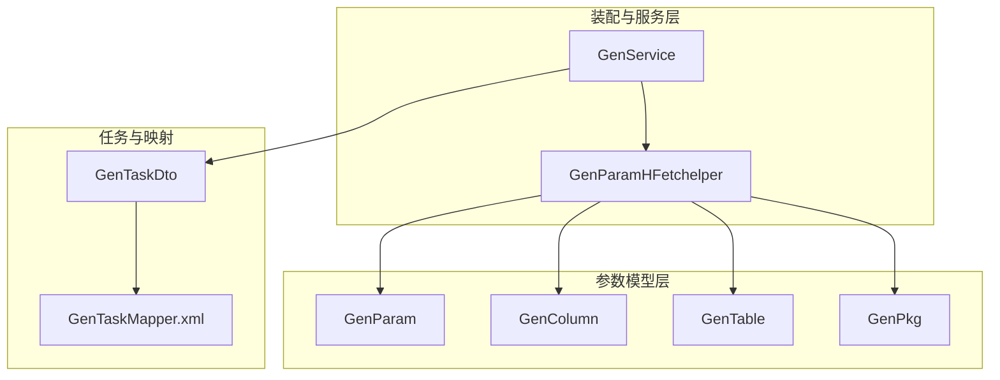
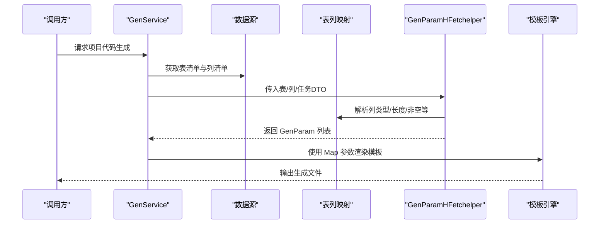
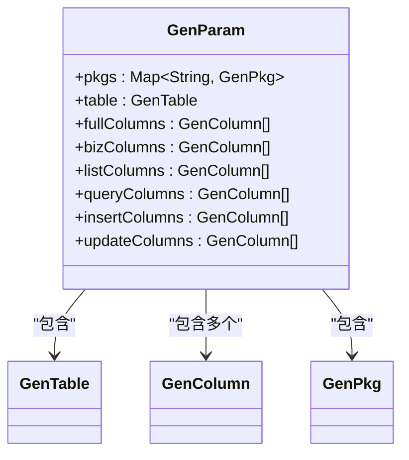
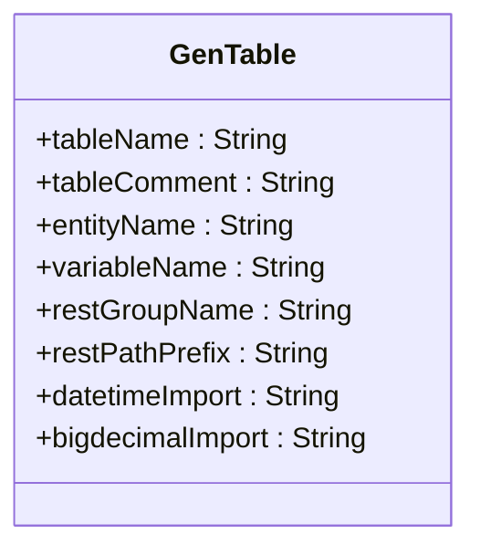
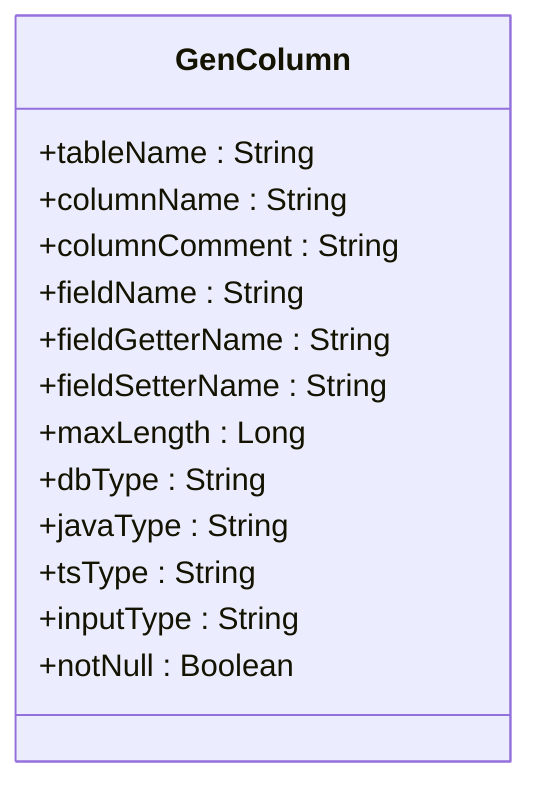
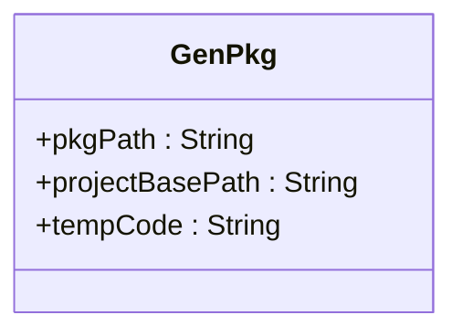
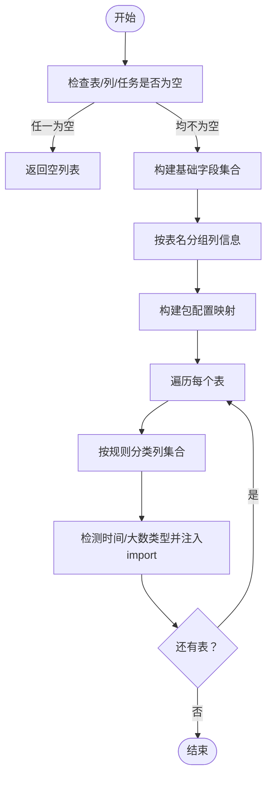
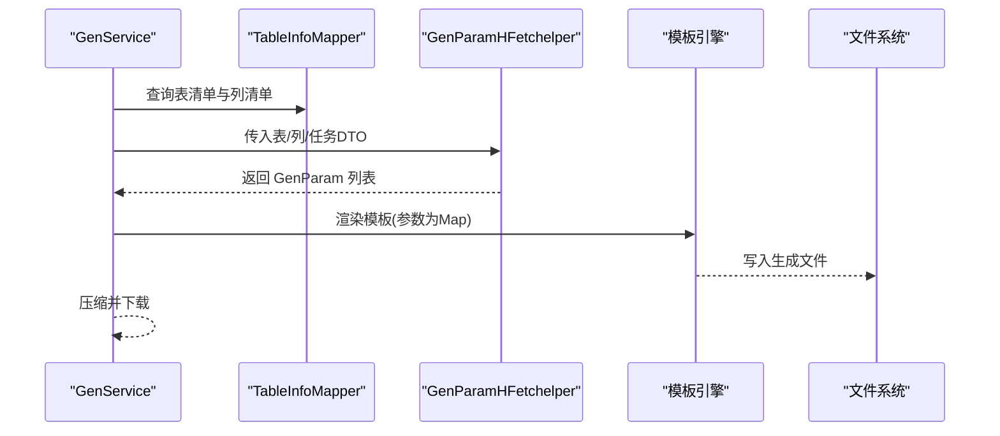
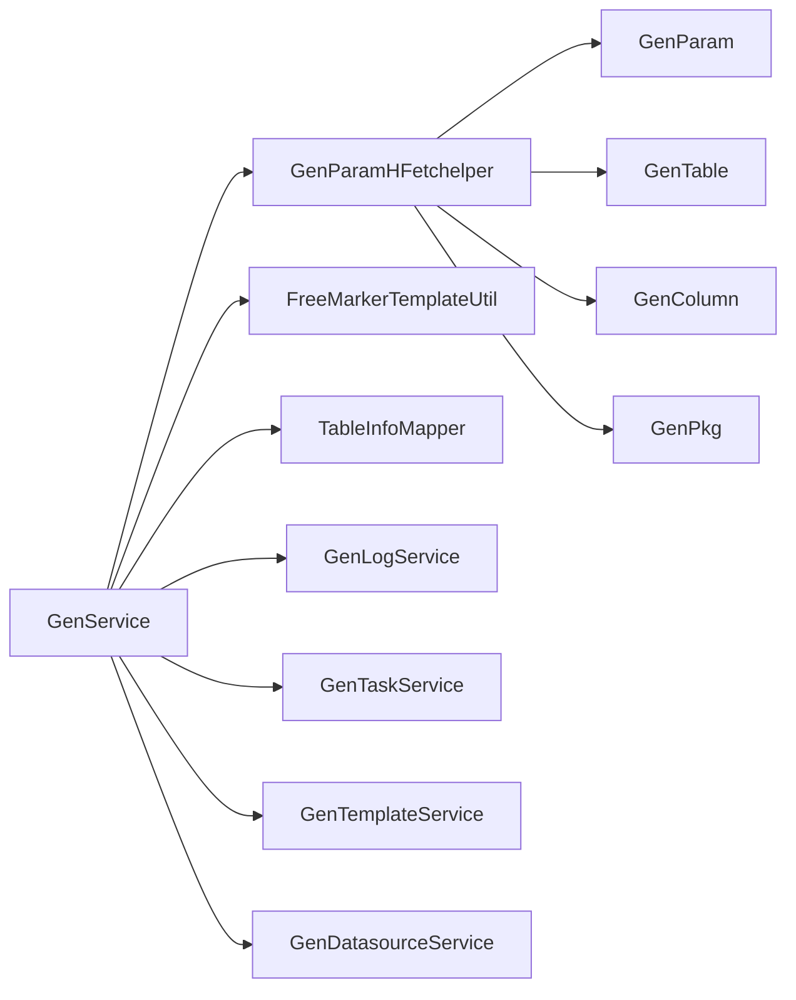

# 生成参数模型

<cite>
**本文引用的文件**
- [GenParam.java](file://generator-server/src/main/java/com/wkclz/generator/server/bean/gen/GenParam.java)
- [GenColumn.java](file://generator-server/src/main/java/com/wkclz/generator/server/bean/gen/GenColumn.java)
- [GenTable.java](file://generator-server/src/main/java/com/wkclz/generator/server/bean/gen/GenTable.java)
- [GenPkg.java](file://generator-server/src/main/java/com/wkclz/generator/server/bean/gen/GenPkg.java)
- [GenParamHFetchelper.java](file://generator-server/src/main/java/com/wkclz/generator/server/helper/GenParamHFetchelper.java)
- [GenService.java](file://generator-server/src/main/java/com/wkclz/generator/server/service/GenService.java)
- [GenTaskDto.java](file://generator-server/src/main/java/com/wkclz/generator/server/bean/dto/GenTaskDto.java)
- [GenTaskMapper.xml](file://generator-server/src/main/resources/mapper/GenTaskMapper.xml)
</cite>

## 目录
1. [引言](#引言)
2. [项目结构](#项目结构)
3. [核心组件](#核心组件)
4. [架构总览](#架构总览)
5. [详细组件分析](#详细组件分析)
6. [依赖分析](#依赖分析)
7. [性能考虑](#性能考虑)
8. [故障排查指南](#故障排查指南)
9. [结论](#结论)
10. [附录](#附录)

## 引言
本设计文档围绕 SH-Generator 的“生成参数模型”展开，系统化阐述 GenParam（生成参数）、GenColumn（列信息）、GenTable（表信息）、GenPkg（包信息）等参数模型的设计思路、用途与交互关系。重点说明参数模型在代码生成流程中的作用：如何从数据库表结构抽取元数据并转换为生成参数；各模型之间的数据流转与依赖关系；参数验证规则与默认值策略；以及模型的扩展性、可定制性与模板引擎集成方式。

## 项目结构
生成参数模型位于服务端模块的通用 Bean 层，配合 Helper 与 Service 完成从数据库元数据到模板渲染参数的全链路转换。关键文件分布如下：
- 参数模型：GenParam、GenColumn、GenTable、GenPkg
- 参数装配器：GenParamHFetchelper
- 服务编排：GenService
- 任务 DTO：GenTaskDto
- 任务查询映射：GenTaskMapper.xml

图表来源
- [GenParam.java:1-33](file://generator-server/src/main/java/com/wkclz/generator/server/bean/gen/GenParam.java#L1-L33)
- [GenColumn.java:1-39](file://generator-server/src/main/java/com/wkclz/generator/server/bean/gen/GenColumn.java#L1-L39)
- [GenTable.java:1-30](file://generator-server/src/main/java/com/wkclz/generator/server/bean/gen/GenTable.java#L1-L30)
- [GenPkg.java:1-15](file://generator-server/src/main/java/com/wkclz/generator/server/bean/gen/GenPkg.java#L1-L15)
- [GenParamHFetchelper.java:1-137](file://generator-server/src/main/java/com/wkclz/generator/server/helper/GenParamHFetchelper.java#L1-L137)
- [GenService.java:1-231](file://generator-server/src/main/java/com/wkclz/generator/server/service/GenService.java#L1-L231)
- [GenTaskDto.java:1-38](file://generator-server/src/main/java/com/wkclz/generator/server/bean/dto/GenTaskDto.java#L1-L38)
- [GenTaskMapper.xml:1-62](file://generator-server/src/main/resources/mapper/GenTaskMapper.xml#L1-L62)

章节来源
- [GenParam.java:1-33](file://generator-server/src/main/java/com/wkclz/generator/server/bean/gen/GenParam.java#L1-L33)
- [GenParamHFetchelper.java:1-137](file://generator-server/src/main/java/com/wkclz/generator/server/helper/GenParamHFetchelper.java#L1-L137)
- [GenService.java:1-231](file://generator-server/src/main/java/com/wkclz/generator/server/service/GenService.java#L1-L231)
- [GenTaskDto.java:1-38](file://generator-server/src/main/java/com/wkclz/generator/server/bean/dto/GenTaskDto.java#L1-L38)
- [GenTaskMapper.xml:1-62](file://generator-server/src/main/resources/mapper/GenTaskMapper.xml#L1-L62)

## 核心组件
- GenParam：聚合一次代码生成所需的全部参数，包含包信息、表信息、完整列集合及按用途细分的列集合（业务列、列表列、查询列、新增列、修改列），用于驱动模板渲染。
- GenTable：描述表级元信息，如表名、注释、实体名、变量名、REST 分组与路径前缀、时间与大数类型的导入声明等。
- GenColumn：描述字段级元信息，如表名、字段名、注释、Java/TS 类型、输入类型、是否非空、getter/setter 名称、最大长度等。
- GenPkg：描述任务级产物输出位置与模板编码，包含包路径、项目基础路径、模板编码等。

章节来源
- [GenParam.java:10-32](file://generator-server/src/main/java/com/wkclz/generator/server/bean/gen/GenParam.java#L10-L32)
- [GenTable.java:8-29](file://generator-server/src/main/java/com/wkclz/generator/server/bean/gen/GenTable.java#L8-L29)
- [GenColumn.java:8-38](file://generator-server/src/main/java/com/wkclz/generator/server/bean/gen/GenColumn.java#L8-L38)
- [GenPkg.java:8-14](file://generator-server/src/main/java/com/wkclz/generator/server/bean/gen/GenPkg.java#L8-L14)

## 架构总览
下图展示从数据库元数据到模板渲染参数的完整流程，以及参数模型在其中的角色与依赖：

图表来源
- [GenService.java:55-101](file://generator-server/src/main/java/com/wkclz/generator/server/service/GenService.java#L55-L101)
- [GenParamHFetchelper.java:28-80](file://generator-server/src/main/java/com/wkclz/generator/server/helper/GenParamHFetchelper.java#L28-L80)

## 详细组件分析

### GenParam 组件分析
- 聚合维度
  - pkgs：任务级包配置映射，键为模板键，值为 GenPkg。
  - table：表级信息 GenTable。
  - fullColumns：表的所有列集合。
  - bizColumns/listColumns/queryColumns/insertColumns/updateColumns：按用途对列进行筛选后的子集。
- 设计要点
  - 将“表级”和“列级”信息统一注入模板上下文，便于模板按需选择列集合。
  - 通过预定义的列过滤规则，减少模板内重复逻辑。
- 典型用途
  - 在模板中根据列集合生成实体、控制器、列表页、查询表单、新增/修改表单等。

图表来源
- [GenParam.java:10-32](file://generator-server/src/main/java/com/wkclz/generator/server/bean/gen/GenParam.java#L10-L32)

章节来源
- [GenParam.java:10-32](file://generator-server/src/main/java/com/wkclz/generator/server/bean/gen/GenParam.java#L10-L32)

### GenTable 组件分析
- 关键属性
  - 表名、注释、实体名、变量名、REST 分组名、REST 路径前缀、时间与大数类型导入声明。
- 设计要点
  - 通过表名推导实体名与变量名，统一 REST 命名风格。
  - 自动识别实体中使用的 Java 时间与大数类型，以便模板注入必要的 import 语句。
- 典型用途
  - 控制器、服务层命名与路径生成；实体类 import 注入。

图表来源
- [GenTable.java:8-29](file://generator-server/src/main/java/com/wkclz/generator/server/bean/gen/GenTable.java#L8-L29)

章节来源
- [GenTable.java:8-29](file://generator-server/src/main/java/com/wkclz/generator/server/bean/gen/GenTable.java#L8-L29)

### GenColumn 组件分析
- 关键属性
  - 表名、字段名、注释、字段变量名、getter/setter 名、最大长度、数据库类型、Java 类型、TS 类型、输入类型、是否非空。
- 设计要点
  - 以数据库列信息为基础，结合类型映射枚举，自动填充 Java/TS 类型与输入类型。
  - 保留字段注释与长度信息，便于模板生成注释与前端校验。
- 典型用途
  - 实体属性、前端表单控件、列表展示列、查询条件等。

图表来源
- [GenColumn.java:8-38](file://generator-server/src/main/java/com/wkclz/generator/server/bean/gen/GenColumn.java#L8-L38)

章节来源
- [GenColumn.java:8-38](file://generator-server/src/main/java/com/wkclz/generator/server/bean/gen/GenColumn.java#L8-L38)

### GenPkg 组件分析
- 关键属性
  - 包路径、项目基础路径、模板编码。
- 设计要点
  - 将任务配置与模板编码解耦，支持多模板并行生成。
  - 支持相对路径替换（例如 ../ 替换为 parent/），避免路径逃逸风险。
- 典型用途
  - 决定生成文件的输出目录与文件后缀（由模板决定）。

图表来源
- [GenPkg.java:8-14](file://generator-server/src/main/java/com/wkclz/generator/server/bean/gen/GenPkg.java#L8-L14)

章节来源
- [GenPkg.java:8-14](file://generator-server/src/main/java/com/wkclz/generator/server/bean/gen/GenPkg.java#L8-L14)

### 参数装配器 GenParamHFetchelper 分析
- 职责
  - 将数据库表/列信息与任务配置组装为 GenParam 列表。
  - 基于预设规则对列进行分类：业务列、列表列、查询列、新增列、修改列。
  - 自动识别实体中使用的时间与大数类型，注入相应 import。
- 关键算法
  - 依据 DbColumnEntity 的字段名集合，排除基础字段（如 ID、创建时间、版本号等）。
  - 过滤掉文本类大字段（如 TEXT、JSON 等）用于列表与查询。
  - 预置忽略字段集合：新增时忽略 id、createTime、updateTime、version；修改时忽略 id、createBy、createTime、updateTime、version。
- 复杂度
  - 时间复杂度近似 O(T+C)，T 为表数量，C 为列数量。
  - 空间复杂度 O(C) 用于列映射与结果集。

图表来源
- [GenParamHFetchelper.java:28-80](file://generator-server/src/main/java/com/wkclz/generator/server/helper/GenParamHFetchelper.java#L28-L80)
- [GenParamHFetchelper.java:108-134](file://generator-server/src/main/java/com/wkclz/generator/server/helper/GenParamHFetchelper.java#L108-L134)

章节来源
- [GenParamHFetchelper.java:28-80](file://generator-server/src/main/java/com/wkclz/generator/server/helper/GenParamHFetchelper.java#L28-L80)
- [GenParamHFetchelper.java:108-134](file://generator-server/src/main/java/com/wkclz/generator/server/helper/GenParamHFetchelper.java#L108-L134)

### 服务编排 GenService 分析
- 职责
  - 从项目配置出发，拉取数据源、表、列信息，组装生成参数。
  - 加载模板，将参数映射为模板上下文，逐文件生成并打包下载。
- 关键流程
  - getGenData：获取项目、数据源、表/列、任务规则，交由 GenParamHFetchelper 生成参数。
  - genCodeData：解析模板、渲染参数、写入文件；支持相对路径替换与目录创建。
  - zipDataAndPush：压缩生成目录并输出下载流。
- 错误处理
  - 当无可用参数时抛出校验异常；文件写入异常转系统异常；模板解析异常回退提示文本。

图表来源
- [GenService.java:55-101](file://generator-server/src/main/java/com/wkclz/generator/server/service/GenService.java#L55-L101)
- [GenService.java:92-159](file://generator-server/src/main/java/com/wkclz/generator/server/service/GenService.java#L92-L159)

章节来源
- [GenService.java:55-101](file://generator-server/src/main/java/com/wkclz/generator/server/service/GenService.java#L55-L101)
- [GenService.java:92-159](file://generator-server/src/main/java/com/wkclz/generator/server/service/GenService.java#L92-L159)

## 依赖分析
- 组件耦合
  - GenParam 依赖 GenTable、GenColumn、GenPkg。
  - GenParamHFetchelper 依赖 DbColumnEntity、ColumnInfo、DataTypeEnum、StringUtil 等工具与枚举。
  - GenService 依赖 GenLogService、GenTaskService、TableInfoMapper、GenTemplateService、GenDatasourceService、FreeMarkerTemplateUtil、CompressUtil 等。
- 外部依赖
  - MyBatis 映射表信息（表/列）。
  - FreeMarker 模板引擎。
  - Apache Commons Collections4、Lombok、Spring Boot 等。

图表来源
- [GenParamHFetchelper.java:1-137](file://generator-server/src/main/java/com/wkclz/generator/server/helper/GenParamHFetchelper.java#L1-L137)
- [GenService.java:1-231](file://generator-server/src/main/java/com/wkclz/generator/server/service/GenService.java#L1-L231)

章节来源
- [GenParamHFetchelper.java:1-137](file://generator-server/src/main/java/com/wkclz/generator/server/helper/GenParamHFetchelper.java#L1-L137)
- [GenService.java:1-231](file://generator-server/src/main/java/com/wkclz/generator/server/service/GenService.java#L1-L231)

## 性能考虑
- 列处理批量化：通过 Stream 与 groupingBy 对列进行一次性分组与映射，避免多次遍历。
- 条件过滤：在装配阶段完成列的分类与过滤，降低模板内计算开销。
- I/O 优化：批量创建目录、顺序写文件、及时 flush/close 流，减少磁盘 IO 抖动。
- 模板渲染：将对象映射为 Map 后一次性渲染，减少模板引擎调用次数。

## 故障排查指南
- “没有可生成代码的数据”
  - 触发点：生成数据为空时抛出校验异常。
  - 排查：确认项目代码、数据源配置、表前缀、任务开关状态。
- 模板解析异常
  - 觞现：模板渲染抛出 TemplateException 或 IOException。
  - 处理：回退输出异常提示文本，便于定位具体文件与模板内容。
- 文件写入异常
  - 觞现：文件输出流或打印流异常。
  - 处理：捕获并转为系统异常，确保日志记录与上抛。
- 相对路径逃逸
  - 觞现：../ 路径导致目录越权。
  - 处理：在生成前将 ../ 替换为 parent/，并在写入前进行安全检查。

章节来源
- [GenService.java:95-97](file://generator-server/src/main/java/com/wkclz/generator/server/service/GenService.java#L95-L97)
- [GenService.java:133-138](file://generator-server/src/main/java/com/wkclz/generator/server/service/GenService.java#L133-L138)
- [GenService.java:141-143](file://generator-server/src/main/java/com/wkclz/generator/server/service/GenService.java#L141-L143)
- [GenService.java:107](file://generator-server/src/main/java/com/wkclz/generator/server/service/GenService.java#L107)

## 结论
生成参数模型以“表/列/任务”为核心，通过 GenParam 将多维元数据整合为模板渲染参数，实现高度可配置与可扩展的代码生成体系。GenParamHFetchelper 提供了稳定的装配流程与规则化过滤，GenService 负责编排与落地输出。整体设计在保证灵活性的同时，兼顾性能与安全性，适合在多模板、多任务场景下稳定运行。

## 附录

### 参数模型与模板引擎集成
- 参数传递：将 GenParam 映射为 Map，作为模板上下文。
- 渲染触发：使用 FreeMarkerTemplateUtil 解析模板字符串，输出最终代码。
- 文件落盘：逐文件写入目标目录，支持模板后缀与包路径拼接。

章节来源
- [GenService.java:127-139](file://generator-server/src/main/java/com/wkclz/generator/server/service/GenService.java#L127-L139)

### 任务与规则来源
- 任务查询：通过 GenTaskMapper.xml 的 SQL 获取任务清单与模板关联。
- 任务 DTO：GenTaskDto 承载任务与模板键的组合信息，供参数装配使用。

章节来源
- [GenTaskMapper.xml:38-58](file://generator-server/src/main/resources/mapper/GenTaskMapper.xml#L38-L58)
- [GenTaskDto.java:15-35](file://generator-server/src/main/java/com/wkclz/generator/server/bean/dto/GenTaskDto.java#L15-L35)