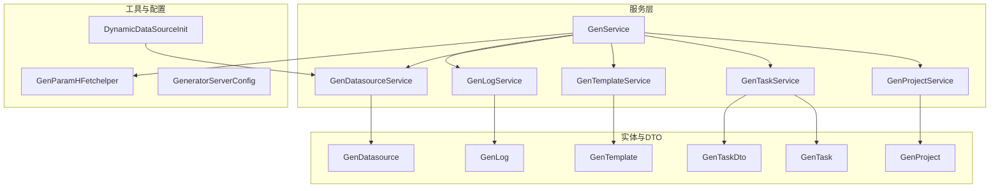
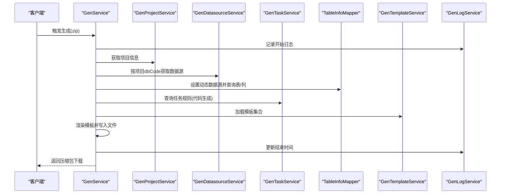
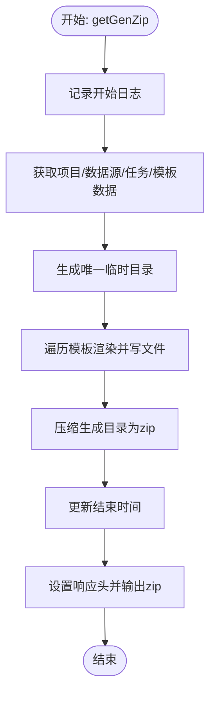
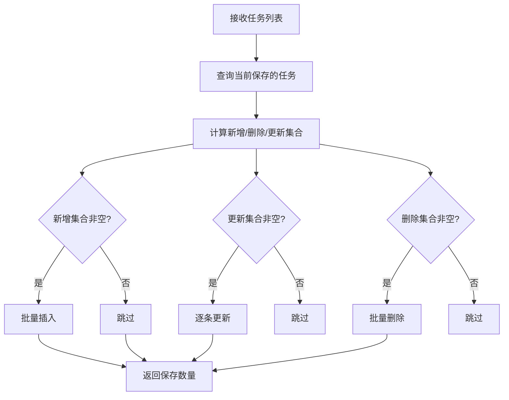
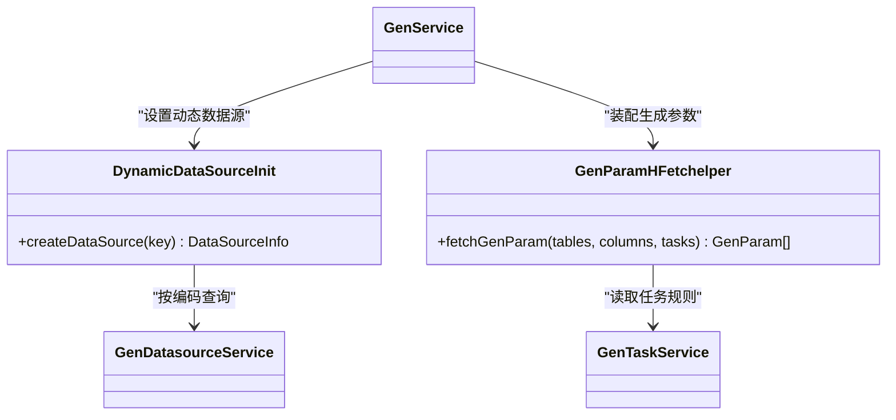
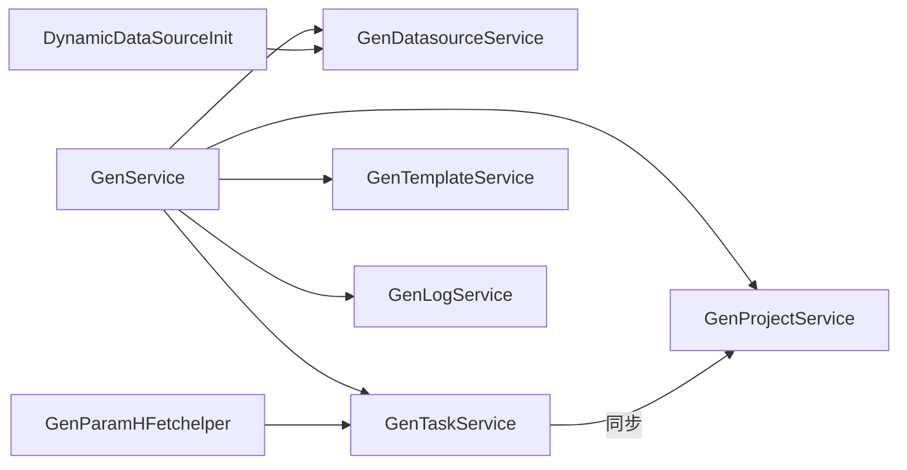

# 业务逻辑层设计

<cite>
**本文引用的文件**
- [GenService.java](file://generator-server/src/main/java/com/wkclz/generator/server/service/GenService.java)
- [GenDatasourceService.java](file://generator-server/src/main/java/com/wkclz/generator/server/service/GenDatasourceService.java)
- [GenProjectService.java](file://generator-server/src/main/java/com/wkclz/generator/server/service/GenProjectService.java)
- [GenTaskService.java](file://generator-server/src/main/java/com/wkclz/generator/server/service/GenTaskService.java)
- [GenTemplateService.java](file://generator-server/src/main/java/com/wkclz/generator/server/service/GenTemplateService.java)
- [GenLogService.java](file://generator-server/src/main/java/com/wkclz/generator/server/service/GenLogService.java)
- [GenProject.java](file://generator-server/src/main/java/com/wkclz/generator/server/bean/entity/GenProject.java)
- [GenDatasource.java](file://generator-server/src/main/java/com/wkclz/generator/server/bean/entity/GenDatasource.java)
- [GenTask.java](file://generator-server/src/main/java/com/wkclz/generator/server/bean/entity/GenTask.java)
- [GenTemplate.java](file://generator-server/src/main/java/com/wkclz/generator/server/bean/entity/GenTemplate.java)
- [GenLog.java](file://generator-server/src/main/java/com/wkclz/generator/server/bean/entity/GenLog.java)
- [GenTaskDto.java](file://generator-server/src/main/java/com/wkclz/generator/server/bean/dto/GenTaskDto.java)
- [DynamicDataSourceInit.java](file://generator-server/src/main/java/com/wkclz/generator/server/helper/DynamicDataSourceInit.java)
- [GenParamHFetchelper.java](file://generator-server/src/main/java/com/wkclz/generator/server/helper/GenParamHFetchelper.java)
- [GeneratorServerConfig.java](file://generator-server/src/main/java/com/wkclz/generator/server/GeneratorServerConfig.java)
</cite>

## 目录
1. [简介](#简介)
2. [项目结构](#项目结构)
3. [核心组件](#核心组件)
4. [架构总览](#架构总览)
5. [详细组件分析](#详细组件分析)
6. [依赖分析](#依赖分析)
7. [性能考虑](#性能考虑)
8. [故障排查指南](#故障排查指南)
9. [结论](#结论)
10. [附录](#附录)

## 简介
本文件聚焦 SH-Generator 的业务逻辑层设计，系统化阐述服务层的架构与职责边界、接口设计模式、事务管理策略、业务规则实现以及异常处理与事务控制机制。重点解析核心服务 GenService 的代码生成流程、GenDatasourceService 的数据源管理、GenProjectService 的项目配置管理，并总结服务层在业务流程编排、数据校验、异常处理与事务控制方面的最佳实践。

## 项目结构
服务层位于 generator-server 模块，采用“按领域分层”的组织方式：
- service 包：核心业务服务（GenService、GenProjectService、GenTaskService、GenTemplateService、GenDatasourceService、GenLogService）
- bean.entity 与 bean.dto：持久化实体与传输 DTO
- helper：与业务强相关的工具类（动态数据源工厂、参数提取器）
- rest：对外暴露的 REST 控制器（用于调用链路示意）
- mapper：MyBatis 映射接口（由 BaseService 统一封装 CRUD）

图表来源
- [GenService.java:1-231](file://generator-server/src/main/java/com/wkclz/generator/server/service/GenService.java#L1-L231)
- [GenProjectService.java:1-134](file://generator-server/src/main/java/com/wkclz/generator/server/service/GenProjectService.java#L1-L134)
- [GenTaskService.java:1-114](file://generator-server/src/main/java/com/wkclz/generator/server/service/GenTaskService.java#L1-L114)
- [GenTemplateService.java:1-34](file://generator-server/src/main/java/com/wkclz/generator/server/service/GenTemplateService.java#L1-L34)
- [GenDatasourceService.java:1-59](file://generator-server/src/main/java/com/wkclz/generator/server/service/GenDatasourceService.java#L1-L59)
- [GenLogService.java:1-18](file://generator-server/src/main/java/com/wkclz/generator/server/service/GenLogService.java#L1-L18)
- [GenProject.java:1-108](file://generator-server/src/main/java/com/wkclz/generator/server/bean/entity/GenProject.java#L1-L108)
- [GenDatasource.java:1-116](file://generator-server/src/main/java/com/wkclz/generator/server/bean/entity/GenDatasource.java#L1-L116)
- [GenTask.java:1-124](file://generator-server/src/main/java/com/wkclz/generator/server/bean/entity/GenTask.java#L1-L124)
- [GenTemplate.java:1-108](file://generator-server/src/main/java/com/wkclz/generator/server/bean/entity/GenTemplate.java#L1-L108)
- [GenLog.java:1-100](file://generator-server/src/main/java/com/wkclz/generator/server/bean/entity/GenLog.java#L1-L100)
- [GenTaskDto.java:1-38](file://generator-server/src/main/java/com/wkclz/generator/server/bean/dto/GenTaskDto.java#L1-L38)
- [DynamicDataSourceInit.java:1-61](file://generator-server/src/main/java/com/wkclz/generator/server/helper/DynamicDataSourceInit.java#L1-L61)
- [GenParamHFetchelper.java:1-137](file://generator-server/src/main/java/com/wkclz/generator/server/helper/GenParamHFetchelper.java#L1-L137)
- [GeneratorServerConfig.java:1-14](file://generator-server/src/main/java/com/wkclz/generator/server/GeneratorServerConfig.java#L1-L14)

章节来源
- [GeneratorServerConfig.java:1-14](file://generator-server/src/main/java/com/wkclz/generator/server/GeneratorServerConfig.java#L1-L14)

## 核心组件
- GenService：代码生成编排中心，负责数据采集、模板渲染、文件生成与打包下载，贯穿项目、数据源、任务、模板与日志服务。
- GenProjectService：项目配置管理，含唯一性校验、项目复制、项目编码生成与任务迁移。
- GenTaskService：任务管理，支持批量保存、插入/更新/删除差异同步，事务保障。
- GenTemplateService：模板管理，提供分页查询与代码生成所需模板筛选。
- GenDatasourceService：数据源管理，提供分页、选项查询、按编码获取与敏感字段保护更新。
- GenLogService：日志管理，提供分页查询与基础 CRUD。

章节来源
- [GenService.java:1-231](file://generator-server/src/main/java/com/wkclz/generator/server/service/GenService.java#L1-L231)
- [GenProjectService.java:1-134](file://generator-server/src/main/java/com/wkclz/generator/server/service/GenProjectService.java#L1-L134)
- [GenTaskService.java:1-114](file://generator-server/src/main/java/com/wkclz/generator/server/service/GenTaskService.java#L1-L114)
- [GenTemplateService.java:1-34](file://generator-server/src/main/java/com/wkclz/generator/server/service/GenTemplateService.java#L1-L34)
- [GenDatasourceService.java:1-59](file://generator-server/src/main/java/com/wkclz/generator/server/service/GenDatasourceService.java#L1-L59)
- [GenLogService.java:1-18](file://generator-server/src/main/java/com/wkclz/generator/server/service/GenLogService.java#L1-L18)

## 架构总览
服务层采用“组合式服务”设计，围绕 GenService 进行跨域协作：
- 动态数据源：通过 DynamicDataSourceInit 按项目 dbCode 解析真实数据源，供 GenService 在生成过程中切换数据源读取表/列元数据。
- 参数装配：GenParamHFetchelper 将表/列元数据与任务配置映射为 GenParam，驱动模板渲染。
- 事务与异常：GenTaskService 使用声明式事务保证任务批量保存的一致性；全局异常通过 ValidationException/SystemException 统一抛出，便于上层控制器捕获与响应。

图表来源
- [GenService.java:72-90](file://generator-server/src/main/java/com/wkclz/generator/server/service/GenService.java#L72-L90)
- [GenService.java:92-159](file://generator-server/src/main/java/com/wkclz/generator/server/service/GenService.java#L92-L159)
- [GenProjectService.java:98-108](file://generator-server/src/main/java/com/wkclz/generator/server/service/GenProjectService.java#L98-L108)
- [GenDatasourceService.java:45-54](file://generator-server/src/main/java/com/wkclz/generator/server/service/GenDatasourceService.java#L45-L54)
- [GenTaskService.java:107-110](file://generator-server/src/main/java/com/wkclz/generator/server/service/GenTaskService.java#L107-L110)
- [GenTemplateService.java:26-31](file://generator-server/src/main/java/com/wkclz/generator/server/service/GenTemplateService.java#L26-L31)
- [GenLogService.java:13-15](file://generator-server/src/main/java/com/wkclz/generator/server/service/GenLogService.java#L13-L15)

## 详细组件分析

### GenService：代码生成编排与执行
- 职责边界
  - 业务编排：聚合项目、数据源、任务、模板与日志服务，完成从元数据采集到文件生成与打包下载的全流程。
  - 数据准备：根据项目与数据源查询表/列元数据，结合任务规则生成 GenParam 列表。
  - 模板渲染：按模板编码加载模板内容，使用 FreeMarker 渲染，写入目标文件。
  - 压缩与下载：将生成文件打包为 zip，通过 HttpServletResponse 输出流返回给客户端。
  - 日志追踪：生成前后记录开始/结束时间，便于审计与性能分析。
- 关键流程
  - 获取项目与数据源：通过 GenProjectService 与 GenDatasourceService 定位生成上下文。
  - 动态数据源切换：利用 DynamicDataSourceHolder 设置数据源键，查询表/列元数据。
  - 参数装配：借助 GenParamHFetchelper 将表/列映射为 GenParam，区分业务字段、列表字段、查询字段、插入/更新字段等。
  - 模板选择与渲染：按任务中的模板编码筛选模板，逐个渲染并写入磁盘。
  - 压缩与下载：统一生成路径，压缩后通过响应头设置 Content-Disposition 返回。
- 异常与事务
  - 无显式事务注解，异常通过 ValidationException/SystemException 抛出，交由上层控制器处理。
  - 文件写入与模板解析异常时，兜底生成异常提示文本，避免中断整体流程。
- 设计要点
  - 依赖注入：通过构造/字段注入多个服务，体现组合式服务设计。
  - 路径处理：对 ../ 路径进行替换，避免目录逃逸风险。
  - 时间戳路径：生成唯一临时目录，避免并发冲突。

图表来源
- [GenService.java:72-90](file://generator-server/src/main/java/com/wkclz/generator/server/service/GenService.java#L72-L90)
- [GenService.java:92-159](file://generator-server/src/main/java/com/wkclz/generator/server/service/GenService.java#L92-L159)
- [GenService.java:162-190](file://generator-server/src/main/java/com/wkclz/generator/server/service/GenService.java#L162-L190)

章节来源
- [GenService.java:1-231](file://generator-server/src/main/java/com/wkclz/generator/server/service/GenService.java#L1-L231)

### GenDatasourceService：数据源管理
- 职责边界
  - 提供数据源分页查询与选项列表。
  - 支持按编码精确获取数据源并做存在性校验。
  - 更新时保护敏感字段（如密码），仅在提供新值时更新。
- 设计要点
  - 继承 BaseService，复用通用 CRUD 与分页能力。
  - 参数校验与异常抛出，保证调用方契约清晰。
  - 密码字段更新策略：若前端传入空值则保留旧值，避免误清空。

章节来源
- [GenDatasourceService.java:1-59](file://generator-server/src/main/java/com/wkclz/generator/server/service/GenDatasourceService.java#L1-L59)
- [GenDatasource.java:1-116](file://generator-server/src/main/java/com/wkclz/generator/server/bean/entity/GenDatasource.java#L1-L116)

### GenProjectService：项目配置管理
- 职责边界
  - 项目分页查询、创建与更新。
  - 唯一性校验：当项目编码非空时，禁止重复。
  - 项目复制：自动生成新编码，复制关联任务并插入新记录。
  - 项目编码生成：使用 RedisIdGenerator 生成带前缀的唯一编码。
  - 项目编码变更：若更换 projectCode，需同步更新关联任务的 projectCode。
- 设计要点
  - 使用 RedisIdGenerator 保证高并发下的唯一性。
  - 更新时对非空字段进行选择性拷贝，避免覆盖。
  - 通过异常码与断言明确错误语义。

章节来源
- [GenProjectService.java:1-134](file://generator-server/src/main/java/com/wkclz/generator/server/service/GenProjectService.java#L1-L134)
- [GenProject.java:1-108](file://generator-server/src/main/java/com/wkclz/generator/server/bean/entity/GenProject.java#L1-L108)

### GenTaskService：任务管理与批量保存
- 职责边界
  - 查询项目任务列表与代码生成规则。
  - 批量保存任务：计算新增、删除与更新集合，分别执行插入、更新与删除。
  - 事务保障：使用 @Transactional 确保批量操作原子性。
- 设计要点
  - 一致性校验：同一项目内模板编码必须唯一，防止重复。
  - 差异对比：通过比较字段值决定是否更新，减少无效写入。
  - 批处理优化：批量插入与逐条更新相结合，提升吞吐。

图表来源
- [GenTaskService.java:27-105](file://generator-server/src/main/java/com/wkclz/generator/server/service/GenTaskService.java#L27-L105)

章节来源
- [GenTaskService.java:1-114](file://generator-server/src/main/java/com/wkclz/generator/server/service/GenTaskService.java#L1-L114)
- [GenTask.java:1-124](file://generator-server/src/main/java/com/wkclz/generator/server/bean/entity/GenTask.java#L1-L124)
- [GenTaskDto.java:1-38](file://generator-server/src/main/java/com/wkclz/generator/server/bean/dto/GenTaskDto.java#L1-L38)

### GenTemplateService：模板管理
- 职责边界
  - 模板分页查询与选项列表。
  - 代码生成所需模板筛选：按模板编码集合查询模板集合。
- 设计要点
  - 继承 BaseService，复用分页与查询能力。
  - 模板筛选方法返回空集合时，调用方需进行空值判断与分支处理。

章节来源
- [GenTemplateService.java:1-34](file://generator-server/src/main/java/com/wkclz/generator/server/service/GenTemplateService.java#L1-L34)
- [GenTemplate.java:1-108](file://generator-server/src/main/java/com/wkclz/generator/server/bean/entity/GenTemplate.java#L1-L108)

### GenLogService：日志管理
- 职责边界
  - 日志分页查询与基础 CRUD。
- 设计要点
  - 继承 BaseService，提供通用分页查询能力。

章节来源
- [GenLogService.java:1-18](file://generator-server/src/main/java/com/wkclz/generator/server/service/GenLogService.java#L1-L18)
- [GenLog.java:1-100](file://generator-server/src/main/java/com/wkclz/generator/server/bean/entity/GenLog.java#L1-L100)

### 动态数据源与参数装配
- DynamicDataSourceInit：按数据源编码解析真实数据源信息，限定数据库类型范围，构造 DataSourceInfo。
- GenParamHFetchelper：将表/列元数据映射为 GenParam，区分业务字段、列表字段、查询字段、插入/更新字段，并处理 Java 类型导入（如 LocalDateTime、BigDecimal）。

图表来源
- [DynamicDataSourceInit.java:1-61](file://generator-server/src/main/java/com/wkclz/generator/server/helper/DynamicDataSourceInit.java#L1-L61)
- [GenParamHFetchelper.java:1-137](file://generator-server/src/main/java/com/wkclz/generator/server/helper/GenParamHFetchelper.java#L1-L137)
- [GenDatasourceService.java:1-59](file://generator-server/src/main/java/com/wkclz/generator/server/service/GenDatasourceService.java#L1-L59)
- [GenTaskService.java:1-114](file://generator-server/src/main/java/com/wkclz/generator/server/service/GenTaskService.java#L1-L114)
- [GenService.java:1-231](file://generator-server/src/main/java/com/wkclz/generator/server/service/GenService.java#L1-L231)

## 依赖分析
- 服务间耦合
  - GenService 对多个服务存在强依赖：项目、数据源、任务、模板、日志与表信息 Mapper。
  - GenTaskService 与 GenProjectService 存在间接耦合：项目编码变更时需同步任务编码。
- 外部依赖
  - 动态数据源：依赖 DynamicDataSourceHolder 与 DataSourceInfo。
  - 模板引擎：依赖 FreeMarkerTemplateUtil。
  - 工具库：MapUtil、StringFormat、CompressUtil、Date/IO 流等。
- 循环依赖
  - 未发现循环依赖迹象，服务间以单向依赖为主。

图表来源
- [GenService.java:1-231](file://generator-server/src/main/java/com/wkclz/generator/server/service/GenService.java#L1-L231)
- [GenProjectService.java:1-134](file://generator-server/src/main/java/com/wkclz/generator/server/service/GenProjectService.java#L1-L134)
- [GenTaskService.java:1-114](file://generator-server/src/main/java/com/wkclz/generator/server/service/GenTaskService.java#L1-L114)
- [GenDatasourceService.java:1-59](file://generator-server/src/main/java/com/wkclz/generator/server/service/GenDatasourceService.java#L1-L59)
- [DynamicDataSourceInit.java:1-61](file://generator-server/src/main/java/com/wkclz/generator/server/helper/DynamicDataSourceInit.java#L1-L61)
- [GenParamHFetchelper.java:1-137](file://generator-server/src/main/java/com/wkclz/generator/server/helper/GenParamHFetchelper.java#L1-L137)

## 性能考虑
- 批量操作
  - GenTaskService 的批量保存采用“差异计算 + 分类执行”，减少不必要的数据库往返。
- IO 与压缩
  - 生成文件采用流式写入，压缩阶段一次性打包，避免多次 IO。
- 动态数据源
  - 通过 DynamicDataSourceHolder 切换数据源，建议在批量查询时尽量减少切换次数。
- 模板渲染
  - 模板内容缓存与 FreeMarker 预热可进一步优化渲染性能（建议在部署层面配置）。

## 故障排查指南
- 常见异常与定位
  - 数据源不存在：DynamicDataSourceInit 在找不到数据源或类型不被支持时抛出校验异常。
  - 项目/任务/模板缺失：各 Service 在按编码查询失败时抛出校验异常。
  - 生成数据为空：GenService 在无可生成数据时抛出校验异常。
  - 文件写入异常：GenService 在文件输出流异常时抛出系统异常。
- 事务与回滚
  - GenTaskService 的批量保存使用 @Transactional，任一步骤异常将触发回滚，确保数据一致性。
- 日志追踪
  - GenService 在生成前后记录日志，便于定位耗时瓶颈与异常点。

章节来源
- [DynamicDataSourceInit.java:24-58](file://generator-server/src/main/java/com/wkclz/generator/server/helper/DynamicDataSourceInit.java#L24-L58)
- [GenProjectService.java:98-108](file://generator-server/src/main/java/com/wkclz/generator/server/service/GenProjectService.java#L98-L108)
- [GenTaskService.java:27-105](file://generator-server/src/main/java/com/wkclz/generator/server/service/GenTaskService.java#L27-L105)
- [GenService.java:95-97](file://generator-server/src/main/java/com/wkclz/generator/server/service/GenService.java#L95-L97)
- [GenService.java:141-143](file://generator-server/src/main/java/com/wkclz/generator/server/service/GenService.java#L141-L143)

## 结论
服务层通过“组合式服务 + 工具类 + 声明式事务”的设计，实现了代码生成业务的高内聚低耦合。GenService 作为编排核心，串联项目、数据源、任务、模板与日志，形成完整的生成流水线；GenTaskService 的批量保存与事务保障确保了任务配置的可靠性；GenDatasourceService 与 DynamicDataSourceInit 提供了灵活的数据源解析能力。整体设计遵循接口隔离与职责单一原则，具备良好的扩展性与可维护性。

## 附录
- 设计原则
  - 接口设计：面向实体与 DTO 的清晰边界，避免跨层直接依赖。
  - 依赖注入：优先使用字段注入，保持构造简洁，便于单元测试。
  - 业务分离：将参数装配、模板渲染、IO 写入等逻辑拆分为独立工具类，降低服务复杂度。
  - 事务控制：对批量写入与关键业务路径使用声明式事务，确保一致性。
  - 异常处理：统一使用 ValidationException/SystemException，配合上层控制器进行标准化响应。