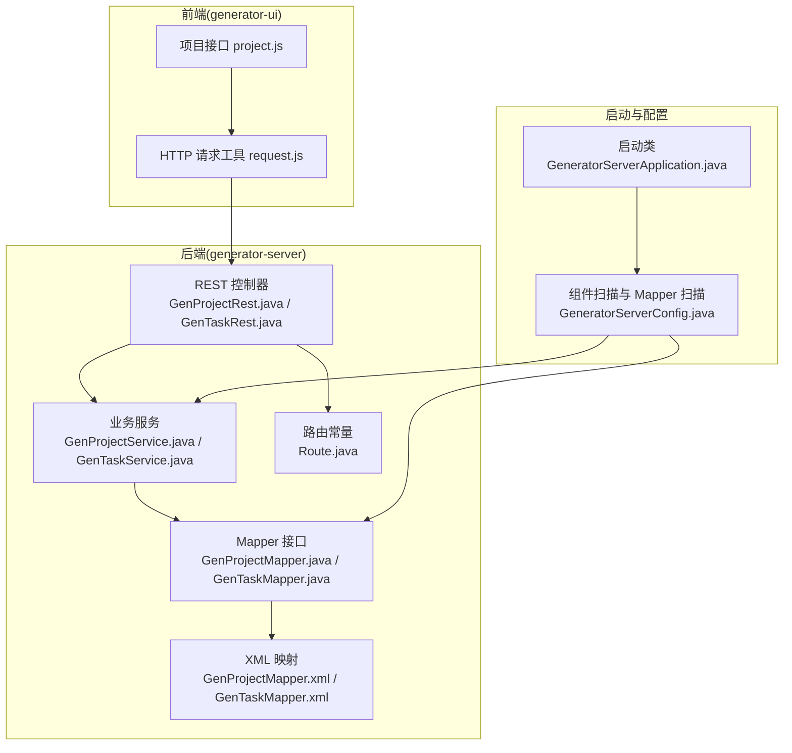
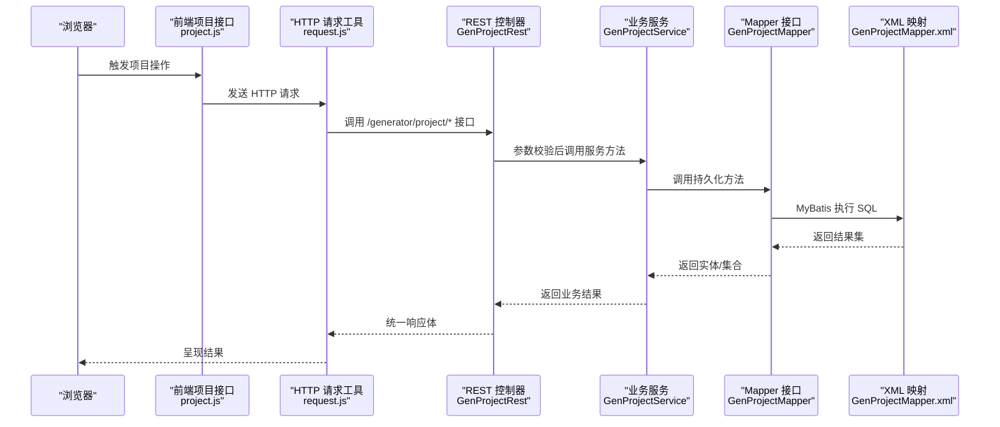
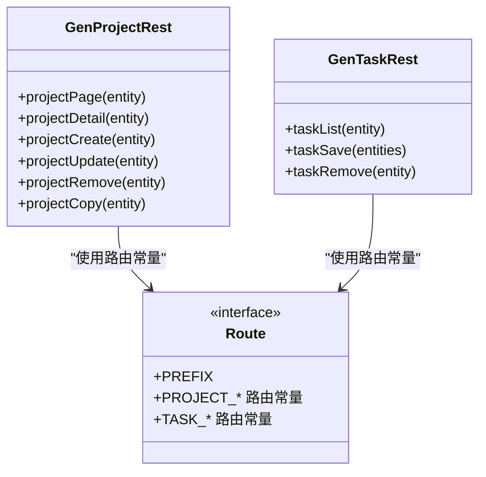
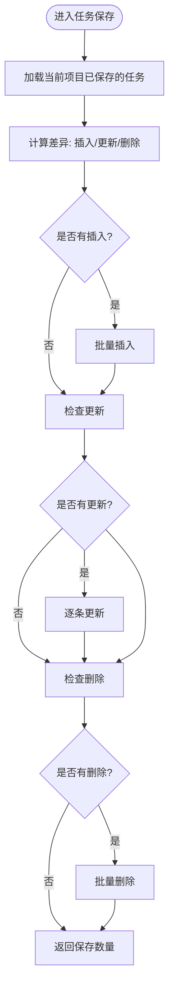
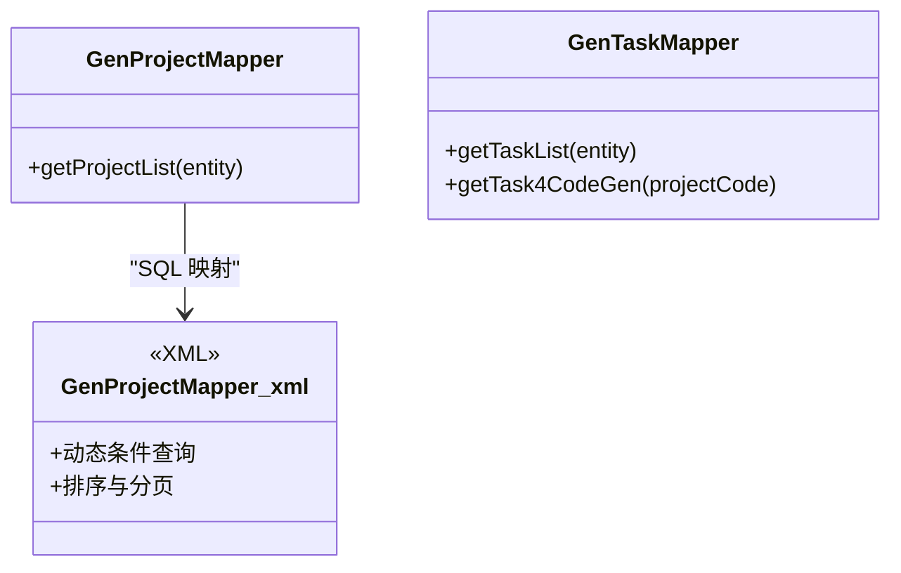
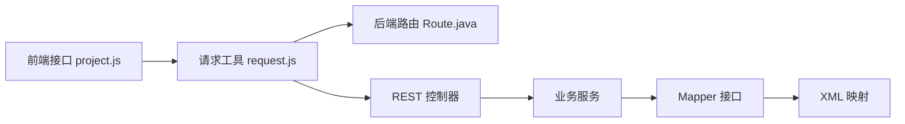
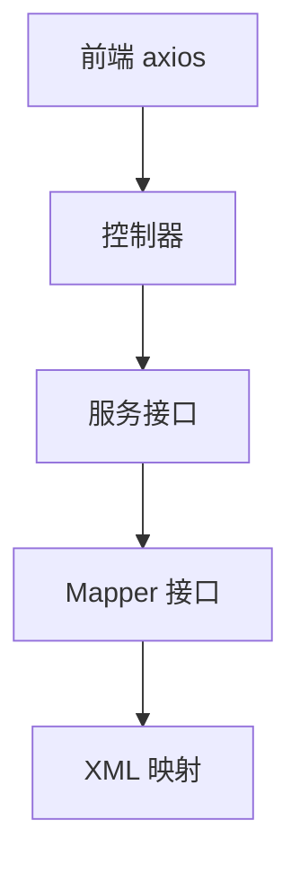

# 分层架构设计

<cite>
**本文引用的文件**
- [generator-server Route.java](file://generator-server/src/main/java/com/wkclz/generator/server/Route.java)
- [generator-server GenProjectRest.java](file://generator-server/src/main/java/com/wkclz/generator/server/rest/GenProjectRest.java)
- [generator-server GenProjectService.java](file://generator-server/src/main/java/com/wkclz/generator/server/service/GenProjectService.java)
- [generator-server GenProjectMapper.java](file://generator-server/src/main/java/com/wkclz/generator/server/mapper/GenProjectMapper.java)
- [generator-server GenProjectMapper.xml](file://generator-server/src/main/resources/mapper/GenProjectMapper.xml)
- [generator-server GenTaskRest.java](file://generator-server/src/main/java/com/wkclz/generator/server/rest/GenTaskRest.java)
- [generator-server GenTaskService.java](file://generator-server/src/main/java/com/wkclz/generator/server/service/GenTaskService.java)
- [generator-server GenTaskMapper.java](file://generator-server/src/main/java/com/wkclz/generator/server/mapper/GenTaskMapper.java)
- [generator-server GeneratorServerConfig.java](file://generator-server/src/main/java/com/wkclz/generator/server/GeneratorServerConfig.java)
- [generator-server-starter GeneratorServerApplication.java](file://generator-server-starter/src/main/java/com/wkclz/generator/server/starter/GeneratorServerApplication.java)
- [generator-ui 项目接口 project.js](file://generator-ui/src/api/project.js)
- [generator-ui HTTP 请求工具 request.js](file://generator-ui/src/utils/request.js)
</cite>

## 目录
1. 引言
2. 项目结构
3. 核心组件
4. 架构总览
5. 详细组件分析
6. 依赖分析
7. 性能考虑
8. 故障排查指南
9. 结论
10. 附录

## 引言
本文件面向 SH-Generator 项目的分层架构设计，系统采用四层架构：表现层（Controller 层）、业务逻辑层（Service 层）、数据访问层（Mapper 层）与基础设施层。围绕 MVC 模式在本项目中的落地，详细说明 REST 控制器如何处理 HTTP 请求、服务层如何封装业务逻辑、数据访问层如何管理数据库操作，并给出各层之间的调用关系图与数据传递流程，阐释分层架构在代码复用、可测试性与可维护性方面的优势。

## 项目结构
- 后端服务模块 generator-server：包含 REST 控制器、Service 业务层、MyBatis Mapper 接口与 XML 映射、路由常量等。
- 启动模块 generator-server-starter：Spring Boot 启动入口与基础扫描配置。
- 前端模块 generator-ui：基于 Vue 的前端界面，通过 axios 封装的请求工具与后端交互。
- 资源文件 generator-server/src/main/resources/mapper：MyBatis XML 映射文件。

图表来源
- [generator-server GenProjectRest.java:1-79](file://generator-server/src/main/java/com/wkclz/generator/server/rest/GenProjectRest.java#L1-L79)
- [generator-server GenTaskRest.java:1-75](file://generator-server/src/main/java/com/wkclz/generator/server/rest/GenTaskRest.java#L1-L75)
- [generator-server GenProjectService.java:1-134](file://generator-server/src/main/java/com/wkclz/generator/server/service/GenProjectService.java#L1-L134)
- [generator-server GenTaskService.java:1-114](file://generator-server/src/main/java/com/wkclz/generator/server/service/GenTaskService.java#L1-L114)
- [generator-server GenProjectMapper.java:1-15](file://generator-server/src/main/java/com/wkclz/generator/server/mapper/GenProjectMapper.java#L1-L15)
- [generator-server GenTaskMapper.java:1-20](file://generator-server/src/main/java/com/wkclz/generator/server/mapper/GenTaskMapper.java#L1-L20)
- [generator-server GenProjectMapper.xml:1-38](file://generator-server/src/main/resources/mapper/GenProjectMapper.xml#L1-L38)
- [generator-server Route.java:1-89](file://generator-server/src/main/java/com/wkclz/generator/server/Route.java#L1-L89)
- [generator-server-starter GeneratorServerApplication.java:1-16](file://generator-server-starter/src/main/java/com/wkclz/generator/server/starter/GeneratorServerApplication.java#L1-L16)
- [generator-server GeneratorServerConfig.java:1-14](file://generator-server/src/main/java/com/wkclz/generator/server/GeneratorServerConfig.java#L1-L14)
- [generator-ui 项目接口 project.js:1-34](file://generator-ui/src/api/project.js#L1-L34)
- [generator-ui HTTP 请求工具 request.js:1-155](file://generator-ui/src/utils/request.js#L1-L155)

章节来源
- [generator-server Route.java:1-89](file://generator-server/src/main/java/com/wkclz/generator/server/Route.java#L1-L89)
- [generator-server-starter GeneratorServerApplication.java:1-16](file://generator-server-starter/src/main/java/com/wkclz/generator/server/starter/GeneratorServerApplication.java#L1-L16)
- [generator-server GeneratorServerConfig.java:1-14](file://generator-server/src/main/java/com/wkclz/generator/server/GeneratorServerConfig.java#L1-L14)

## 核心组件
- 表现层（Controller 层）
  - REST 控制器负责接收 HTTP 请求，进行参数校验与入参装配，调用服务层执行业务，并以统一响应体返回结果。
  - 示例：GenProjectRest 提供项目分页、详情、新增、修改、删除、复制等接口；GenTaskRest 提供任务列表、保存、删除等接口。
- 业务逻辑层（Service 层）
  - 服务层封装核心业务规则，协调实体持久化、缓存/分布式 ID 等基础设施能力，保证事务一致性与数据完整性。
  - 示例：GenProjectService 实现项目分页查询、去重校验、复制逻辑；GenTaskService 实现任务批量保存与差异同步。
- 数据访问层（Mapper 层）
  - Mapper 接口继承通用基类，结合 MyBatis XML 映射 SQL，完成数据库 CRUD 操作。
  - 示例：GenProjectMapper 定义分页查询方法；GenTaskMapper 定义任务查询与代码生成专用查询；对应 XML 文件完成 SQL 实现。
- 基础设施层
  - 组件扫描与 Mapper 扫描由 Spring AutoConfiguration 配置；前端通过 axios 封装统一请求与响应处理。

章节来源
- [generator-server GenProjectRest.java:1-79](file://generator-server/src/main/java/com/wkclz/generator/server/rest/GenProjectRest.java#L1-L79)
- [generator-server GenTaskRest.java:1-75](file://generator-server/src/main/java/com/wkclz/generator/server/rest/GenTaskRest.java#L1-L75)
- [generator-server GenProjectService.java:1-134](file://generator-server/src/main/java/com/wkclz/generator/server/service/GenProjectService.java#L1-L134)
- [generator-server GenTaskService.java:1-114](file://generator-server/src/main/java/com/wkclz/generator/server/service/GenTaskService.java#L1-L114)
- [generator-server GenProjectMapper.java:1-15](file://generator-server/src/main/java/com/wkclz/generator/server/mapper/GenProjectMapper.java#L1-L15)
- [generator-server GenTaskMapper.java:1-20](file://generator-server/src/main/java/com/wkclz/generator/server/mapper/GenTaskMapper.java#L1-L20)
- [generator-server GenProjectMapper.xml:1-38](file://generator-server/src/main/resources/mapper/GenProjectMapper.xml#L1-L38)
- [generator-server GeneratorServerConfig.java:1-14](file://generator-server/src/main/java/com/wkclz/generator/server/GeneratorServerConfig.java#L1-L14)

## 架构总览
下图展示 MVC 在本项目中的落地：前端通过 axios 发起请求，REST 控制器解析请求并调用服务层，服务层协调 Mapper 完成数据库操作，最终返回统一响应体。

图表来源
- [generator-ui 项目接口 project.js:1-34](file://generator-ui/src/api/project.js#L1-L34)
- [generator-ui HTTP 请求工具 request.js:1-155](file://generator-ui/src/utils/request.js#L1-L155)
- [generator-server GenProjectRest.java:1-79](file://generator-server/src/main/java/com/wkclz/generator/server/rest/GenProjectRest.java#L1-L79)
- [generator-server GenProjectService.java:1-134](file://generator-server/src/main/java/com/wkclz/generator/server/service/GenProjectService.java#L1-L134)
- [generator-server GenProjectMapper.java:1-15](file://generator-server/src/main/java/com/wkclz/generator/server/mapper/GenProjectMapper.java#L1-L15)
- [generator-server GenProjectMapper.xml:1-38](file://generator-server/src/main/resources/mapper/GenProjectMapper.xml#L1-L38)

## 详细组件分析

### 表现层（Controller 层）分析
- 职责边界
  - 接收并解析 HTTP 请求，进行参数校验与入参装配，调用服务层执行业务，封装统一响应体返回。
- 接口定义与交互规则
  - 使用注解驱动的 REST 控制器，结合路由常量 Route 统一前缀与路径，确保接口命名规范与可维护性。
  - 典型流程：参数校验 → 服务调用 → 统一响应包装 → 返回结果。
- 关键实现点
  - GenProjectRest：提供分页、详情、新增、修改、删除、复制等接口，使用 SessionHelper 注入用户上下文。
  - GenTaskRest：提供任务列表、批量保存、删除等接口，对批量参数进行去重与一致性校验。

图表来源
- [generator-server GenProjectRest.java:1-79](file://generator-server/src/main/java/com/wkclz/generator/server/rest/GenProjectRest.java#L1-L79)
- [generator-server GenTaskRest.java:1-75](file://generator-server/src/main/java/com/wkclz/generator/server/rest/GenTaskRest.java#L1-L75)
- [generator-server Route.java:1-89](file://generator-server/src/main/java/com/wkclz/generator/server/Route.java#L1-L89)

章节来源
- [generator-server GenProjectRest.java:1-79](file://generator-server/src/main/java/com/wkclz/generator/server/rest/GenProjectRest.java#L1-L79)
- [generator-server GenTaskRest.java:1-75](file://generator-server/src/main/java/com/wkclz/generator/server/rest/GenTaskRest.java#L1-L75)
- [generator-server Route.java:1-89](file://generator-server/src/main/java/com/wkclz/generator/server/Route.java#L1-L89)

### 业务逻辑层（Service 层）分析
- 职责边界
  - 封装业务规则与流程控制，协调数据持久化、分布式 ID 生成、事务控制与跨实体关联更新。
- 处理逻辑与复杂度
  - GenProjectService：分页查询、去重校验、项目复制（含子任务迁移）、字段选择性更新。
  - GenTaskService：任务批量保存（插入/更新/删除三段式差异计算）、按项目维度一致性校验。
- 事务与一致性
  - 任务保存使用事务注解，确保插入、更新、删除操作的原子性。

图表来源
- [generator-server GenTaskService.java:1-114](file://generator-server/src/main/java/com/wkclz/generator/server/service/GenTaskService.java#L1-L114)

章节来源
- [generator-server GenProjectService.java:1-134](file://generator-server/src/main/java/com/wkclz/generator/server/service/GenProjectService.java#L1-L134)
- [generator-server GenTaskService.java:1-114](file://generator-server/src/main/java/com/wkclz/generator/server/service/GenTaskService.java#L1-L114)

### 数据访问层（Mapper 层）分析
- 职责边界
  - 定义数据访问契约，交由 MyBatis XML 实现 SQL，屏蔽数据库细节。
- 数据结构与复杂度
  - Mapper 接口方法与 XML 中的 SQL 对应，查询复杂度取决于 SQL 条件与索引设计。
- 关键实现点
  - GenProjectMapper：提供分页查询方法；XML 中支持多条件动态拼接与排序。
  - GenTaskMapper：提供任务列表查询与“用于代码生成”的专用查询。

图表来源
- [generator-server GenProjectMapper.java:1-15](file://generator-server/src/main/java/com/wkclz/generator/server/mapper/GenProjectMapper.java#L1-L15)
- [generator-server GenProjectMapper.xml:1-38](file://generator-server/src/main/resources/mapper/GenProjectMapper.xml#L1-L38)
- [generator-server GenTaskMapper.java:1-20](file://generator-server/src/main/java/com/wkclz/generator/server/mapper/GenTaskMapper.java#L1-L20)

章节来源
- [generator-server GenProjectMapper.java:1-15](file://generator-server/src/main/java/com/wkclz/generator/server/mapper/GenProjectMapper.java#L1-L15)
- [generator-server GenProjectMapper.xml:1-38](file://generator-server/src/main/resources/mapper/GenProjectMapper.xml#L1-L38)
- [generator-server GenTaskMapper.java:1-20](file://generator-server/src/main/java/com/wkclz/generator/server/mapper/GenTaskMapper.java#L1-L20)

### 基础设施层与前端交互
- 基础设施层
  - 组件扫描与 Mapper 扫描通过 AutoConfiguration 配置，确保服务与 Mapper 可被容器管理。
  - 启动类负责应用启动与上下文加载。
- 前端交互
  - 项目接口集中定义后端路由；HTTP 请求工具统一封装 axios，处理重复提交、错误码映射、超时与鉴权头注入等。

图表来源
- [generator-ui 项目接口 project.js:1-34](file://generator-ui/src/api/project.js#L1-L34)
- [generator-ui HTTP 请求工具 request.js:1-155](file://generator-ui/src/utils/request.js#L1-L155)
- [generator-server Route.java:1-89](file://generator-server/src/main/java/com/wkclz/generator/server/Route.java#L1-L89)
- [generator-server GenProjectRest.java:1-79](file://generator-server/src/main/java/com/wkclz/generator/server/rest/GenProjectRest.java#L1-L79)
- [generator-server GenProjectService.java:1-134](file://generator-server/src/main/java/com/wkclz/generator/server/service/GenProjectService.java#L1-L134)
- [generator-server GenProjectMapper.java:1-15](file://generator-server/src/main/java/com/wkclz/generator/server/mapper/GenProjectMapper.java#L1-L15)
- [generator-server GenProjectMapper.xml:1-38](file://generator-server/src/main/resources/mapper/GenProjectMapper.xml#L1-L38)

章节来源
- [generator-server GeneratorServerConfig.java:1-14](file://generator-server/src/main/java/com/wkclz/generator/server/GeneratorServerConfig.java#L1-L14)
- [generator-server-starter GeneratorServerApplication.java:1-16](file://generator-server-starter/src/main/java/com/wkclz/generator/server/starter/GeneratorServerApplication.java#L1-L16)
- [generator-ui 项目接口 project.js:1-34](file://generator-ui/src/api/project.js#L1-L34)
- [generator-ui HTTP 请求工具 request.js:1-155](file://generator-ui/src/utils/request.js#L1-L155)

## 依赖分析
- 组件耦合与内聚
  - 控制器仅依赖服务接口，降低对具体实现的耦合；服务层依赖 Mapper 接口，保持高内聚低耦合。
- 直接与间接依赖
  - 控制器 → 服务接口；服务接口 → Mapper 接口；Mapper 接口 → XML 映射。
- 外部依赖与集成点
  - 前端通过 axios 与后端 REST 接口通信；后端通过 MyBatis 访问数据库；Spring 自动装配组件与扫描包。

图表来源
- [generator-server GenProjectRest.java:1-79](file://generator-server/src/main/java/com/wkclz/generator/server/rest/GenProjectRest.java#L1-L79)
- [generator-server GenProjectService.java:1-134](file://generator-server/src/main/java/com/wkclz/generator/server/service/GenProjectService.java#L1-L134)
- [generator-server GenProjectMapper.java:1-15](file://generator-server/src/main/java/com/wkclz/generator/server/mapper/GenProjectMapper.java#L1-L15)
- [generator-ui HTTP 请求工具 request.js:1-155](file://generator-ui/src/utils/request.js#L1-L155)

章节来源
- [generator-server GenProjectRest.java:1-79](file://generator-server/src/main/java/com/wkclz/generator/server/rest/GenProjectRest.java#L1-L79)
- [generator-server GenProjectService.java:1-134](file://generator-server/src/main/java/com/wkclz/generator/server/service/GenProjectService.java#L1-L134)
- [generator-server GenProjectMapper.java:1-15](file://generator-server/src/main/java/com/wkclz/generator/server/mapper/GenProjectMapper.java#L1-L15)
- [generator-ui HTTP 请求工具 request.js:1-155](file://generator-ui/src/utils/request.js#L1-L155)

## 性能考虑
- 分页查询与动态 SQL
  - 使用分页查询与动态条件拼接，避免一次性加载全量数据；合理设计索引以提升查询性能。
- 批量操作
  - 任务保存采用批量插入与批量删除，减少往返次数；更新采用差异计算，避免全量写入。
- 前端防重复提交
  - 请求工具内置防重复提交策略，降低无效请求对后端的压力。
- 事务边界
  - 任务保存使用事务，确保一致性的同时尽量缩短事务时间，减少锁竞争。

## 故障排查指南
- 常见问题定位
  - 参数校验失败：检查控制器参数校验与必填项约束。
  - 记录不存在或重复：服务层抛出业务异常，需核对唯一性条件与记录状态。
  - 数据库访问异常：查看 MyBatis XML SQL 与 Mapper 方法是否匹配，确认连接与权限。
- 前端错误处理
  - 统一响应码映射与错误提示，关注 401、500、601 等状态码对应的处理逻辑。
- 运行时诊断
  - 启动类与配置类确保组件扫描与 Mapper 扫描生效，避免 Bean 未注册导致的空指针。

章节来源
- [generator-server GenProjectRest.java:64-75](file://generator-server/src/main/java/com/wkclz/generator/server/rest/GenProjectRest.java#L64-L75)
- [generator-server GenTaskRest.java:47-71](file://generator-server/src/main/java/com/wkclz/generator/server/rest/GenTaskRest.java#L47-L71)
- [generator-server GenProjectService.java:112-131](file://generator-server/src/main/java/com/wkclz/generator/server/service/GenProjectService.java#L112-L131)
- [generator-ui HTTP 请求工具 request.js:75-125](file://generator-ui/src/utils/request.js#L75-L125)

## 结论
本项目通过清晰的四层架构实现了职责分离与高内聚低耦合：表现层专注请求处理与响应封装，业务层承载核心规则与事务控制，数据访问层屏蔽底层细节，基础设施层提供启动与扫描配置。该架构提升了代码复用性、可测试性与可维护性，便于后续扩展与演进。

## 附录
- 路由常量与接口一览
  - 项目相关路由：分页、详情、新增、修改、删除、复制。
  - 任务相关路由：列表、保存、删除。
- 前端接口与请求工具
  - 项目接口集中定义后端路由；请求工具统一封装 axios，处理鉴权、错误与下载等。

章节来源
- [generator-server Route.java:1-89](file://generator-server/src/main/java/com/wkclz/generator/server/Route.java#L1-L89)
- [generator-ui 项目接口 project.js:1-34](file://generator-ui/src/api/project.js#L1-L34)
- [generator-ui HTTP 请求工具 request.js:1-155](file://generator-ui/src/utils/request.js#L1-L155)