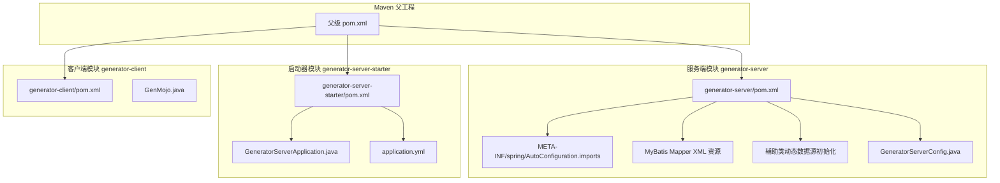
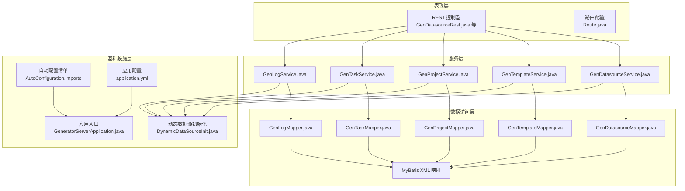
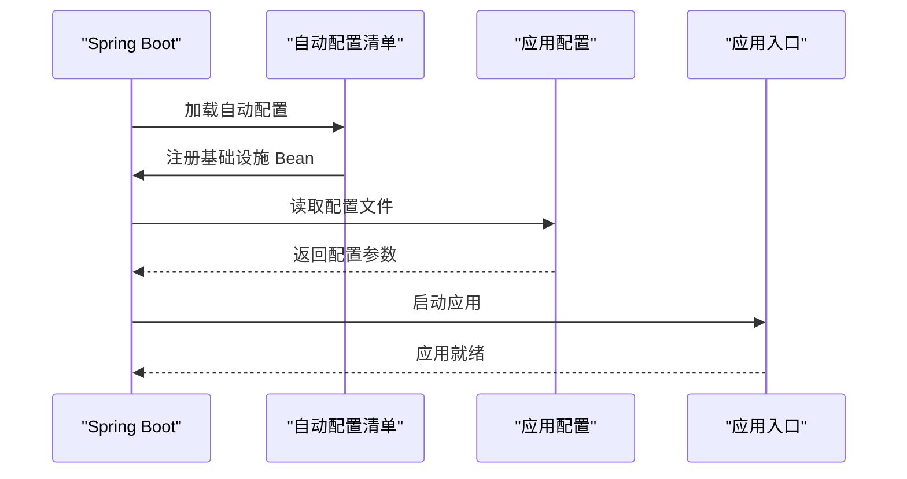
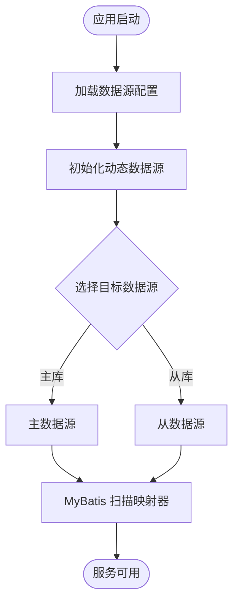
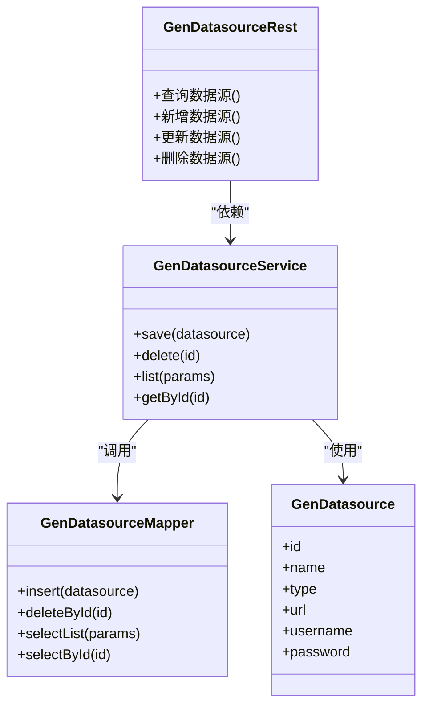
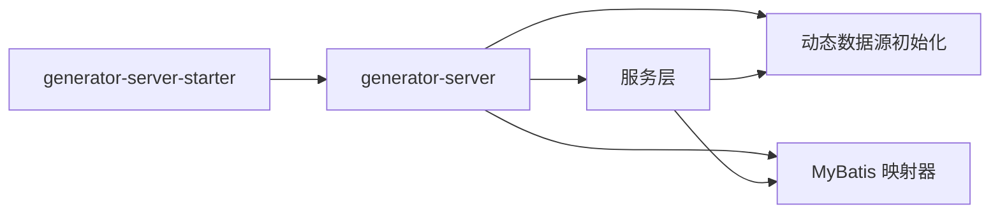

# 基础设施层设计

<cite>
**本文档引用的文件**
- [pom.xml](file://pom.xml)
- [generator-server/pom.xml](file://generator-server/pom.xml)
- [generator-server-starter/pom.xml](file://generator-server-starter/pom.xml)
- [application.yml](file://generator-server-starter/src/main/resources/config/application.yml)
- [AutoConfiguration.imports](file://generator-server/src/main/resources/META-INF/spring/AutoConfiguration.imports)
- [DynamicDataSourceInit.java](file://generator-server/src/main/java/com/wkclz/generator/server/helper/DynamicDataSourceInit.java)
- [GeneratorServerConfig.java](file://generator-server/src/main/java/com/wkclz/generator/server/GeneratorServerConfig.java)
- [GenDatasourceMapper.java](file://generator-server/src/main/java/com/wkclz/generator/server/mapper/GenDatasourceMapper.java)
- [GenDatasourceMapper.xml](file://generator-server/src/main/resources/mapper/GenDatasourceMapper.xml)
- [GenDatasourceRest.java](file://generator-server/src/main/java/com/wkclz/generator/server/rest/GenDatasourceRest.java)
- [GenDatasourceService.java](file://generator-server/src/main/java/com/wkclz/generator/server/service/GenDatasourceService.java)
- [GenDatasource.java](file://generator-server/src/main/java/com/wkclz/generator/server/bean/entity/GenDatasource.java)
- [GenTaskService.java](file://generator-server/src/main/java/com/wkclz/generator/server/service/GenTaskService.java)
- [GenTask.java](file://generator-server/src/main/java/com/wkclz/generator/server/bean/entity/GenTask.java)
- [GenTemplateService.java](file://generator-server/src/main/java/com/wkclz/generator/server/service/GenTemplateService.java)
- [GenTemplate.java](file://generator-server/src/main/java/com/wkclz/generator/server/bean/entity/GenTemplate.java)
- [GenProjectService.java](file://generator-server/src/main/java/com/wkclz/generator/server/service/GenProjectService.java)
- [GenProject.java](file://generator-server/src/main/java/com/wkclz/generator/server/bean/entity/GenProject.java)
- [GenLogService.java](file://generator-server/src/main/java/com/wkclz/generator/server/service/GenLogService.java)
- [GenLog.java](file://generator-server/src/main/java/com/wkclz/generator/server/bean/entity/GenLog.java)
- [Route.java](file://generator-server/src/main/java/com/wkclz/generator/server/Route.java)
- [GeneratorServerApplication.java](file://generator-server-starter/src/main/java/com/wkclz/generator/server/starter/GeneratorServerApplication.java)
</cite>

## 目录
1. [引言](#引言)
2. [项目结构](#项目结构)
3. [核心组件](#核心组件)
4. [架构总览](#架构总览)
5. [详细组件分析](#详细组件分析)
6. [依赖关系分析](#依赖关系分析)
7. [性能考虑](#性能考虑)
8. [故障排除指南](#故障排除指南)
9. [结论](#结论)
10. [附录](#附录)

## 引言
本文件聚焦于 SH-Generator 的基础设施层设计，系统性阐述 Spring Boot 配置、数据源与 MyBatis 集成、模板引擎配置、动态数据源初始化机制、自动配置类作用、组件扫描与依赖注入策略，以及如何通过基础设施层提供数据库连接池管理、缓存、安全与监控等支撑能力。文档同时给出配置示例与部署最佳实践，覆盖生产环境配置、性能优化与常见故障排除。

## 项目结构
项目采用多模块 Maven 结构，基础设施层主要集中在 generator-server 模块中，通过 starter 模块对外暴露应用入口与默认配置。关键模块职责如下：
- generator-server：业务服务、数据访问、REST 接口、自动配置与资源文件（MyBatis Mapper XML、Spring 自动配置导入清单）
- generator-server-starter：Spring Boot 启动器，包含应用入口与默认配置文件
- generator-client：Maven 插件客户端（用于代码生成任务的构建期集成）

**图表来源**
- [pom.xml:1-200](file://pom.xml#L1-L200)
- [generator-server/pom.xml:1-200](file://generator-server/pom.xml#L1-L200)
- [generator-server-starter/pom.xml:1-200](file://generator-server-starter/pom.xml#L1-L200)

**章节来源**
- [pom.xml:1-200](file://pom.xml#L1-L200)
- [generator-server/pom.xml:1-200](file://generator-server/pom.xml#L1-L200)
- [generator-server-starter/pom.xml:1-200](file://generator-server-starter/pom.xml#L1-L200)

## 核心组件
基础设施层的核心组件围绕以下方面展开：
- Spring Boot 自动配置与组件扫描：通过 AutoConfiguration.imports 定义自动装配入口，结合 @EnableAutoConfiguration 或注解驱动的条件装配
- 数据源与 MyBatis 集成：基于动态数据源初始化机制，支持多数据源切换；MyBatis 映射器与 XML 配置分离
- REST 层与服务层：提供数据源、模板、项目、日志、任务等业务接口与服务实现
- 配置中心与默认配置：通过 application.yml 提供默认参数，便于在不同环境快速部署

关键文件与职责：
- 自动配置清单：定义自动装配入口，确保服务启动时加载必要的基础设施 Bean
- 动态数据源初始化：根据运行时配置或上下文动态选择数据源
- MyBatis 映射器：DAO 层接口与 XML 映射文件分离，提升可维护性
- REST 控制器与服务：对外暴露 CRUD 与业务操作接口
- 应用入口与默认配置：启动器模块负责应用启动与默认配置加载

**章节来源**
- [AutoConfiguration.imports:1-50](file://generator-server/src/main/resources/META-INF/spring/AutoConfiguration.imports#L1-L50)
- [DynamicDataSourceInit.java:1-200](file://generator-server/src/main/java/com/wkclz/generator/server/helper/DynamicDataSourceInit.java#L1-L200)
- [GenDatasourceMapper.java:1-200](file://generator-server/src/main/java/com/wkclz/generator/server/mapper/GenDatasourceMapper.java#L1-L200)
- [GenDatasourceMapper.xml:1-200](file://generator-server/src/main/resources/mapper/GenDatasourceMapper.xml#L1-L200)
- [GenDatasourceRest.java:1-200](file://generator-server/src/main/java/com/wkclz/generator/server/rest/GenDatasourceRest.java#L1-L200)
- [GeneratorServerApplication.java:1-200](file://generator-server-starter/src/main/java/com/wkclz/generator/server/starter/GeneratorServerApplication.java#L1-L200)
- [application.yml:1-200](file://generator-server-starter/src/main/resources/config/application.yml#L1-L200)

## 架构总览
基础设施层采用分层架构，自上而下为表现层（REST）、服务层（Service）、数据访问层（MyBatis Mapper），并通过动态数据源机制实现多数据源支持。自动配置与组件扫描确保 Bean 的按需装配，启动器模块提供统一的默认配置与启动入口。

**图表来源**
- [GenDatasourceRest.java:1-200](file://generator-server/src/main/java/com/wkclz/generator/server/rest/GenDatasourceRest.java#L1-L200)
- [GenDatasourceService.java:1-200](file://generator-server/src/main/java/com/wkclz/generator/server/service/GenDatasourceService.java#L1-L200)
- [GenDatasourceMapper.java:1-200](file://generator-server/src/main/java/com/wkclz/generator/server/mapper/GenDatasourceMapper.java#L1-L200)
- [GenDatasourceMapper.xml:1-200](file://generator-server/src/main/resources/mapper/GenDatasourceMapper.xml#L1-L200)
- [DynamicDataSourceInit.java:1-200](file://generator-server/src/main/java/com/wkclz/generator/server/helper/DynamicDataSourceInit.java#L1-L200)
- [AutoConfiguration.imports:1-50](file://generator-server/src/main/resources/META-INF/spring/AutoConfiguration.imports#L1-L50)
- [GeneratorServerApplication.java:1-200](file://generator-server-starter/src/main/java/com/wkclz/generator/server/starter/GeneratorServerApplication.java#L1-L200)
- [application.yml:1-200](file://generator-server-starter/src/main/resources/config/application.yml#L1-L200)

## 详细组件分析

### Spring Boot 自动配置与组件扫描
- 自动配置清单：通过 Spring 自动配置导入清单定义自动装配入口，确保在应用启动时加载必要的基础设施 Bean，如数据源、事务管理器、MyBatis 组件等
- 组件扫描：结合 @ComponentScan 或默认扫描规则，确保服务层、控制器、配置类被正确注册为 Bean
- 条件装配：利用 @ConditionalOnProperty、@ConditionalOnMissingBean 等条件注解，实现按需装配与默认值覆盖

**图表来源**
- [AutoConfiguration.imports:1-50](file://generator-server/src/main/resources/META-INF/spring/AutoConfiguration.imports#L1-L50)
- [application.yml:1-200](file://generator-server-starter/src/main/resources/config/application.yml#L1-L200)
- [GeneratorServerApplication.java:1-200](file://generator-server-starter/src/main/java/com/wkclz/generator/server/starter/GeneratorServerApplication.java#L1-L200)

**章节来源**
- [AutoConfiguration.imports:1-50](file://generator-server/src/main/resources/META-INF/spring/AutoConfiguration.imports#L1-L50)
- [GeneratorServerApplication.java:1-200](file://generator-server-starter/src/main/java/com/wkclz/generator/server/starter/GeneratorServerApplication.java#L1-L200)

### 数据源与 MyBatis 集成
- 动态数据源初始化：根据运行时上下文或配置选择目标数据源，支持多数据源场景下的切换与隔离
- MyBatis 映射器：DAO 接口与 XML 映射文件分离，提升可维护性与可测试性
- 配置要点：数据源连接池参数、事务管理、MyBatis 配置项（如类型别名、插件、映射路径）等

**图表来源**
- [DynamicDataSourceInit.java:1-200](file://generator-server/src/main/java/com/wkclz/generator/server/helper/DynamicDataSourceInit.java#L1-L200)
- [GenDatasourceMapper.java:1-200](file://generator-server/src/main/java/com/wkclz/generator/server/mapper/GenDatasourceMapper.java#L1-L200)
- [GenDatasourceMapper.xml:1-200](file://generator-server/src/main/resources/mapper/GenDatasourceMapper.xml#L1-L200)

**章节来源**
- [DynamicDataSourceInit.java:1-200](file://generator-server/src/main/java/com/wkclz/generator/server/helper/DynamicDataSourceInit.java#L1-L200)
- [GenDatasourceMapper.java:1-200](file://generator-server/src/main/java/com/wkclz/generator/server/mapper/GenDatasourceMapper.java#L1-L200)
- [GenDatasourceMapper.xml:1-200](file://generator-server/src/main/resources/mapper/GenDatasourceMapper.xml#L1-L200)

### REST 层与服务层
- REST 控制器：对外提供数据源、模板、项目、日志、任务等资源接口，负责请求处理与响应封装
- 服务层：封装业务逻辑，协调数据访问与外部依赖，保证接口幂等与一致性
- 实体模型：GenDatasource、GenTemplate、GenProject、GenTask、GenLog 等实体定义了数据结构与业务语义

**图表来源**
- [GenDatasourceRest.java:1-200](file://generator-server/src/main/java/com/wkclz/generator/server/rest/GenDatasourceRest.java#L1-L200)
- [GenDatasourceService.java:1-200](file://generator-server/src/main/java/com/wkclz/generator/server/service/GenDatasourceService.java#L1-L200)
- [GenDatasourceMapper.java:1-200](file://generator-server/src/main/java/com/wkclz/generator/server/mapper/GenDatasourceMapper.java#L1-L200)
- [GenDatasource.java:1-200](file://generator-server/src/main/java/com/wkclz/generator/server/bean/entity/GenDatasource.java#L1-L200)

**章节来源**
- [GenDatasourceRest.java:1-200](file://generator-server/src/main/java/com/wkclz/generator/server/rest/GenDatasourceRest.java#L1-L200)
- [GenDatasourceService.java:1-200](file://generator-server/src/main/java/com/wkclz/generator/server/service/GenDatasourceService.java#L1-L200)
- [GenDatasourceMapper.java:1-200](file://generator-server/src/main/java/com/wkclz/generator/server/mapper/GenDatasourceMapper.java#L1-L200)
- [GenDatasource.java:1-200](file://generator-server/src/main/java/com/wkclz/generator/server/bean/entity/GenDatasource.java#L1-L200)

### 配置与部署
- 默认配置：application.yml 提供基础参数，如服务器端口、数据库连接、日志级别、线程池大小等
- 启动器模块：GeneratorServerApplication 作为应用入口，加载默认配置并启动 Spring 容器
- 部署建议：生产环境建议通过环境变量或配置中心覆盖默认配置，启用 HTTPS、限流与健康检查，合理设置连接池与线程池参数

**章节来源**
- [application.yml:1-200](file://generator-server-starter/src/main/resources/config/application.yml#L1-L200)
- [GeneratorServerApplication.java:1-200](file://generator-server-starter/src/main/java/com/wkclz/generator/server/starter/GeneratorServerApplication.java#L1-L200)

## 依赖关系分析
基础设施层的依赖关系体现为模块间清晰的边界与弱耦合：
- generator-server 依赖 generator-server-starter 的启动能力与默认配置
- 服务层依赖数据访问层的映射器接口与 XML 配置
- 动态数据源初始化为服务层提供数据源选择能力
- 自动配置清单与应用配置共同决定 Bean 的装配顺序与参数

**图表来源**
- [generator-server-starter/pom.xml:1-200](file://generator-server-starter/pom.xml#L1-L200)
- [generator-server/pom.xml:1-200](file://generator-server/pom.xml#L1-L200)
- [DynamicDataSourceInit.java:1-200](file://generator-server/src/main/java/com/wkclz/generator/server/helper/DynamicDataSourceInit.java#L1-L200)
- [GenDatasourceMapper.java:1-200](file://generator-server/src/main/java/com/wkclz/generator/server/mapper/GenDatasourceMapper.java#L1-L200)

**章节来源**
- [generator-server-starter/pom.xml:1-200](file://generator-server-starter/pom.xml#L1-L200)
- [generator-server/pom.xml:1-200](file://generator-server/pom.xml#L1-L200)

## 性能考虑
- 连接池参数：合理设置最大连接数、空闲超时、连接生命周期，避免连接泄漏与抖动
- 线程池配置：根据业务并发特征调整核心线程数、最大线程数与队列长度
- SQL 优化：通过 MyBatis XML 精准编写 SQL，配合索引与分页策略降低数据库压力
- 缓存策略：对热点数据引入本地或分布式缓存，减少重复查询
- 监控与告警：启用健康检查、慢查询日志与性能指标采集，及时发现瓶颈

## 故障排除指南
- 启动失败：检查 application.yml 中的数据库连接信息与端口占用情况，确认自动配置清单是否正确加载
- 数据源异常：核对动态数据源初始化逻辑，验证目标数据源标识与连接参数
- MyBatis 映射错误：检查映射器接口与 XML 文件命名与路径是否一致，确认 SQL 语法与表结构匹配
- 服务不可用：查看服务层日志与异常栈，定位具体业务环节与数据问题
- 性能问题：通过慢查询日志与监控指标定位热点接口与 SQL，结合缓存与索引优化

**章节来源**
- [application.yml:1-200](file://generator-server-starter/src/main/resources/config/application.yml#L1-L200)
- [DynamicDataSourceInit.java:1-200](file://generator-server/src/main/java/com/wkclz/generator/server/helper/DynamicDataSourceInit.java#L1-L200)
- [GenDatasourceMapper.xml:1-200](file://generator-server/src/main/resources/mapper/GenDatasourceMapper.xml#L1-L200)

## 结论
基础设施层通过 Spring Boot 自动配置、动态数据源初始化与 MyBatis 集成，提供了稳定、可扩展且易于维护的系统支撑能力。结合合理的配置与部署实践，能够在生产环境中实现高可用与高性能。建议持续完善监控体系与容量规划，以应对业务增长带来的挑战。

## 附录
- 配置示例参考路径：
  - [application.yml:1-200](file://generator-server-starter/src/main/resources/config/application.yml#L1-L200)
  - [AutoConfiguration.imports:1-50](file://generator-server/src/main/resources/META-INF/spring/AutoConfiguration.imports#L1-L50)
- 关键实现参考路径：
  - [DynamicDataSourceInit.java:1-200](file://generator-server/src/main/java/com/wkclz/generator/server/helper/DynamicDataSourceInit.java#L1-L200)
  - [GenDatasourceMapper.java:1-200](file://generator-server/src/main/java/com/wkclz/generator/server/mapper/GenDatasourceMapper.java#L1-L200)
  - [GenDatasourceMapper.xml:1-200](file://generator-server/src/main/resources/mapper/GenDatasourceMapper.xml#L1-L200)
  - [GenDatasourceRest.java:1-200](file://generator-server/src/main/java/com/wkclz/generator/server/rest/GenDatasourceRest.java#L1-L200)
  - [GeneratorServerApplication.java:1-200](file://generator-server-starter/src/main/java/com/wkclz/generator/server/starter/GeneratorServerApplication.java#L1-L200)