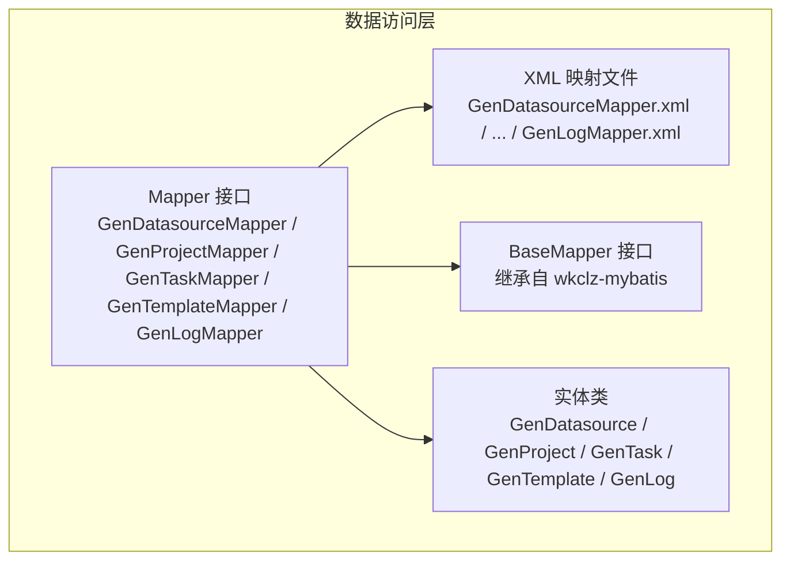
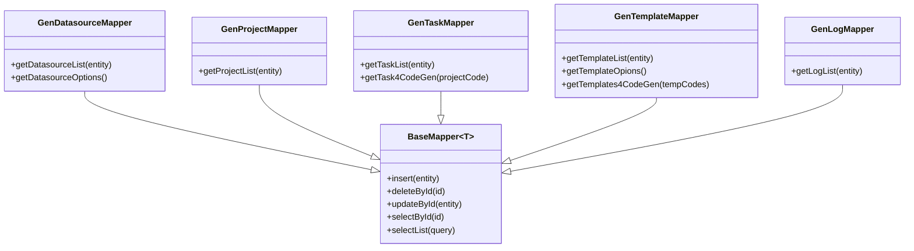
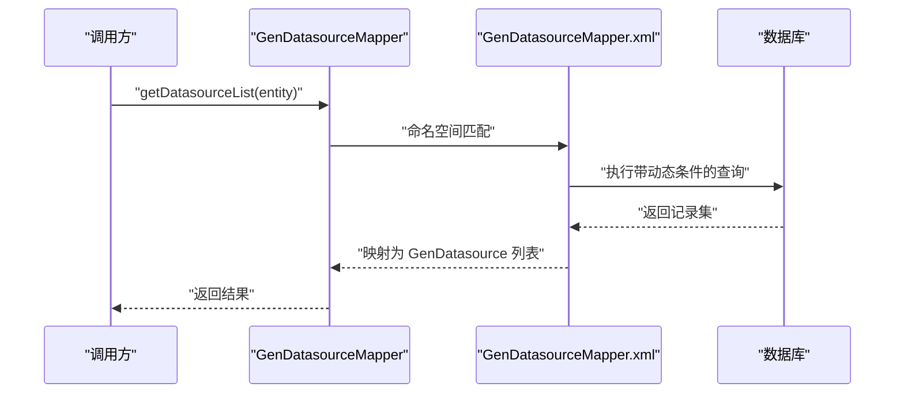
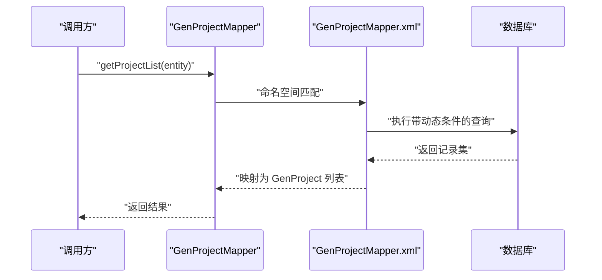
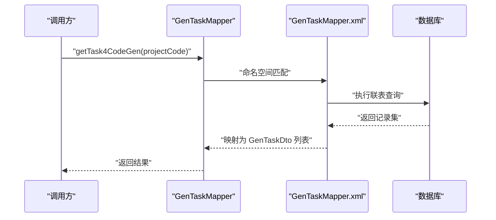
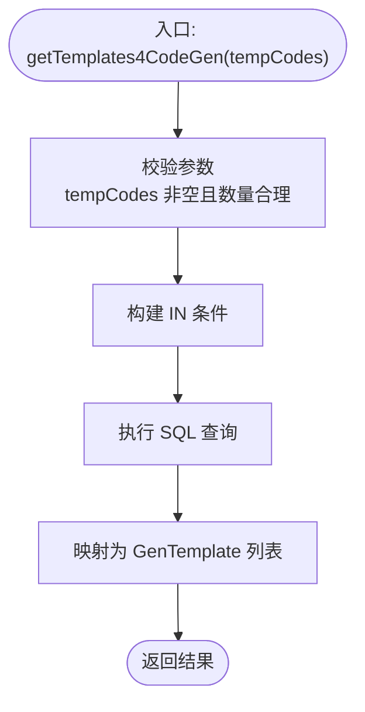
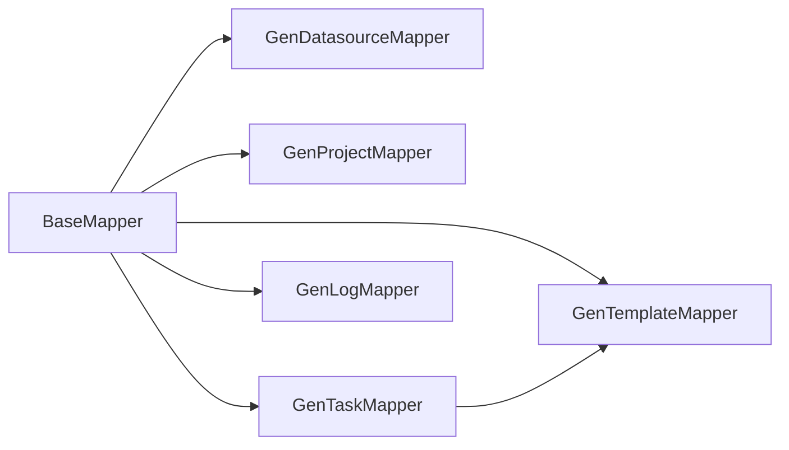

# 数据访问层设计

<cite>
**本文引用的文件**
- [GenDatasourceMapper.java](file://generator-server/src/main/java/com/wkclz/generator/server/mapper/GenDatasourceMapper.java)
- [GenProjectMapper.java](file://generator-server/src/main/java/com/wkclz/generator/server/mapper/GenProjectMapper.java)
- [GenTaskMapper.java](file://generator-server/src/main/java/com/wkclz/generator/server/mapper/GenTaskMapper.java)
- [GenTemplateMapper.java](file://generator-server/src/main/java/com/wkclz/generator/server/mapper/GenTemplateMapper.java)
- [GenLogMapper.java](file://generator-server/src/main/java/com/wkclz/generator/server/mapper/GenLogMapper.java)
- [GenDatasourceMapper.xml](file://generator-server/src/main/resources/mapper/GenDatasourceMapper.xml)
- [GenProjectMapper.xml](file://generator-server/src/main/resources/mapper/GenProjectMapper.xml)
- [GenTaskMapper.xml](file://generator-server/src/main/resources/mapper/GenTaskMapper.xml)
- [GenTemplateMapper.xml](file://generator-server/src/main/resources/mapper/GenTemplateMapper.xml)
- [GenLogMapper.xml](file://generator-server/src/main/resources/mapper/GenLogMapper.xml)
- [GenDatasource.java](file://generator-server/src/main/java/com/wkclz/generator/server/bean/entity/GenDatasource.java)
- [GenProject.java](file://generator-server/src/main/java/com/wkclz/generator/server/bean/entity/GenProject.java)
- [GenTask.java](file://generator-server/src/main/java/com/wkclz/generator/server/bean/entity/GenTask.java)
- [GenTemplate.java](file://generator-server/src/main/java/com/wkclz/generator/server/bean/entity/GenTemplate.java)
- [GenLog.java](file://generator-server/src/main/java/com/wkclz/generator/server/bean/entity/GenLog.java)
</cite>

## 目录
1. [简介](#简介)
2. [项目结构](#项目结构)
3. [核心组件](#核心组件)
4. [架构总览](#架构总览)
5. [详细组件分析](#详细组件分析)
6. [依赖分析](#依赖分析)
7. [性能考虑](#性能考虑)
8. [故障排查指南](#故障排查指南)
9. [结论](#结论)

## 简介
本文件系统化梳理 SH-Generator 的 MyBatis 数据访问层（DAO）设计与实现，重点覆盖以下方面：
- Mapper 接口的职责划分与扩展点
- XML 映射文件的 SQL 编写规范与动态条件拼接
- 实体模型与字段约束
- 常见 CRUD、复杂查询、批量操作的实现思路
- 连接管理、事务与性能优化建议
- 最佳实践与常见问题排查

## 项目结构
数据访问层位于 generator-server 模块中，采用“接口 + XML 映射”的标准 MyBatis 架构：
- 接口层：位于 mapper 包，声明 CRUD 与业务查询方法
- 映射层：位于 resources/mapper，以 XML 定义 SQL 与结果映射
- 实体层：位于 bean/entity，承载表结构与字段注解
- 继承基类：所有 Mapper 继承通用 BaseMapper，获得基础增删改查能力

图表来源
- [GenDatasourceMapper.java:1-17](file://generator-server/src/main/java/com/wkclz/generator/server/mapper/GenDatasourceMapper.java#L1-L17)
- [GenProjectMapper.java:1-15](file://generator-server/src/main/java/com/wkclz/generator/server/mapper/GenProjectMapper.java#L1-L15)
- [GenTaskMapper.java:1-20](file://generator-server/src/main/java/com/wkclz/generator/server/mapper/GenTaskMapper.java#L1-L20)
- [GenTemplateMapper.java:1-19](file://generator-server/src/main/java/com/wkclz/generator/server/mapper/GenTemplateMapper.java#L1-L19)
- [GenLogMapper.java:1-15](file://generator-server/src/main/java/com/wkclz/generator/server/mapper/GenLogMapper.java#L1-L15)
- [GenDatasourceMapper.xml:1-59](file://generator-server/src/main/resources/mapper/GenDatasourceMapper.xml#L1-L59)
- [GenProjectMapper.xml:1-38](file://generator-server/src/main/resources/mapper/GenProjectMapper.xml#L1-L38)
- [GenTaskMapper.xml:1-62](file://generator-server/src/main/resources/mapper/GenTaskMapper.xml#L1-L62)
- [GenTemplateMapper.xml:1-73](file://generator-server/src/main/resources/mapper/GenTemplateMapper.xml#L1-L73)
- [GenLogMapper.xml:1-36](file://generator-server/src/main/resources/mapper/GenLogMapper.xml#L1-L36)

章节来源
- [GenDatasourceMapper.java:1-17](file://generator-server/src/main/java/com/wkclz/generator/server/mapper/GenDatasourceMapper.java#L1-L17)
- [GenProjectMapper.java:1-15](file://generator-server/src/main/java/com/wkclz/generator/server/mapper/GenProjectMapper.java#L1-L15)
- [GenTaskMapper.java:1-20](file://generator-server/src/main/java/com/wkclz/generator/server/mapper/GenTaskMapper.java#L1-L20)
- [GenTemplateMapper.java:1-19](file://generator-server/src/main/java/com/wkclz/generator/server/mapper/GenTemplateMapper.java#L1-L19)
- [GenLogMapper.java:1-15](file://generator-server/src/main/java/com/wkclz/generator/server/mapper/GenLogMapper.java#L1-L15)

## 核心组件
- GenDatasourceMapper：数据源相关查询，支持列表查询与选项查询
- GenProjectMapper：项目信息查询，支持多字段模糊与精确过滤
- GenTaskMapper：任务查询，包含常规列表与代码生成专用联表查询
- GenTemplateMapper：模板查询，支持列表、选项与批量按编码查询
- GenLogMapper：日志查询，支持时间范围与多字段过滤

每个 Mapper 均继承通用 BaseMapper，具备基础的增删改查能力；同时在接口中声明业务方法，在 XML 中实现 SQL。

章节来源
- [GenDatasourceMapper.java:10-16](file://generator-server/src/main/java/com/wkclz/generator/server/mapper/GenDatasourceMapper.java#L10-L16)
- [GenProjectMapper.java:10-14](file://generator-server/src/main/java/com/wkclz/generator/server/mapper/GenProjectMapper.java#L10-L14)
- [GenTaskMapper.java:12-19](file://generator-server/src/main/java/com/wkclz/generator/server/mapper/GenTaskMapper.java#L12-L19)
- [GenTemplateMapper.java:11-18](file://generator-server/src/main/java/com/wkclz/generator/server/mapper/GenTemplateMapper.java#L11-L18)
- [GenLogMapper.java:10-14](file://generator-server/src/main/java/com/wkclz/generator/server/mapper/GenLogMapper.java#L10-L14)

## 架构总览
MyBatis 数据访问层遵循“接口驱动 + XML 配置”的分层设计：
- Mapper 接口：定义方法签名与参数类型，返回实体或 DTO 列表
- XML 映射：通过 namespace 关联到对应 Mapper，使用动态 SQL 条件拼接
- 实体类：承载表字段与注解，用于结果映射与拷贝工具
- BaseMapper：提供通用 CRUD 能力，减少重复实现

图表来源
- [GenDatasourceMapper.java:10-16](file://generator-server/src/main/java/com/wkclz/generator/server/mapper/GenDatasourceMapper.java#L10-L16)
- [GenProjectMapper.java:10-14](file://generator-server/src/main/java/com/wkclz/generator/server/mapper/GenProjectMapper.java#L10-L14)
- [GenTaskMapper.java:12-19](file://generator-server/src/main/java/com/wkclz/generator/server/mapper/GenTaskMapper.java#L12-L19)
- [GenTemplateMapper.java:11-18](file://generator-server/src/main/java/com/wkclz/generator/server/mapper/GenTemplateMapper.java#L11-L18)
- [GenLogMapper.java:10-14](file://generator-server/src/main/java/com/wkclz/generator/server/mapper/GenLogMapper.java#L10-L14)

## 详细组件分析

### GenDatasourceMapper（数据源）
- 职责
  - 列表查询：根据数据源编码、类型、主机、模式、用户等条件进行模糊/精确匹配
  - 选项查询：返回可选的数据源列表，用于下拉选择
- SQL 特性
  - 使用动态条件拼接，支持多字段组合过滤
  - 排序规则：优先按 sort 升序，再按主键降序
- 性能要点
  - 建议在 db_code、db_type、user_code 上建立索引
  - LIKE 模糊匹配避免前缀通配，必要时考虑全文检索或应用侧预处理

图表来源
- [GenDatasourceMapper.java:12-12](file://generator-server/src/main/java/com/wkclz/generator/server/mapper/GenDatasourceMapper.java#L12-L12)
- [GenDatasourceMapper.xml:5-34](file://generator-server/src/main/resources/mapper/GenDatasourceMapper.xml#L5-L34)

章节来源
- [GenDatasourceMapper.java:12-14](file://generator-server/src/main/java/com/wkclz/generator/server/mapper/GenDatasourceMapper.java#L12-L14)
- [GenDatasourceMapper.xml:5-34](file://generator-server/src/main/resources/mapper/GenDatasourceMapper.xml#L5-L34)

### GenProjectMapper（项目）
- 职责
  - 查询项目列表，支持项目编码、模块名、项目名、用户、数据库编码等过滤
- SQL 特性
  - 多条件动态拼接，排序规则：sort 升序、id 降序
- 性能要点
  - 在 project_code、module_name、project_name、user_code、db_code 建立复合索引或单列索引，视查询分布而定

图表来源
- [GenProjectMapper.java:12-12](file://generator-server/src/main/java/com/wkclz/generator/server/mapper/GenProjectMapper.java#L12-L12)
- [GenProjectMapper.xml:5-34](file://generator-server/src/main/resources/mapper/GenProjectMapper.xml#L5-L34)

章节来源
- [GenProjectMapper.java:12-12](file://generator-server/src/main/java/com/wkclz/generator/server/mapper/GenProjectMapper.java#L12-L12)
- [GenProjectMapper.xml:5-34](file://generator-server/src/main/resources/mapper/GenProjectMapper.xml#L5-L34)

### GenTaskMapper（任务）
- 职责
  - 常规任务列表查询
  - 代码生成专用查询：按项目编码联表查询模板关键信息，用于生成流程
- SQL 特性
  - 常规查询：多字段动态过滤，排序 id 升序
  - 生成查询：INNER JOIN 模板表，按项目编码过滤，返回任务与模板的关键字段
- 性能要点
  - 生成查询涉及联表，建议在 project_code、temp_code 建索引
  - 控制返回字段，避免 SELECT *

图表来源
- [GenTaskMapper.java:16-16](file://generator-server/src/main/java/com/wkclz/generator/server/mapper/GenTaskMapper.java#L16-L16)
- [GenTaskMapper.xml:38-58](file://generator-server/src/main/resources/mapper/GenTaskMapper.xml#L38-L58)

章节来源
- [GenTaskMapper.java:14-16](file://generator-server/src/main/java/com/wkclz/generator/server/mapper/GenTaskMapper.java#L14-L16)
- [GenTaskMapper.xml:5-35](file://generator-server/src/main/resources/mapper/GenTaskMapper.xml#L5-L35)
- [GenTaskMapper.xml:38-58](file://generator-server/src/main/resources/mapper/GenTaskMapper.xml#L38-L58)

### GenTemplateMapper（模板）
- 职责
  - 模板列表查询、选项查询
  - 批量按模板编码查询模板内容，用于生成阶段读取模板
- SQL 特性
  - 列表与选项：动态条件 + 排序
  - 批量查询：IN 子句，支持传入字符串列表
- 性能要点
  - 批量查询建议限制 tempCodes 数量，避免超长 IN 列表
  - 对 temp_code 建索引，提升批量查询效率

图表来源
- [GenTemplateMapper.java:16-16](file://generator-server/src/main/java/com/wkclz/generator/server/mapper/GenTemplateMapper.java#L16-L16)
- [GenTemplateMapper.xml:55-68](file://generator-server/src/main/resources/mapper/GenTemplateMapper.xml#L55-L68)

章节来源
- [GenTemplateMapper.java:13-17](file://generator-server/src/main/java/com/wkclz/generator/server/mapper/GenTemplateMapper.java#L13-L17)
- [GenTemplateMapper.xml:6-33](file://generator-server/src/main/resources/mapper/GenTemplateMapper.xml#L6-L33)
- [GenTemplateMapper.xml:37-51](file://generator-server/src/main/resources/mapper/GenTemplateMapper.xml#L37-L51)
- [GenTemplateMapper.xml:55-68](file://generator-server/src/main/resources/mapper/GenTemplateMapper.xml#L55-L68)

### GenLogMapper（日志）
- 职责
  - 日志列表查询，支持用户、项目、授权码、时间范围过滤
- SQL 特性
  - 动态条件 + 时间范围过滤 + 逆序排序
- 性能要点
  - 建议对 user_code、project_code、auth_code、create_time 建立索引
  - 时间范围查询建议限定最大跨度，避免全表扫描

章节来源
- [GenLogMapper.java:12-12](file://generator-server/src/main/java/com/wkclz/generator/server/mapper/GenLogMapper.java#L12-L12)
- [GenLogMapper.xml:5-32](file://generator-server/src/main/resources/mapper/GenLogMapper.xml#L5-L32)

## 依赖分析
- 组件耦合
  - 各 Mapper 仅依赖 BaseMapper 与各自实体类，内聚性高、耦合度低
  - GenTaskMapper 与 GenTemplateMapper 在 SQL 层存在联表关系，但接口层面无直接依赖
- 外部依赖
  - 基于 wkclz-mybatis 的 BaseMapper 提供通用 CRUD
  - MyBatis XML 映射文件通过命名空间与接口绑定

图表来源
- [GenDatasourceMapper.java:4-4](file://generator-server/src/main/java/com/wkclz/generator/server/mapper/GenDatasourceMapper.java#L4-L4)
- [GenProjectMapper.java:4-4](file://generator-server/src/main/java/com/wkclz/generator/server/mapper/GenProjectMapper.java#L4-L4)
- [GenTaskMapper.java:4-4](file://generator-server/src/main/java/com/wkclz/generator/server/mapper/GenTaskMapper.java#L4-L4)
- [GenTemplateMapper.java:4-4](file://generator-server/src/main/java/com/wkclz/generator/server/mapper/GenTemplateMapper.java#L4-L4)
- [GenLogMapper.java:4-4](file://generator-server/src/main/java/com/wkclz/generator/server/mapper/GenLogMapper.java#L4-L4)

## 性能考虑
- 索引策略
  - 在高频过滤字段上建立索引：如数据源的 db_code/db_type/user_code；项目表的 project_code/module_name/project_name/user_code/db_code；任务表的 project_code/temp_code；模板表的 temp_code；日志表的 user_code/project_code/auth_code/create_time
- SQL 优化
  - 避免 SELECT *，仅返回必要字段
  - LIKE 通配符尽量避免前缀通配，必要时考虑前缀索引或应用侧预处理
  - 批量查询控制集合大小，避免超长 IN 列表
- 分页与排序
  - 大数据量场景建议引入分页参数，结合合适索引
  - 排序字段应与索引匹配，减少文件排序
- 连接与事务
  - MyBatis 默认非自动提交，结合 Spring 事务管理器进行批量写入时建议显式开启事务，确保一致性与性能平衡
- 缓存
  - 对只读列表与选项查询可考虑二级缓存（需评估更新频率）

## 故障排查指南
- 常见问题
  - SQL 参数为空导致条件缺失：检查 XML 中的 <if> 条件是否正确拼接
  - 返回字段不匹配：确认 XML resultType 与实体字段一致
  - 联表查询结果重复：检查 JOIN 条件与去重逻辑
  - 批量查询失败：确认传入集合非空且长度合理
- 排查步骤
  - 打印最终执行 SQL（MyBatis 日志）
  - 校验实体字段与表字段映射
  - 验证索引是否存在及是否被使用
  - 对比接口方法与 XML 命名空间是否一致

章节来源
- [GenDatasourceMapper.xml:24-34](file://generator-server/src/main/resources/mapper/GenDatasourceMapper.xml#L24-L34)
- [GenProjectMapper.xml:24-34](file://generator-server/src/main/resources/mapper/GenProjectMapper.xml#L24-L34)
- [GenTaskMapper.xml:26-35](file://generator-server/src/main/resources/mapper/GenTaskMapper.xml#L26-L35)
- [GenTemplateMapper.xml:24-33](file://generator-server/src/main/resources/mapper/GenTemplateMapper.xml#L24-L33)
- [GenLogMapper.xml:23-32](file://generator-server/src/main/resources/mapper/GenLogMapper.xml#L23-L32)

## 结论
本数据访问层以 MyBatis 为核心，采用“接口 + XML”清晰分离职责，配合通用 BaseMapper 提升开发效率。通过动态 SQL 与合理的索引策略，能够满足多维过滤、联表查询与批量读取等典型场景。建议在生产环境中进一步完善索引、分页与日志监控，并结合 Spring 事务管理保障批量操作的一致性与性能。