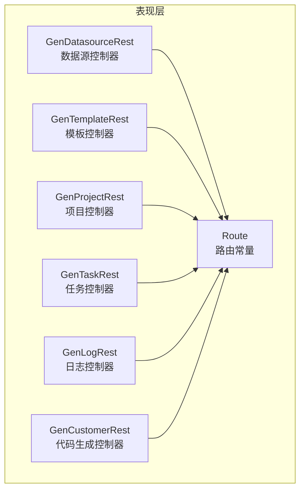
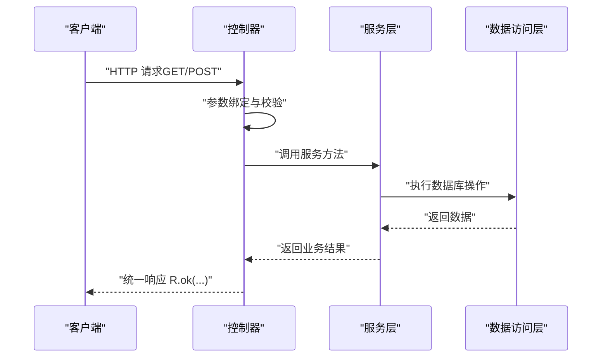
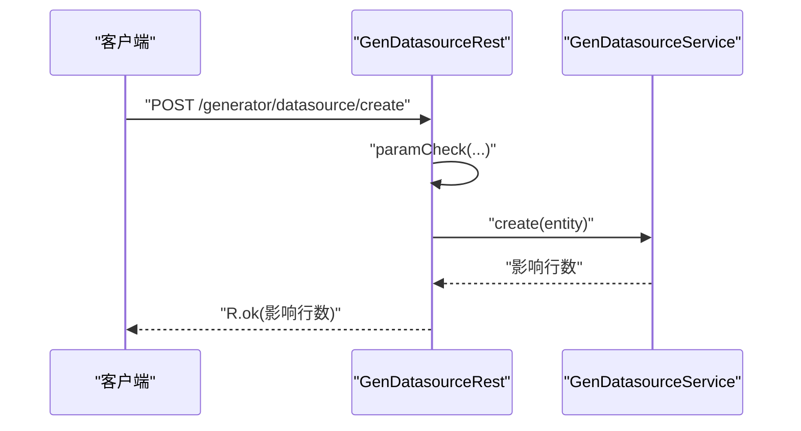
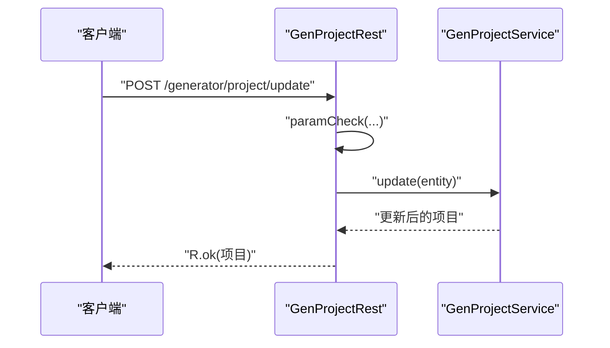
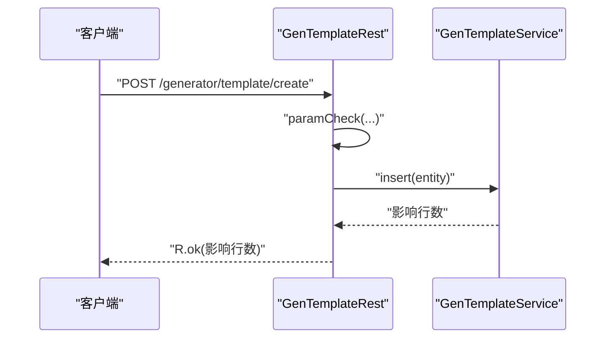
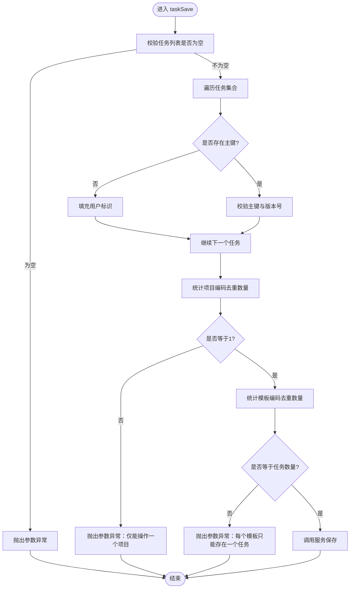
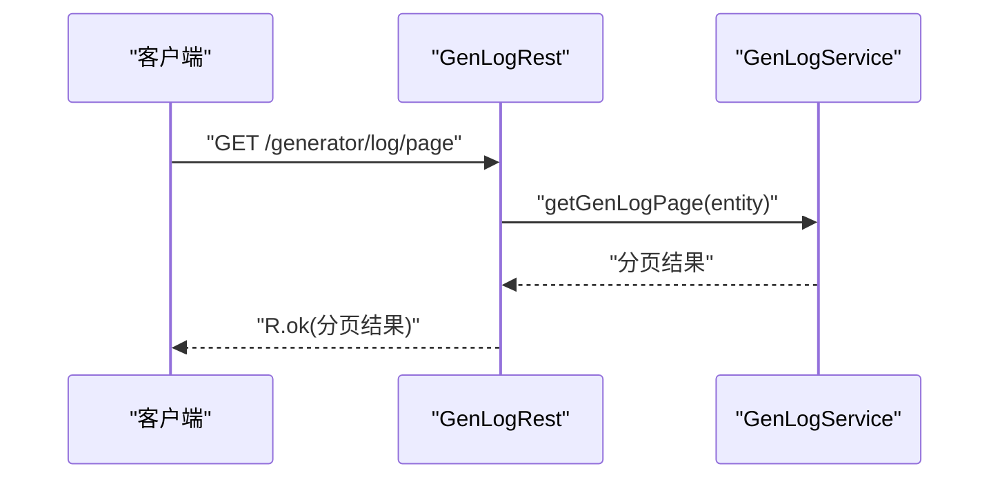
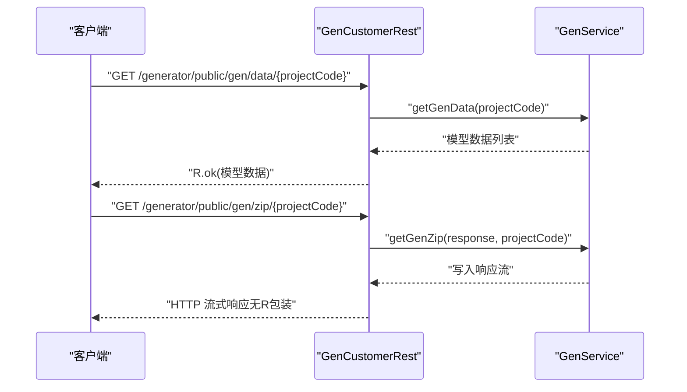
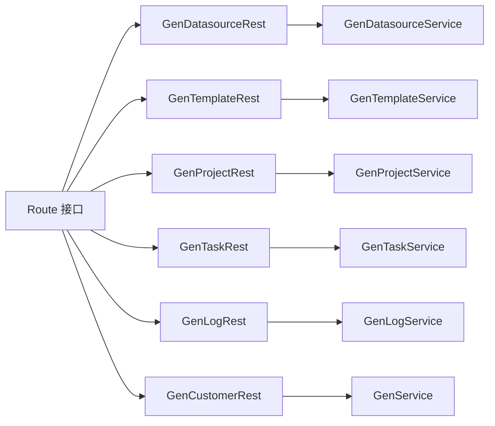

# 表现层设计

<cite>
**本文引用的文件**
- [Route.java](file://generator-server/src/main/java/com/wkclz/generator/server/Route.java)
- [GenDatasourceRest.java](file://generator-server/src/main/java/com/wkclz/generator/server/rest/GenDatasourceRest.java)
- [GenProjectRest.java](file://generator-server/src/main/java/com/wkclz/generator/server/rest/GenProjectRest.java)
- [GenTemplateRest.java](file://generator-server/src/main/java/com/wkclz/generator/server/rest/GenTemplateRest.java)
- [GenLogRest.java](file://generator-server/src/main/java/com/wkclz/generator/server/rest/GenLogRest.java)
- [GenTaskRest.java](file://generator-server/src/main/java/com/wkclz/generator/server/rest/GenTaskRest.java)
- [GenCustomerRest.java](file://generator-server/src/main/java/com/wkclz/generator/server/rest/GenCustomerRest.java)
</cite>

## 目录
1. [简介](#简介)
2. [项目结构](#项目结构)
3. [核心组件](#核心组件)
4. [架构总览](#架构总览)
5. [详细组件分析](#详细组件分析)
6. [依赖关系分析](#依赖关系分析)
7. [性能考虑](#性能考虑)
8. [故障排查指南](#故障排查指南)
9. [结论](#结论)

## 简介
本文件聚焦于 SH-Generator 的表现层（REST 控制器层）设计与实现，系统性阐述基于 Spring Web MVC 的控制器架构：包括 @RestController 注解的统一返回封装、@RequestMapping 路由前缀与各资源路径映射、HTTP 方法映射策略；并逐一对数据源、模板、项目、任务、日志及代码生成等控制器进行职责拆解与流程说明。同时给出参数校验、异常处理与统一响应封装的最佳实践与参考路径。

## 项目结构
表现层位于 generator-server 模块的 rest 包下，采用按资源划分的包组织方式，每个资源对应一个控制器类，统一通过 Route 接口集中声明路由常量，控制器类以 @RestController 统一返回包装对象，内部注入对应的服务层接口完成业务处理。

图表来源
- [Route.java:1-89](file://generator-server/src/main/java/com/wkclz/generator/server/Route.java#L1-L89)
- [GenDatasourceRest.java:16-83](file://generator-server/src/main/java/com/wkclz/generator/server/rest/GenDatasourceRest.java#L16-L83)
- [GenTemplateRest.java:16-82](file://generator-server/src/main/java/com/wkclz/generator/server/rest/GenTemplateRest.java#L16-L82)
- [GenProjectRest.java:14-79](file://generator-server/src/main/java/com/wkclz/generator/server/rest/GenProjectRest.java#L14-L79)
- [GenTaskRest.java:17-75](file://generator-server/src/main/java/com/wkclz/generator/server/rest/GenTaskRest.java#L17-L75)
- [GenLogRest.java:13-35](file://generator-server/src/main/java/com/wkclz/generator/server/rest/GenLogRest.java#L13-L35)
- [GenCustomerRest.java:17-44](file://generator-server/src/main/java/com/wkclz/generator/server/rest/GenCustomerRest.java#L17-L44)

章节来源
- [Route.java:1-89](file://generator-server/src/main/java/com/wkclz/generator/server/Route.java#L1-L89)

## 核心组件
- 路由常量定义：Route 接口集中声明模块前缀与各资源的 REST 路径常量，统一由 @Router 注解标注模块信息，便于前端与文档生成工具识别。
- 控制器基座：所有控制器均使用 @RestController，返回统一响应体 R，内部包含状态码、消息与数据载体，简化前后端交互。
- 请求映射：控制器类级 @RequestMapping(Route.PREFIX) 统一前缀；方法级使用 @GetMapping/@PostMapping 映射具体资源路径。
- 参数绑定与校验：控制器通过方法参数直接绑定请求体或查询参数，并在进入业务逻辑前执行参数校验，必要时抛出参数异常。
- 服务层协作：控制器注入对应服务接口，调用服务完成数据访问与业务处理，最终以 R.ok(...) 返回结果。

章节来源
- [Route.java:6-89](file://generator-server/src/main/java/com/wkclz/generator/server/Route.java#L6-L89)
- [GenDatasourceRest.java:16-83](file://generator-server/src/main/java/com/wkclz/generator/server/rest/GenDatasourceRest.java#L16-L83)
- [GenProjectRest.java:14-79](file://generator-server/src/main/java/com/wkclz/generator/server/rest/GenProjectRest.java#L14-L79)
- [GenTemplateRest.java:16-82](file://generator-server/src/main/java/com/wkclz/generator/server/rest/GenTemplateRest.java#L16-L82)
- [GenLogRest.java:13-35](file://generator-server/src/main/java/com/wkclz/generator/server/rest/GenLogRest.java#L13-L35)
- [GenTaskRest.java:17-75](file://generator-server/src/main/java/com/wkclz/generator/server/rest/GenTaskRest.java#L17-L75)
- [GenCustomerRest.java:17-44](file://generator-server/src/main/java/com/wkclz/generator/server/rest/GenCustomerRest.java#L17-L44)

## 架构总览
控制器层遵循“请求 -> 控制器 -> 服务 -> 数据访问”的分层调用链路，统一通过 Route 前缀与资源路径进行路由分发，控制器仅负责参数解析、校验与响应封装，不承担业务逻辑。

图表来源
- [GenDatasourceRest.java:24-28](file://generator-server/src/main/java/com/wkclz/generator/server/rest/GenDatasourceRest.java#L24-L28)
- [GenProjectRest.java:22-26](file://generator-server/src/main/java/com/wkclz/generator/server/rest/GenProjectRest.java#L22-L26)
- [GenTemplateRest.java:25-29](file://generator-server/src/main/java/com/wkclz/generator/server/rest/GenTemplateRest.java#L25-L29)
- [GenLogRest.java:21-25](file://generator-server/src/main/java/com/wkclz/generator/server/rest/GenLogRest.java#L21-L25)
- [GenTaskRest.java:25-30](file://generator-server/src/main/java/com/wkclz/generator/server/rest/GenTaskRest.java#L25-L30)
- [GenCustomerRest.java:26-30](file://generator-server/src/main/java/com/wkclz/generator/server/rest/GenCustomerRest.java#L26-L30)

## 详细组件分析

### 数据源控制器（GenDatasourceRest）
- 职责概述：提供数据源的分页查询、详情查询、新增、修改、删除、选项列表等能力。
- 关键映射：
  - GET /generator/datasource/page
  - GET /generator/datasource/detail
  - POST /generator/datasource/create
  - POST /generator/datasource/update
  - POST /generator/datasource/remove
  - GET /generator/datasource/options
- 参数校验与处理：
  - 新增场景自动填充用户标识，要求数据库连接关键字段非空。
  - 修改/删除场景要求主键与版本号非空，确保幂等更新。
  - 详情接口对敏感字段进行脱敏处理后返回。
- 统一响应：所有方法返回 R.ok(...) 封装后的结果。

图表来源
- [GenDatasourceRest.java:38-43](file://generator-server/src/main/java/com/wkclz/generator/server/rest/GenDatasourceRest.java#L38-L43)
- [GenDatasourceRest.java:67-81](file://generator-server/src/main/java/com/wkclz/generator/server/rest/GenDatasourceRest.java#L67-L81)

章节来源
- [GenDatasourceRest.java:16-83](file://generator-server/src/main/java/com/wkclz/generator/server/rest/GenDatasourceRest.java#L16-L83)
- [Route.java:14-25](file://generator-server/src/main/java/com/wkclz/generator/server/Route.java#L14-L25)

### 项目控制器（GenProjectRest）
- 职责概述：提供项目配置的分页、详情、新增、修改、删除、复制等能力。
- 关键映射：
  - GET /generator/project/page
  - GET /generator/project/detail
  - POST /generator/project/create
  - POST /generator/project/update
  - POST /generator/project/remove
  - POST /generator/project/copy
- 参数校验与处理：
  - 新增场景自动填充用户标识，要求数据库编码、模块名、项目名称等关键字段非空。
  - 修改/删除场景要求主键与版本号非空，确保幂等更新。
  - 复制接口基于主键进行项目复制。
- 统一响应：所有方法返回 R.ok(...) 封装后的结果。

图表来源
- [GenProjectRest.java:42-47](file://generator-server/src/main/java/com/wkclz/generator/server/rest/GenProjectRest.java#L42-L47)
- [GenProjectRest.java:64-75](file://generator-server/src/main/java/com/wkclz/generator/server/rest/GenProjectRest.java#L64-L75)

章节来源
- [GenProjectRest.java:14-79](file://generator-server/src/main/java/com/wkclz/generator/server/rest/GenProjectRest.java#L14-L79)
- [Route.java:41-53](file://generator-server/src/main/java/com/wkclz/generator/server/Route.java#L41-L53)

### 模板控制器（GenTemplateRest）
- 职责概述：提供代码模板的分页、详情、新增、修改、删除、选项列表等能力。
- 关键映射：
  - GET /generator/template/page
  - GET /generator/template/detail
  - POST /generator/template/create
  - POST /generator/template/update
  - POST /generator/template/remove
  - GET /generator/template/options
- 参数校验与处理：
  - 新增场景自动填充用户标识，要求模板键、名称、后缀、内容等关键字段非空。
  - 修改/删除场景要求主键与版本号非空，确保幂等更新。
- 统一响应：所有方法返回 R.ok(...) 封装后的结果。

图表来源
- [GenTemplateRest.java:38-43](file://generator-server/src/main/java/com/wkclz/generator/server/rest/GenTemplateRest.java#L38-L43)
- [GenTemplateRest.java:66-78](file://generator-server/src/main/java/com/wkclz/generator/server/rest/GenTemplateRest.java#L66-L78)

章节来源
- [GenTemplateRest.java:16-82](file://generator-server/src/main/java/com/wkclz/generator/server/rest/GenTemplateRest.java#L16-L82)
- [Route.java:27-39](file://generator-server/src/main/java/com/wkclz/generator/server/Route.java#L27-L39)

### 任务控制器（GenTaskRest）
- 职责概述：提供任务列表查询、批量保存、删除等能力，支持按项目维度进行任务编排。
- 关键映射：
  - GET /generator/task/list
  - POST /generator/task/save
  - POST /generator/task/remove
- 参数校验与处理：
  - 列表查询要求项目编码非空。
  - 批量保存校验任务列表非空，且同一请求内仅允许一个项目编码、每个模板仅允许一个任务。
  - 修改/删除场景要求主键与版本号非空，确保幂等更新。
- 统一响应：所有方法返回 R.ok(...) 封装后的结果。

图表来源
- [GenTaskRest.java:32-37](file://generator-server/src/main/java/com/wkclz/generator/server/rest/GenTaskRest.java#L32-L37)
- [GenTaskRest.java:47-71](file://generator-server/src/main/java/com/wkclz/generator/server/rest/GenTaskRest.java#L47-L71)

章节来源
- [GenTaskRest.java:17-75](file://generator-server/src/main/java/com/wkclz/generator/server/rest/GenTaskRest.java#L17-L75)
- [Route.java:55-61](file://generator-server/src/main/java/com/wkclz/generator/server/Route.java#L55-L61)

### 日志控制器（GenLogRest）
- 职责概述：提供生成日志的分页与详情查询能力。
- 关键映射：
  - GET /generator/log/page
  - GET /generator/log/detail
- 参数校验与处理：
  - 详情查询要求主键非空。
- 统一响应：所有方法返回 R.ok(...) 封装后的结果。

图表来源
- [GenLogRest.java:21-25](file://generator-server/src/main/java/com/wkclz/generator/server/rest/GenLogRest.java#L21-L25)

章节来源
- [GenLogRest.java:13-35](file://generator-server/src/main/java/com/wkclz/generator/server/rest/GenLogRest.java#L13-L35)
- [Route.java:63-67](file://generator-server/src/main/java/com/wkclz/generator/server/Route.java#L63-L67)

### 代码生成控制器（GenCustomerRest）
- 职责概述：提供公开的代码生成相关接口，包括模型数据、打包下载、生成规则等。
- 关键映射：
  - GET /generator/public/gen/data/{projectCode}
  - GET /generator/public/gen/zip/{projectCode}
  - GET /generator/public/gen/rule/{projectCode}
- 处理特点：
  - zip 下载接口直接输出二进制流到 HttpServletResponse，不返回 R 包装。
  - 其他接口返回 R.ok(...) 封装后的结果。
- 统一响应：除 zip 输出外，其余接口返回 R.ok(...) 封装后的结果。

图表来源
- [GenCustomerRest.java:26-35](file://generator-server/src/main/java/com/wkclz/generator/server/rest/GenCustomerRest.java#L26-L35)
- [GenCustomerRest.java:37-41](file://generator-server/src/main/java/com/wkclz/generator/server/rest/GenCustomerRest.java#L37-L41)

章节来源
- [GenCustomerRest.java:17-44](file://generator-server/src/main/java/com/wkclz/generator/server/rest/GenCustomerRest.java#L17-L44)
- [Route.java:76-84](file://generator-server/src/main/java/com/wkclz/generator/server/Route.java#L76-L84)

## 依赖关系分析
- 控制器依赖 Route 接口提供的路由常量，避免硬编码路径。
- 控制器依赖对应服务接口，实现业务解耦。
- 统一响应 R 作为返回载体，贯穿所有控制器方法。
- 异常处理：控制器内部通过断言与自定义参数异常进行快速失败，服务层可进一步抛出自定义异常，最终由全局异常处理器转换为统一响应。

图表来源
- [Route.java:6-89](file://generator-server/src/main/java/com/wkclz/generator/server/Route.java#L6-L89)
- [GenDatasourceRest.java:20-21](file://generator-server/src/main/java/com/wkclz/generator/server/rest/GenDatasourceRest.java#L20-L21)
- [GenTemplateRest.java:21-22](file://generator-server/src/main/java/com/wkclz/generator/server/rest/GenTemplateRest.java#L21-L22)
- [GenProjectRest.java:18-19](file://generator-server/src/main/java/com/wkclz/generator/server/rest/GenProjectRest.java#L18-L19)
- [GenTaskRest.java:21-22](file://generator-server/src/main/java/com/wkclz/generator/server/rest/GenTaskRest.java#L21-L22)
- [GenLogRest.java:17-18](file://generator-server/src/main/java/com/wkclz/generator/server/rest/GenLogRest.java#L17-L18)
- [GenCustomerRest.java:22-23](file://generator-server/src/main/java/com/wkclz/generator/server/rest/GenCustomerRest.java#L22-L23)

章节来源
- [Route.java:6-89](file://generator-server/src/main/java/com/wkclz/generator/server/Route.java#L6-L89)

## 性能考虑
- 参数校验前置：在控制器层尽早进行参数校验，减少无效调用进入服务层的成本。
- 分页查询：对列表接口统一采用分页查询，避免一次性返回大量数据导致内存压力。
- 敏感信息脱敏：在详情接口对敏感字段进行脱敏处理，降低安全风险与带宽消耗。
- 流式输出：对于大体积下载场景（如 zip），采用流式输出策略，避免占用过多内存。
- 缓存策略：对只读选项类接口可结合缓存提升响应速度（需在服务层实现）。

## 故障排查指南
- 参数缺失或非法：
  - 现象：接口直接返回参数错误或断言失败。
  - 排查：确认请求体字段、路径变量与查询参数是否满足控制器方法签名与校验规则。
  - 参考路径：控制器参数校验方法与断言位置。
- 版本冲突或主键缺失：
  - 现象：修改/删除失败，提示缺少主键或版本号。
  - 排查：确认传入主键与版本号是否正确，避免并发覆盖。
  - 参考路径：控制器修改/删除方法中的断言与版本校验。
- 任务保存异常：
  - 现象：批量保存失败，提示项目或模板约束。
  - 排查：确保同一请求内仅包含一个项目编码，且每个模板仅出现一次。
  - 参考路径：任务保存的参数校验逻辑。
- 下载接口无响应：
  - 现象：zip 下载无内容或浏览器无法保存。
  - 排查：确认项目编码有效、生成规则已配置、响应头设置正确。
  - 参考路径：代码生成控制器的 zip 输出方法。

章节来源
- [GenDatasourceRest.java:32-35](file://generator-server/src/main/java/com/wkclz/generator/server/rest/GenDatasourceRest.java#L32-L35)
- [GenProjectRest.java:50-54](file://generator-server/src/main/java/com/wkclz/generator/server/rest/GenProjectRest.java#L50-L54)
- [GenTemplateRest.java:52-57](file://generator-server/src/main/java/com/wkclz/generator/server/rest/GenTemplateRest.java#L52-L57)
- [GenTaskRest.java:47-71](file://generator-server/src/main/java/com/wkclz/generator/server/rest/GenTaskRest.java#L47-L71)
- [GenCustomerRest.java:32-35](file://generator-server/src/main/java/com/wkclz/generator/server/rest/GenCustomerRest.java#L32-L35)

## 结论
本表现层设计以 Route 集中化路由、控制器统一返回与严格的参数校验为核心，实现了清晰的职责边界与一致的交互体验。通过将参数校验前置、分页查询与流式输出等策略，兼顾了易用性与性能。建议在后续迭代中完善全局异常处理与统一响应封装，进一步提升系统的可观测性与一致性。