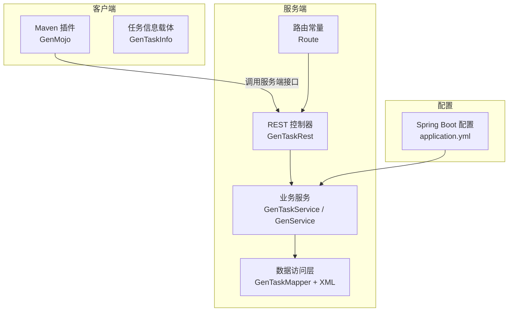
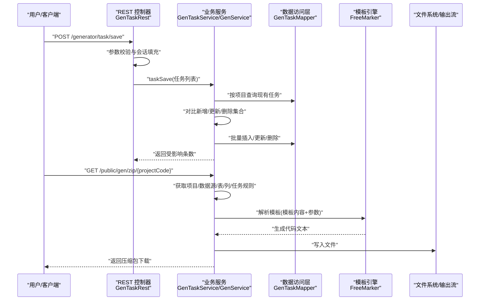
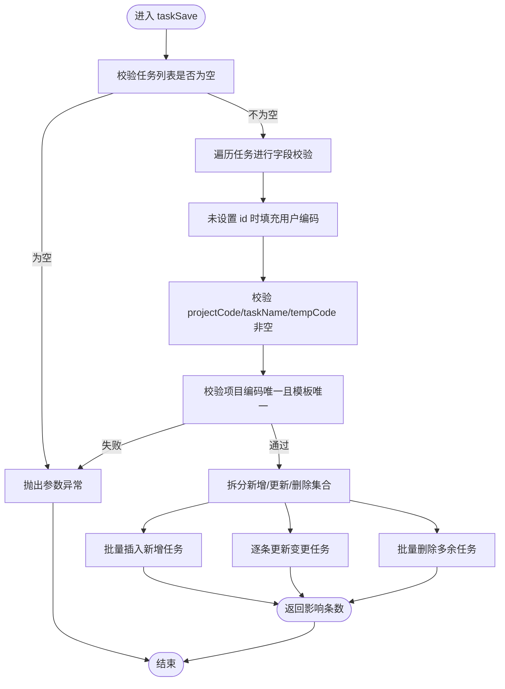
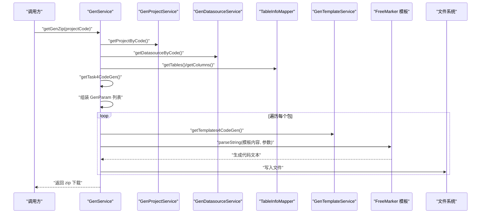
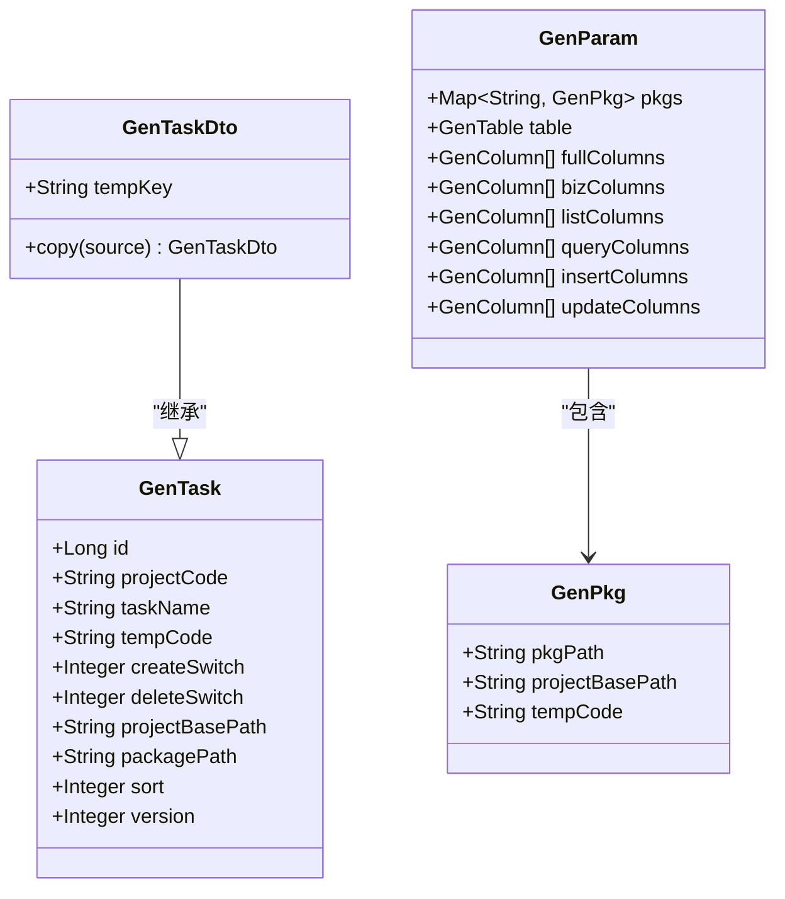
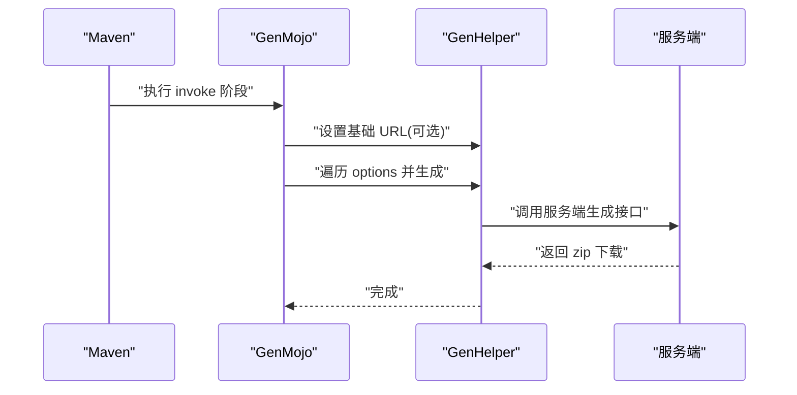
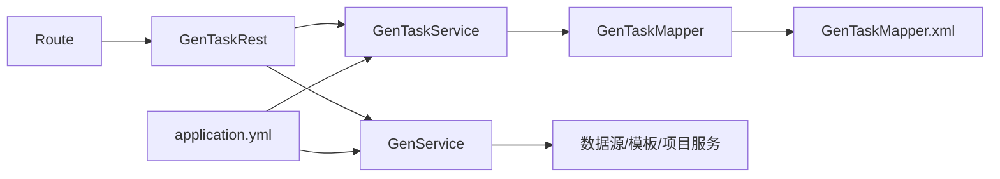

# 数据流设计

<cite>
**本文引用的文件**
- [generator-server\src\main\java\com\wkclz\generator\server\rest\GenTaskRest.java](file://generator-server/src/main/java/com/wkclz/generator/server/rest/GenTaskRest.java)
- [generator-server\src\main\java\com\wkclz\generator\server\service\GenTaskService.java](file://generator-server/src/main/java/com/wkclz/generator/server/service/GenTaskService.java)
- [generator-server\src\main\java\com\wkclz\generator\server\service\GenService.java](file://generator-server/src/main/java/com/wkclz/generator/server/service/GenService.java)
- [generator-server\src\main\java\com\wkclz\generator\server\bean\dto\GenTaskDto.java](file://generator-server/src/main/java/com/wkclz/generator/server/bean/dto/GenTaskDto.java)
- [generator-server\src\main\java\com\wkclz\generator\server\bean\gen\GenParam.java](file://generator-server/src/main/java/com/wkclz/generator/server/bean/gen/GenParam.java)
- [generator-server\src\main\java\com\wkclz\generator\server\bean\gen\GenPkg.java](file://generator-server/src/main/java/com/wkclz/generator/server/bean/gen/GenPkg.java)
- [generator-server\src\main\java\com\wkclz\generator\server\mapper\GenTaskMapper.java](file://generator-server/src/main/java/com/wkclz/generator/server/mapper/GenTaskMapper.java)
- [generator-server\src\main\resources\mapper\GenTaskMapper.xml](file://generator-server/src/main/resources/mapper/GenTaskMapper.xml)
- [generator-server\src\main\java\com\wkclz\generator\server\Route.java](file://generator-server/src/main/java/com/wkclz/generator/server/Route.java)
- [generator-server-starter\src\main\resources\config\application.yml](file://generator-server-starter/src/main/resources/config/application.yml)
- [generator-client\src\main\java\com\wkclz\generator\client\GenMojo.java](file://generator-client/src/main/java/com/wkclz/generator/client/GenMojo.java)
- [generator-client\src\main\java\com\wkclz\generator\client\bean\GenTaskInfo.java](file://generator-client/src/main/java/com/wkclz/generator/client/bean/GenTaskInfo.java)
</cite>

## 目录
1. 引言
2. 项目结构
3. 核心组件
4. 架构总览
5. 详细组件分析
6. 依赖分析
7. 性能考虑
8. 故障排查指南
9. 结论
10. 附录

## 引言
本文件面向 SH-Generator 的数据流设计，系统目标是“从用户请求到最终代码生成”的完整数据链路。我们将围绕以下主题展开：HTTP 请求参数的接收与校验、业务参数的封装与转换、模板渲染过程中的数据绑定、以及最终代码文件的生成与打包。同时给出数据流图与时序图，解释数据验证、转换与处理规则，并提供异常情况下的数据处理策略。

## 项目结构
系统采用前后端分离与多模块组织：
- generator-server：后端服务，包含 REST 接口、业务服务、数据访问层、路由定义与 MyBatis 映射。
- generator-server-starter：启动器与基础配置（如应用端口、MyBatis 映射路径等）。
- generator-ui：前端界面（本文件不深入前端实现细节）。
- generator-client：Maven 插件入口，用于在构建阶段触发远程代码生成或本地生成流程。

图表来源
- [generator-server\src\main\java\com\wkclz\generator\server\rest\GenTaskRest.java:1-75](file://generator-server/src/main/java/com/wkclz/generator/server/rest/GenTaskRest.java#L1-L75)
- [generator-server\src\main\java\com\wkclz\generator\server\service\GenTaskService.java:1-114](file://generator-server/src/main/java/com/wkclz/generator/server/service/GenTaskService.java#L1-L114)
- [generator-server\src\main\java\com\wkclz\generator\server\service\GenService.java:1-231](file://generator-server/src/main/java/com/wkclz/generator/server/service/GenService.java#L1-L231)
- [generator-server\src\main\java\com\wkclz\generator\server\mapper\GenTaskMapper.java:1-20](file://generator-server/src/main/java/com/wkclz/generator/server/mapper/GenTaskMapper.java#L1-L20)
- [generator-server\src\main\resources\mapper\GenTaskMapper.xml:1-62](file://generator-server/src/main/resources/mapper/GenTaskMapper.xml#L1-L62)
- [generator-server\src\main\java\com\wkclz\generator\server\Route.java:1-89](file://generator-server/src/main/java/com/wkclz/generator/server/Route.java#L1-L89)
- [generator-server-starter\src\main\resources\config\application.yml:1-52](file://generator-server-starter/src/main/resources/config/application.yml#L1-L52)
- [generator-client\src\main\java\com\wkclz\generator\client\GenMojo.java:1-42](file://generator-client/src/main/java/com/wkclz/generator/client/GenMojo.java#L1-L42)
- [generator-client\src\main\java\com\wkclz\generator\client\bean\GenTaskInfo.java:1-19](file://generator-client/src/main/java/com/wkclz/generator/client/bean/GenTaskInfo.java#L1-L19)

章节来源
- [generator-server\src\main\java\com\wkclz\generator\server\Route.java:1-89](file://generator-server/src/main/java/com/wkclz/generator/server/Route.java#L1-L89)
- [generator-server-starter\src\main\resources\config\application.yml:1-52](file://generator-server-starter/src/main/resources/config/application.yml#L1-L52)

## 核心组件
- REST 层：负责接收 HTTP 请求、参数校验与返回统一响应包装。
- 业务服务层：协调数据查询、规则计算、模板选择与代码生成调度。
- 数据访问层：基于 MyBatis 的实体映射与 SQL 执行。
- 客户端插件：通过 Maven 生命周期阶段触发生成流程。
- 路由与配置：统一管理 API 前缀与对外暴露的接口路径；配置数据库连接、MyBatis 映射等。

章节来源
- [generator-server\src\main\java\com\wkclz\generator\server\rest\GenTaskRest.java:1-75](file://generator-server/src/main/java/com/wkclz/generator/server/rest/GenTaskRest.java#L1-L75)
- [generator-server\src\main\java\com\wkclz\generator\server\service\GenTaskService.java:1-114](file://generator-server/src/main/java/com/wkclz/generator/server/service/GenTaskService.java#L1-L114)
- [generator-server\src\main\java\com\wkclz\generator\server\service\GenService.java:1-231](file://generator-server/src/main/java/com/wkclz/generator/server/service/GenService.java#L1-L231)
- [generator-server\src\main\java\com\wkclz\generator\server\mapper\GenTaskMapper.java:1-20](file://generator-server/src/main/java/com/wkclz/generator/server/mapper/GenTaskMapper.java#L1-L20)
- [generator-server\src\main\resources\mapper\GenTaskMapper.xml:1-62](file://generator-server/src/main/resources/mapper/GenTaskMapper.xml#L1-L62)
- [generator-client\src\main\java\com\wkclz\generator\client\GenMojo.java:1-42](file://generator-client/src/main/java/com/wkclz/generator/client/GenMojo.java#L1-L42)

## 架构总览
下图展示了从“任务保存”到“代码生成”的关键数据流路径，涵盖参数接收、校验、持久化、读取规则、组装生成参数、模板渲染与打包下载。

图表来源
- [generator-server\src\main\java\com\wkclz\generator\server\rest\GenTaskRest.java:32-44](file://generator-server/src/main/java/com/wkclz/generator/server/rest/GenTaskRest.java#L32-L44)
- [generator-server\src\main\java\com\wkclz\generator\server\service\GenTaskService.java:27-105](file://generator-server/src/main/java/com/wkclz/generator/server/service/GenTaskService.java#L27-L105)
- [generator-server\src\main\java\com\wkclz\generator\server\service\GenService.java:72-90](file://generator-server/src/main/java/com/wkclz/generator/server/service/GenService.java#L72-L90)
- [generator-server\src\main\resources\mapper\GenTaskMapper.xml:38-58](file://generator-server/src/main/resources/mapper/GenTaskMapper.xml#L38-L58)

## 详细组件分析

### 组件一：任务保存（参数接收与校验）
- 参数接收：使用 @RequestBody 接收任务列表。
- 校验规则：
  - 非空校验：任务列表非空；每条任务需包含 projectCode、taskName、tempCode。
  - 并发约束：同一请求仅允许一个项目编码；同一模板在该请求中唯一。
  - 更新场景：若带 id，则必须携带版本号字段，确保并发安全。
- 处理逻辑：根据当前数据库中已存在的任务，计算新增、更新、删除三类集合，分别执行批量插入、逐条更新、批量删除。

图表来源
- [generator-server\src\main\java\com\wkclz\generator\server\rest\GenTaskRest.java:47-71](file://generator-server/src/main/java/com/wkclz/generator/server/rest/GenTaskRest.java#L47-L71)
- [generator-server\src\main\java\com\wkclz\generator\server\service\GenTaskService.java:27-105](file://generator-server/src/main/java/com/wkclz/generator/server/service/GenTaskService.java#L27-L105)

章节来源
- [generator-server\src\main\java\com\wkclz\generator\server\rest\GenTaskRest.java:32-71](file://generator-server/src/main/java/com/wkclz/generator/server/rest/GenTaskRest.java#L32-L71)
- [generator-server\src\main\java\com\wkclz\generator\server\service\GenTaskService.java:27-105](file://generator-server/src/main/java/com/wkclz/generator/server/service/GenTaskService.java#L27-L105)

### 组件二：代码生成（数据采集、模板渲染与打包）
- 数据采集：
  - 获取项目与数据源信息。
  - 动态切换数据源，查询表清单与列清单（过滤逻辑删除列）。
  - 读取任务规则（任务开关、包路径、基础路径、模板编码）。
  - 将表、列与任务规则整合为生成参数模型。
- 模板渲染：
  - 根据任务规则中的模板编码加载模板内容。
  - 使用 FreeMarker 将参数对象映射到模板，生成代码文本。
  - 写入文件系统，按包路径与模板后缀生成目标文件。
- 打包下载：
  - 生成完成后压缩目录为 zip。
  - 设置响应头并流式写出压缩包供下载。

图表来源
- [generator-server\src\main\java\com\wkclz\generator\server\service\GenService.java:72-190](file://generator-server/src/main/java/com/wkclz/generator/server/service/GenService.java#L72-L190)
- [generator-server\src\main\resources\mapper\GenTaskMapper.xml:38-58](file://generator-server/src/main/resources/mapper/GenTaskMapper.xml#L38-L58)

章节来源
- [generator-server\src\main\java\com\wkclz\generator\server\service\GenService.java:55-227](file://generator-server/src/main/java/com/wkclz/generator/server/service/GenService.java#L55-L227)

### 组件三：数据模型与转换
- 任务 DTO：在任务实体基础上扩展 tempKey 字段，便于模板侧使用。
- 生成参数模型：
  - 包装层 GenPkg：包含包路径、项目基础路径、模板编码。
  - 参数层 GenParam：包含表结构、全量列、业务列、列表列、查询列、新增列、修改列等。
- 规则读取：通过 Mapper XML 的 SQL 返回任务规则集，供业务层组装生成参数。

图表来源
- [generator-server\src\main\java\com\wkclz\generator\server\bean\dto\GenTaskDto.java:1-38](file://generator-server/src/main/java/com/wkclz/generator/server/bean/dto/GenTaskDto.java#L1-L38)
- [generator-server\src\main\java\com\wkclz\generator\server\bean\gen\GenParam.java:1-33](file://generator-server/src/main/java/com/wkclz/generator/server/bean/gen/GenParam.java#L1-L33)
- [generator-server\src\main\java\com\wkclz\generator\server\bean\gen\GenPkg.java:1-15](file://generator-server/src/main/java/com/wkclz/generator/server/bean/gen/GenPkg.java#L1-L15)

章节来源
- [generator-server\src\main\java\com\wkclz\generator\server\bean\dto\GenTaskDto.java:1-38](file://generator-server/src/main/java/com/wkclz/generator/server/bean/dto/GenTaskDto.java#L1-L38)
- [generator-server\src\main\java\com\wkclz\generator\server\bean\gen\GenParam.java:1-33](file://generator-server/src/main/java/com/wkclz/generator/server/bean/gen/GenParam.java#L1-L33)
- [generator-server\src\main\java\com\wkclz\generator\server\bean\gen\GenPkg.java:1-15](file://generator-server/src/main/java/com/wkclz/generator/server/bean/gen/GenPkg.java#L1-L15)

### 组件四：客户端集成（Maven 插件）
- 插件入口：通过 Maven 生命周期阶段触发，支持传入远程地址与选项列表。
- 选项驱动：遍历选项，调用内部帮助类发起生成请求。
- 任务信息：GenTaskInfo 作为客户端侧的任务参数载体，包含项目编码、模板编码/键、任务名称、开关、后缀与包路径等。

图表来源
- [generator-client\src\main\java\com\wkclz\generator\client\GenMojo.java:28-40](file://generator-client/src/main/java/com/wkclz/generator/client/GenMojo.java#L28-L40)
- [generator-client\src\main\java\com\wkclz\generator\client\bean\GenTaskInfo.java:1-19](file://generator-client/src/main/java/com/wkclz/generator/client/bean/GenTaskInfo.java#L1-L19)

章节来源
- [generator-client\src\main\java\com\wkclz\generator\client\GenMojo.java:1-42](file://generator-client/src/main/java/com/wkclz/generator/client/GenMojo.java#L1-L42)
- [generator-client\src\main\java\com\wkclz\generator\client\bean\GenTaskInfo.java:1-19](file://generator-client/src/main/java/com/wkclz/generator/client/bean/GenTaskInfo.java#L1-L19)

## 依赖分析
- 控制器与服务：REST 控制器依赖业务服务；业务服务依赖数据访问层与各领域服务。
- 数据访问层：Mapper 接口与 XML 映射，SQL 负责读取任务规则与模板内容。
- 路由与配置：Route 提供统一前缀与接口路径；application.yml 提供 MyBatis 映射路径与健康监控端口等。

图表来源
- [generator-server\src\main\java\com\wkclz\generator\server\Route.java:1-89](file://generator-server/src/main/java/com/wkclz/generator/server/Route.java#L1-L89)
- [generator-server\src\main\java\com\wkclz\generator\server\rest\GenTaskRest.java:1-75](file://generator-server/src/main/java/com/wkclz/generator/server/rest/GenTaskRest.java#L1-L75)
- [generator-server\src\main\java\com\wkclz\generator\server\service\GenTaskService.java:1-114](file://generator-server/src/main/java/com/wkclz/generator/server/service/GenTaskService.java#L1-L114)
- [generator-server\src\main\java\com\wkclz\generator\server\service\GenService.java:1-231](file://generator-server/src/main/java/com/wkclz/generator/server/service/GenService.java#L1-L231)
- [generator-server\src\main\java\com\wkclz\generator\server\mapper\GenTaskMapper.java:1-20](file://generator-server/src/main/java/com/wkclz/generator/server/mapper/GenTaskMapper.java#L1-L20)
- [generator-server\src\main\resources\mapper\GenTaskMapper.xml:1-62](file://generator-server/src/main/resources/mapper/GenTaskMapper.xml#L1-L62)
- [generator-server-starter\src\main\resources\config\application.yml:1-52](file://generator-server-starter/src/main/resources/config/application.yml#L1-L52)

章节来源
- [generator-server\src\main\java\com\wkclz\generator\server\rest\GenTaskRest.java:1-75](file://generator-server/src/main/java/com/wkclz/generator/server/rest/GenTaskRest.java#L1-L75)
- [generator-server\src\main\java\com\wkclz\generator\server\service\GenTaskService.java:1-114](file://generator-server/src/main/java/com/wkclz/generator/server/service/GenTaskService.java#L1-L114)
- [generator-server\src\main\java\com\wkclz\generator\server\service\GenService.java:1-231](file://generator-server/src/main/java/com/wkclz/generator/server/service/GenService.java#L1-L231)
- [generator-server\src\main\java\com\wkclz\generator\server\mapper\GenTaskMapper.java:1-20](file://generator-server/src/main/java/com/wkclz/generator/server/mapper/GenTaskMapper.java#L1-L20)
- [generator-server\src\main\resources\mapper\GenTaskMapper.xml:1-62](file://generator-server/src/main/resources/mapper/GenTaskMapper.xml#L1-L62)
- [generator-server-starter\src\main\resources\config\application.yml:1-52](file://generator-server-starter/src/main/resources/config/application.yml#L1-L52)

## 性能考虑
- 批量操作：任务保存时对新增、更新、删除集合进行批量处理，减少多次往返。
- 模板渲染：按包维度生成文件，避免一次性加载过多模板导致内存峰值。
- I/O 流程：文件写入使用 PrintStream/OutputStream，注意及时 flush/close，避免资源泄漏。
- 数据源切换：动态数据源切换仅在必要时进行，避免频繁切换带来的开销。
- 压缩与下载：采用流式写出，避免将整个 zip 加载到内存。

## 故障排查指南
- 参数校验异常：
  - 任务列表为空、缺少 projectCode/taskName/tempCode、跨项目或模板重复等，均会抛出参数异常。
- 生成数据为空：
  - 若未查询到任何可生成的表/列/任务规则，将提示“没有可生成代码的数据”。
- 模板渲染异常：
  - FreeMarker 渲染失败时，会回退为包含异常信息与模板内容的文本，便于定位问题。
- 文件写入异常：
  - 文件不存在或权限不足时，会抛出系统异常；请检查 dist 目录权限与磁盘空间。
- 压缩异常：
  - 压缩过程中出现 IO 异常，会抛出系统异常；请确认临时目录可写。

章节来源
- [generator-server\src\main\java\com\wkclz\generator\server\rest\GenTaskRest.java:47-71](file://generator-server/src/main/java/com/wkclz/generator/server/rest/GenTaskRest.java#L47-L71)
- [generator-server\src\main\java\com\wkclz\generator\server\service\GenService.java:95-142](file://generator-server/src/main/java/com/wkclz/generator/server/service/GenService.java#L95-L142)
- [generator-server\src\main\resources\mapper\GenTaskMapper.xml:38-58](file://generator-server/src/main/resources/mapper/GenTaskMapper.xml#L38-L58)

## 结论
本设计文档梳理了 SH-Generator 从“任务保存”到“代码生成”的完整数据流：REST 层负责参数接收与校验，业务层负责数据采集与规则装配，模板引擎负责渲染，文件系统与压缩模块负责产物落地与下载。通过清晰的职责划分与严格的参数校验，系统在保证正确性的同时具备良好的可维护性与扩展性。

## 附录
- API 路由参考：
  - 任务：/generator/task/list、/generator/task/save、/generator/task/remove
  - 生成：/generator/public/gen/data/{projectCode}、/generator/public/gen/zip/{projectCode}、/generator/public/gen/rule/{projectCode}
- 配置要点：
  - MyBatis 映射路径：classpath*:mapper/**/*.xml
  - 健康监控端口：50000

章节来源
- [generator-server\src\main\java\com\wkclz\generator\server\Route.java:55-85](file://generator-server/src/main/java/com/wkclz/generator/server/Route.java#L55-L85)
- [generator-server-starter\src\main\resources\config\application.yml:14-18](file://generator-server-starter/src/main/resources/config/application.yml#L14-L18)