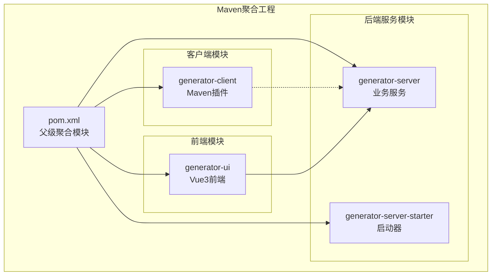
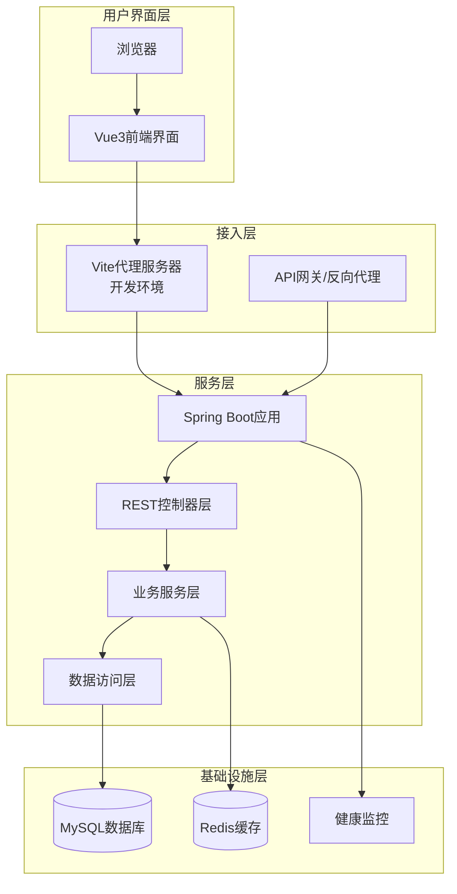
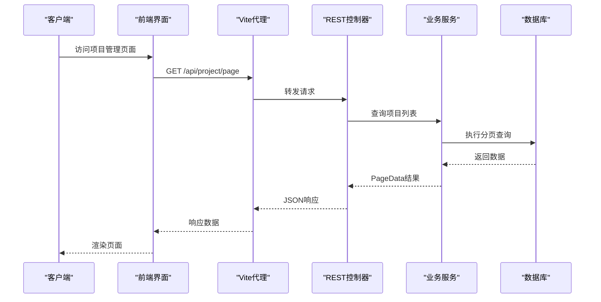
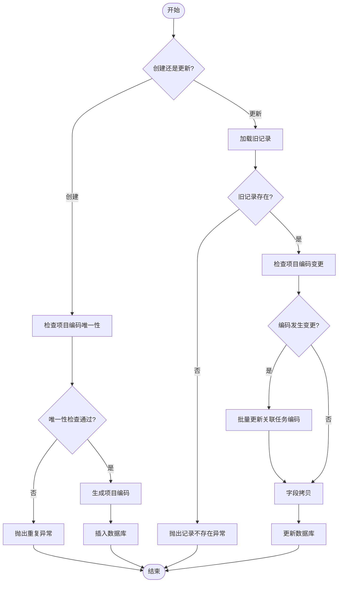
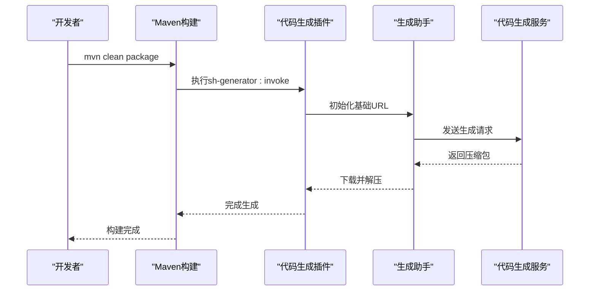
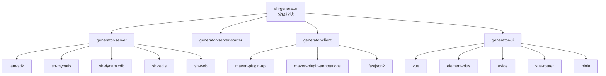

# 整体架构概览

<cite>
**本文档引用的文件**
- [pom.xml](file://pom.xml)
- [generator-server-starter/src/main/java/com/wkclz/generator/server/starter/GeneratorServerApplication.java](file://generator-server-starter/src/main/java/com/wkclz/generator/server/starter/GeneratorServerApplication.java)
- [generator-server-starter/src/main/resources/config/application.yml](file://generator-server-starter/src/main/resources/config/application.yml)
- [generator-server/pom.xml](file://generator-server/pom.xml)
- [generator-server/src/main/java/com/wkclz/generator/server/GeneratorServerConfig.java](file://generator-server/src/main/java/com/wkclz/generator/server/GeneratorServerConfig.java)
- [generator-server/src/main/java/com/wkclz/generator/server/Route.java](file://generator-server/src/main/java/com/wkclz/generator/server/Route.java)
- [generator-server/src/main/java/com/wkclz/generator/server/rest/GenProjectRest.java](file://generator-server/src/main/java/com/wkclz/generator/server/rest/GenProjectRest.java)
- [generator-server/src/main/java/com/wkclz/generator/server/service/GenProjectService.java](file://generator-server/src/main/java/com/wkclz/generator/server/service/GenProjectService.java)
- [generator-client/pom.xml](file://generator-client/pom.xml)
- [generator-client/src/main/java/com/wkclz/generator/client/GenMojo.java](file://generator-client/src/main/java/com/wkclz/generator/client/GenMojo.java)
- [generator-ui/package.json](file://generator-ui/package.json)
- [generator-ui/vite.config.js](file://generator-ui/vite.config.js)
- [generator-ui/src/main.js](file://generator-ui/src/main.js)
- [README.md](file://README.md)
</cite>

## 目录
1. [简介](#简介)
2. [项目结构](#项目结构)
3. [核心组件](#核心组件)
4. [架构总览](#架构总览)
5. [详细组件分析](#详细组件分析)
6. [依赖关系分析](#依赖关系分析)
7. [性能考虑](#性能考虑)
8. [故障排除指南](#故障排除指南)
9. [结论](#结论)

## 简介
本项目是一个基于前后端分离理念的代码生成器系统，采用Maven多模块架构组织，包含后端服务(generator-server)、启动器(generator-server-starter)、前端界面(generator-ui)与Maven插件客户端(generator-client)四大核心模块。系统通过REST接口提供统一的数据访问能力，前端通过代理转发请求至后端服务，Maven插件用于在构建阶段触发远程代码生成流程。

**章节来源**
- [README.md:1-3](file://README.md#L1-L3)

## 项目结构
项目采用Maven聚合工程模式，顶层pom声明了三个子模块：
- generator-server：后端业务服务模块，提供完整的代码生成相关REST接口与业务逻辑
- generator-server-starter：Spring Boot启动器模块，负责应用启动与基础配置
- generator-client：Maven插件模块，封装代码生成调用逻辑，支持在构建阶段执行
- generator-ui：Vue3前端界面模块，提供可视化管理界面与交互体验

**图表来源**
- [pom.xml:20-24](file://pom.xml#L20-L24)

**章节来源**
- [pom.xml:1-35](file://pom.xml#L1-L35)

## 核心组件
系统由以下核心组件构成：

### 后端服务层（generator-server）
- REST控制器层：提供数据源、模板、项目、任务、日志等完整CRUD接口
- 业务服务层：封装领域业务逻辑，处理数据校验、唯一性检查、复制逻辑等
- 数据访问层：基于MyBatis实现，提供Mapper接口与XML映射文件
- 配置层：Spring Boot自动配置与MyBatis扫描配置

### 启动器层（generator-server-starter）
- Spring Boot应用入口：标准@SpringBootApplication注解
- 应用配置：端口、数据库连接、Jackson序列化等基础配置
- 健康监控：Actuator管理端点配置

### 客户端层（generator-client）
- Maven插件：继承AbstractMojo，支持自定义参数传递
- 代码生成助手：封装HTTP调用与压缩包下载逻辑
- 构建集成：可在Maven生命周期中触发远程代码生成

### 前端层（generator-ui）
- Vue3应用：基于Composition API的现代化前端框架
- Element Plus组件库：提供丰富的UI组件与主题样式
- Vite构建：快速开发与生产构建支持
- 代理配置：开发环境通过代理转发API请求

**章节来源**
- [generator-server/src/main/java/com/wkclz/generator/server/Route.java:6-88](file://generator-server/src/main/java/com/wkclz/generator/server/Route.java#L6-L88)
- [generator-server-starter/src/main/java/com/wkclz/generator/server/starter/GeneratorServerApplication.java:6-13](file://generator-server-starter/src/main/java/com/wkclz/generator/server/starter/GeneratorServerApplication.java#L6-L13)
- [generator-client/src/main/java/com/wkclz/generator/client/GenMojo.java:15-41](file://generator-client/src/main/java/com/wkclz/generator/client/GenMojo.java#L15-L41)
- [generator-ui/src/main.js:64-104](file://generator-ui/src/main.js#L64-L104)

## 架构总览
系统采用典型的三层架构设计，结合前后端分离与微服务化的思想：

**图表来源**
- [generator-ui/vite.config.js:45-52](file://generator-ui/vite.config.js#L45-L52)
- [generator-server-starter/src/main/resources/config/application.yml:1-52](file://generator-server-starter/src/main/resources/config/application.yml#L1-L52)

### 系统边界划分
- **generator-server**：后端业务边界，提供完整的REST API服务，包含所有业务功能的实现
- **generator-server-starter**：应用启动边界，负责Spring Boot应用的启动与配置加载
- **generator-ui**：前端展示边界，提供用户交互界面与数据可视化
- **generator-client**：构建工具边界，提供Maven插件能力，支持在CI/CD流程中使用

### 架构决策原因
1. **前后端分离**：提升开发效率与用户体验，前端专注交互，后端专注业务
2. **模块化设计**：清晰的职责分离，便于维护与扩展
3. **Maven多模块**：统一构建管理，支持独立部署与发布
4. **Spring Boot**：简化配置，快速启动，内置监控能力

**章节来源**
- [generator-server-starter/src/main/resources/config/application.yml:28-52](file://generator-server-starter/src/main/resources/config/application.yml#L28-L52)

## 详细组件分析

### 后端REST接口体系
系统通过统一的路由前缀"/generator"组织各类资源接口，采用模块化设计：

**图表来源**
- [generator-server/src/main/java/com/wkclz/generator/server/rest/GenProjectRest.java:22-26](file://generator-server/src/main/java/com/wkclz/generator/server/rest/GenProjectRest.java#L22-L26)
- [generator-server/src/main/java/com/wkclz/generator/server/service/GenProjectService.java:31-33](file://generator-server/src/main/java/com/wkclz/generator/server/service/GenProjectService.java#L31-L33)

### 项目管理业务流程
项目管理涉及创建、更新、复制等复杂业务逻辑：

**图表来源**
- [generator-server/src/main/java/com/wkclz/generator/server/service/GenProjectService.java:112-131](file://generator-server/src/main/java/com/wkclz/generator/server/service/GenProjectService.java#L112-L131)
- [generator-server/src/main/java/com/wkclz/generator/server/service/GenProjectService.java:45-68](file://generator-server/src/main/java/com/wkclz/generator/server/service/GenProjectService.java#L45-L68)

### Maven插件工作流
Maven插件支持在构建阶段自动触发远程代码生成：

**图表来源**
- [generator-client/src/main/java/com/wkclz/generator/client/GenMojo.java:28-40](file://generator-client/src/main/java/com/wkclz/generator/client/GenMojo.java#L28-L40)

**章节来源**
- [generator-server/src/main/java/com/wkclz/generator/server/rest/GenProjectRest.java:1-79](file://generator-server/src/main/java/com/wkclz/generator/server/rest/GenProjectRest.java#L1-L79)
- [generator-server/src/main/java/com/wkclz/generator/server/service/GenProjectService.java:1-134](file://generator-server/src/main/java/com/wkclz/generator/server/service/GenProjectService.java#L1-L134)
- [generator-client/src/main/java/com/wkclz/generator/client/GenMojo.java:1-42](file://generator-client/src/main/java/com/wkclz/generator/client/GenMojo.java#L1-L42)

## 依赖关系分析

### Maven模块依赖图

**图表来源**
- [generator-server/pom.xml:14-40](file://generator-server/pom.xml#L14-L40)
- [generator-client/pom.xml:16-38](file://generator-client/pom.xml#L16-L38)
- [generator-ui/package.json:18-39](file://generator-ui/package.json#L18-L39)

### 关键依赖特性
- **后端服务依赖**：整合IAM认证、MyBatis持久化、动态数据源、Redis缓存与Web框架
- **客户端依赖**：基于Maven插件机制，支持自定义参数传递与构建集成
- **前端依赖**：现代化Vue3生态，Element Plus组件库，完善的开发工具链

**章节来源**
- [generator-server/pom.xml:1-58](file://generator-server/pom.xml#L1-L58)
- [generator-client/pom.xml:1-75](file://generator-client/pom.xml#L1-L75)
- [generator-ui/package.json:1-53](file://generator-ui/package.json#L1-L53)

## 性能考虑
系统在多个层面考虑了性能优化：

### 后端性能优化
- **分页查询**：使用PageHelper实现高效分页，避免全量数据传输
- **缓存策略**：集成Redis缓存热点数据，减少数据库压力
- **连接池配置**：合理配置数据库连接池，提升并发处理能力
- **监控指标**：内置Actuator端点，提供健康检查与性能监控

### 前端性能优化
- **按需加载**：组件按需引入，减少初始包体积
- **代理配置**：开发环境通过代理避免跨域问题，提升调试效率
- **构建优化**：Vite提供快速热重载与生产构建优化

### 客户端性能优化
- **压缩传输**：后端返回压缩包，减少网络传输开销
- **异步处理**：代码生成采用异步方式，避免阻塞主线程

## 故障排除指南

### 常见问题诊断
1. **前端无法访问后端接口**
   - 检查Vite代理配置是否正确指向后端服务
   - 确认CORS跨域配置与防火墙设置

2. **Maven插件执行失败**
   - 验证插件配置中的URL参数是否正确
   - 检查网络连通性与后端服务状态

3. **数据库连接异常**
   - 确认数据库配置信息与连接字符串
   - 检查数据库服务状态与权限配置

### 日志与监控
- **应用日志**：通过Spring Boot日志输出查看运行状态
- **健康检查**：访问/actuator/health端点获取服务状态
- **性能监控**：利用Actuator提供的指标数据进行性能分析

**章节来源**
- [generator-server-starter/src/main/resources/config/application.yml:28-52](file://generator-server-starter/src/main/resources/config/application.yml#L28-L52)

## 结论
SH-Generator项目通过合理的架构设计实现了代码生成器的完整解决方案。四模块分离的设计既保证了系统的可维护性，又提供了灵活的部署与集成能力。前后端分离的架构提升了开发效率与用户体验，而Maven插件的集成使得代码生成功能可以无缝融入现有的CI/CD流程。该架构具有良好的扩展性，为后续的功能增强与性能优化奠定了坚实的基础。