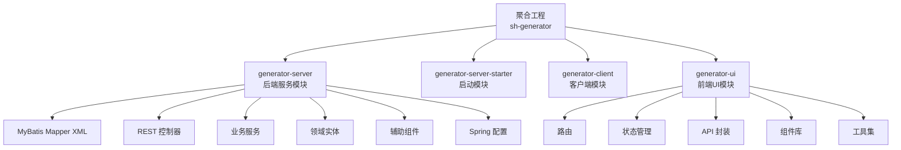
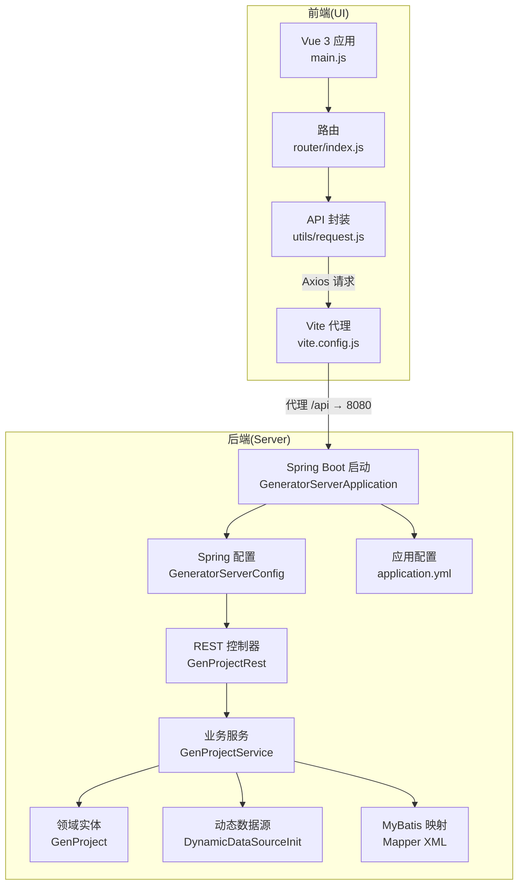
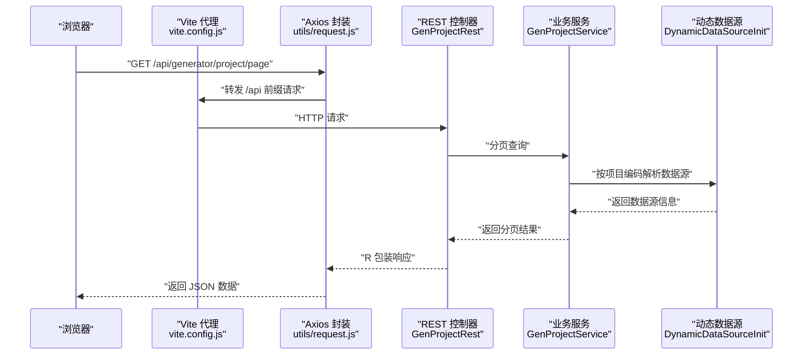
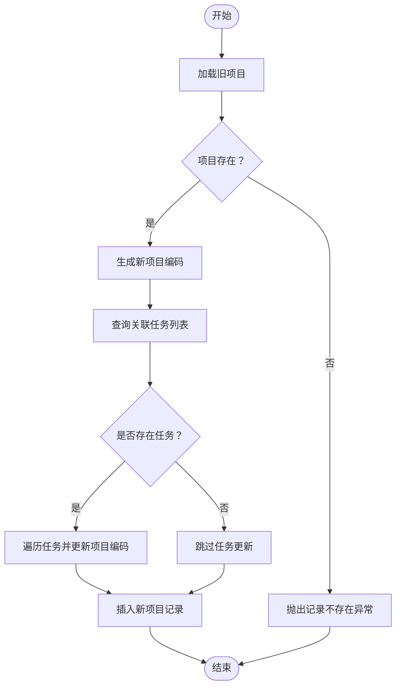

# 系统架构设计

<cite>
**本文档引用的文件**
- [pom.xml](file://pom.xml)
- [GeneratorServerApplication.java](file://generator-server-starter/src/main/java/com/wkclz/generator/server/starter/GeneratorServerApplication.java)
- [GeneratorServerConfig.java](file://generator-server/src/main/java/com/wkclz/generator/server/GeneratorServerConfig.java)
- [application.yml](file://generator-server-starter/src/main/resources/config/application.yml)
- [main.js](file://generator-ui/src/main.js)
- [package.json](file://generator-ui/package.json)
- [vite.config.js](file://generator-ui/vite.config.js)
- [Route.java](file://generator-server/src/main/java/com/wkclz/generator/server/Route.java)
- [GenProjectRest.java](file://generator-server/src/main/java/com/wkclz/generator/server/rest/GenProjectRest.java)
- [GenProjectService.java](file://generator-server/src/main/java/com/wkclz/generator/server/service/GenProjectService.java)
- [GenProject.java](file://generator-server/src/main/java/com/wkclz/generator/server/bean/entity/GenProject.java)
- [DynamicDataSourceInit.java](file://generator-server/src/main/java/com/wkclz/generator/server/helper/DynamicDataSourceInit.java)
- [org.springframework.boot.autoconfigure.AutoConfiguration.imports](file://generator-server/src/main/resources/META-INF/spring/org.springframework.boot.autoconfigure.AutoConfiguration.imports)
- [index.js](file://generator-ui/src/router/index.js)
- [request.js](file://generator-ui/src/utils/request.js)
</cite>

## 目录
1. [引言](#引言)
2. [项目结构](#项目结构)
3. [核心组件](#核心组件)
4. [架构总览](#架构总览)
5. [详细组件分析](#详细组件分析)
6. [依赖分析](#依赖分析)
7. [性能考虑](#性能考虑)
8. [故障排除指南](#故障排除指南)
9. [结论](#结论)

## 引言
本文件为 SH-Generator 系统的架构设计文档，面向开发者与架构师，系统采用前后端分离架构，结合 Spring Boot（后端）、Vue 3（前端）与 MyBatis 技术栈，实现“代码生成器”的模块化与可扩展性。文档重点阐述：
- 整体架构模式：前后端分离、微服务化设计思路与模块化组织
- 分层设计：表现层、业务层、数据访问层的职责划分与交互关系
- 技术栈选型原因与组件作用：Spring Boot、Vue 3、MyBatis、动态数据源等
- 系统边界与组件交互：通过系统边界图与组件交互图帮助理解数据流与控制流

## 项目结构
项目采用多模块聚合工程，包含后端服务模块、启动模块与前端 UI 模块，配合 Maven 父 POM 进行统一版本与构建管理。

图表来源
- [pom.xml:20-24](file://pom.xml#L20-L24)
- [org.springframework.boot.autoconfigure.AutoConfiguration.imports:1-2](file://generator-server/src/main/resources/META-INF/spring/org.springframework.boot.autoconfigure.AutoConfiguration.imports#L1-L2)

章节来源
- [pom.xml:1-35](file://pom.xml#L1-L35)

## 核心组件
- 后端启动入口：Spring Boot 应用入口负责应用上下文初始化与自动装配。
- 后端配置：集中扫描组件与 Mapper，启用 MyBatis 映射。
- 前端应用入口：Vue 3 应用初始化，注册全局组件、指令与插件，挂载 Element Plus。
- 前端构建配置：Vite 提供开发服务器与代理，将 /api 前缀转发至后端服务端口。
- 路由与控制器：统一路由前缀与 API 定义，REST 控制器提供 CRUD 与业务接口。
- 业务服务：封装分页查询、数据校验、复制与更新逻辑。
- 动态数据源：根据项目绑定的数据源编码动态创建数据源连接信息。

章节来源
- [GeneratorServerApplication.java:1-16](file://generator-server-starter/src/main/java/com/wkclz/generator/server/starter/GeneratorServerApplication.java#L1-L16)
- [GeneratorServerConfig.java:1-14](file://generator-server/src/main/java/com/wkclz/generator/server/GeneratorServerConfig.java#L1-L14)
- [main.js:1-105](file://generator-ui/src/main.js#L1-L105)
- [vite.config.js:1-72](file://generator-ui/vite.config.js#L1-L72)
- [Route.java:1-89](file://generator-server/src/main/java/com/wkclz/generator/server/Route.java#L1-L89)
- [GenProjectService.java:1-134](file://generator-server/src/main/java/com/wkclz/generator/server/service/GenProjectService.java#L1-L134)
- [DynamicDataSourceInit.java:1-61](file://generator-server/src/main/java/com/wkclz/generator/server/helper/DynamicDataSourceInit.java#L1-L61)

## 架构总览
系统采用前后端分离架构，前端 Vue 3 通过 Axios 发起请求，经由 Vite 开发代理将 /api 前缀请求转发到后端 Spring Boot 应用；后端以 REST 接口暴露业务能力，并通过 MyBatis 访问数据库。系统支持动态数据源，按项目维度隔离不同数据库连接。

图表来源
- [main.js:1-105](file://generator-ui/src/main.js#L1-L105)
- [index.js:1-86](file://generator-ui/src/router/index.js#L1-L86)
- [request.js:1-155](file://generator-ui/src/utils/request.js#L1-L155)
- [vite.config.js:41-53](file://generator-ui/vite.config.js#L41-L53)
- [GeneratorServerApplication.java:1-16](file://generator-server-starter/src/main/java/com/wkclz/generator/server/starter/GeneratorServerApplication.java#L1-L16)
- [GeneratorServerConfig.java:1-14](file://generator-server/src/main/java/com/wkclz/generator/server/GeneratorServerConfig.java#L1-L14)
- [GenProjectRest.java:1-79](file://generator-server/src/main/java/com/wkclz/generator/server/rest/GenProjectRest.java#L1-L79)
- [GenProjectService.java:1-134](file://generator-server/src/main/java/com/wkclz/generator/server/service/GenProjectService.java#L1-L134)
- [GenProject.java:1-108](file://generator-server/src/main/java/com/wkclz/generator/server/bean/entity/GenProject.java#L1-L108)
- [DynamicDataSourceInit.java:1-61](file://generator-server/src/main/java/com/wkclz/generator/server/helper/DynamicDataSourceInit.java#L1-L61)
- [application.yml:1-52](file://generator-server-starter/src/main/resources/config/application.yml#L1-L52)

## 详细组件分析

### 后端启动与配置
- 启动类：作为 Spring Boot 应用入口，负责加载自动配置与组件扫描。
- 配置类：集中声明组件扫描与 Mapper 扫描路径，确保 MyBatis 能正确发现映射文件。
- 自动导入：通过 Spring AutoConfiguration 导入自定义配置类，保证装配顺序与一致性。

章节来源
- [GeneratorServerApplication.java:1-16](file://generator-server-starter/src/main/java/com/wkclz/generator/server/starter/GeneratorServerApplication.java#L1-L16)
- [GeneratorServerConfig.java:1-14](file://generator-server/src/main/java/com/wkclz/generator/server/GeneratorServerConfig.java#L1-L14)
- [org.springframework.boot.autoconfigure.AutoConfiguration.imports:1-2](file://generator-server/src/main/resources/META-INF/spring/org.springframework.boot.autoconfigure.AutoConfiguration.imports#L1-L2)

### 前端应用与构建
- 应用入口：创建 Vue 实例，注册 Element Plus、全局组件与指令，注入全局工具方法。
- 路由：定义公共路由与滚动行为，支持 hash 模式与动态路由占位。
- 构建与代理：Vite 提供开发服务器与代理，将 /api 前缀请求转发到后端 8080 端口，便于本地联调。

章节来源
- [main.js:1-105](file://generator-ui/src/main.js#L1-L105)
- [index.js:1-86](file://generator-ui/src/router/index.js#L1-L86)
- [vite.config.js:1-72](file://generator-ui/vite.config.js#L1-L72)

### REST 控制器与路由规范
- 统一路由前缀：所有接口以统一前缀开头，便于网关与反向代理管理。
- 控制器职责：接收请求参数，调用业务服务，返回统一响应包装对象。
- 参数校验：对主键、必填字段进行断言与校验，避免空值导致的业务异常。

章节来源
- [Route.java:1-89](file://generator-server/src/main/java/com/wkclz/generator/server/Route.java#L1-L89)
- [GenProjectRest.java:1-79](file://generator-server/src/main/java/com/wkclz/generator/server/rest/GenProjectRest.java#L1-L79)

### 业务服务与实体模型
- 业务服务：继承基础服务类，提供分页查询、创建、更新、复制、按编码查询与唯一性校验。
- 实体模型：定义项目实体的字段与拷贝方法，支持全量与非空字段拷贝，保障更新安全。
- 事务与一致性：在更新场景下，若更换项目编码，同步更新关联任务的项目编码，保持数据一致性。

章节来源
- [GenProjectService.java:1-134](file://generator-server/src/main/java/com/wkclz/generator/server/service/GenProjectService.java#L1-L134)
- [GenProject.java:1-108](file://generator-server/src/main/java/com/wkclz/generator/server/bean/entity/GenProject.java#L1-L108)

### 动态数据源与数据库访问
- 动态数据源工厂：根据项目绑定的数据源编码查询配置，校验数据库类型，构造 JDBC URL 与凭证，返回数据源信息。
- 类型约束：当前仅支持 MySQL 与 MariaDB，其他类型将抛出异常。
- 与业务集成：业务服务在需要跨库读取元数据时，可通过动态数据源工厂获取目标库连接。

章节来源
- [DynamicDataSourceInit.java:1-61](file://generator-server/src/main/java/com/wkclz/generator/server/helper/DynamicDataSourceInit.java#L1-L61)

### 前后端交互流程（序列图）
以下序列图展示了从前端发起项目分页请求到后端返回分页结果的完整流程。

图表来源
- [vite.config.js:41-53](file://generator-ui/vite.config.js#L41-L53)
- [request.js:1-155](file://generator-ui/src/utils/request.js#L1-L155)
- [GenProjectRest.java:1-79](file://generator-server/src/main/java/com/wkclz/generator/server/rest/GenProjectRest.java#L1-L79)
- [GenProjectService.java:1-134](file://generator-server/src/main/java/com/wkclz/generator/server/service/GenProjectService.java#L1-L134)
- [DynamicDataSourceInit.java:1-61](file://generator-server/src/main/java/com/wkclz/generator/server/helper/DynamicDataSourceInit.java#L1-L61)

### 项目复制流程（流程图）
项目复制涉及生成新编码、迁移关联任务以及插入新记录，流程如下：

图表来源
- [GenProjectService.java:72-93](file://generator-server/src/main/java/com/wkclz/generator/server/service/GenProjectService.java#L72-L93)

## 依赖分析
- 模块依赖：父 POM 聚合三个子模块，分别承担服务、启动与前端 UI 的职责。
- 前端依赖：Vue 3、Element Plus、Axios、Pinia、Vue Router 等，支撑 UI 交互与状态管理。
- 后端依赖：Spring Boot、MyBatis、动态数据源框架、分页插件等，支撑 REST 服务与数据访问。
- 配置依赖：application.yml 中定义端口、数据源、Jackson、分页与监控等配置。

章节来源
- [pom.xml:20-24](file://pom.xml#L20-L24)
- [package.json:1-53](file://generator-ui/package.json#L1-L53)
- [application.yml:1-52](file://generator-server-starter/src/main/resources/config/application.yml#L1-L52)

## 性能考虑
- 前端性能
  - Vite 构建优化：按需打包、代码分割与资源命名策略降低首屏体积。
  - Axios 请求拦截：统一头部与重复提交防护，减少无效请求。
- 后端性能
  - MyBatis 驼峰映射与 Mapper XML：提升 SQL 查询与映射效率。
  - 分页插件：合理设置分页参数，避免一次性拉取大量数据。
  - 动态数据源：按需创建连接，避免长连接占用与切换开销。
- 网络与缓存
  - 代理与跨域：开发阶段通过 Vite 代理简化跨域问题。
  - 响应式与状态管理：Pinia 与 Element Plus 组件复用，减少重渲染。

## 故障排除指南
- 常见错误与定位
  - 401 会话失效：前端拦截器检测到 401，弹窗提示并触发登出流程。
  - 请求超时与网络异常：统一错误提示与重试建议。
  - 业务异常：后端返回统一响应码，前端根据错误码提示用户。
- 数据源相关
  - 数据源编码不存在：动态数据源工厂抛出异常，检查项目绑定的数据源配置。
  - 不支持的数据库类型：当前仅支持 MySQL 与 MariaDB，其他类型将被拒绝。
- 配置检查
  - 后端端口与代理端口：确认 Vite 代理 target 与后端端口一致。
  - Jackson 与分页配置：确保驼峰映射与分页参数正确。

章节来源
- [request.js:75-125](file://generator-ui/src/utils/request.js#L75-L125)
- [DynamicDataSourceInit.java:24-58](file://generator-server/src/main/java/com/wkclz/generator/server/helper/DynamicDataSourceInit.java#L24-L58)
- [application.yml:1-52](file://generator-server-starter/src/main/resources/config/application.yml#L1-L52)

## 结论
SH-Generator 通过前后端分离与模块化组织，实现了清晰的职责划分与良好的可维护性。后端以 Spring Boot + MyBatis 为核心，提供 REST 接口与动态数据源能力；前端以 Vue 3 为基础，借助 Vite 与 Axios 构建高效交互体验。统一的路由前缀与响应格式，为后续微服务化与网关接入提供了良好基础。