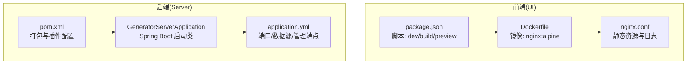
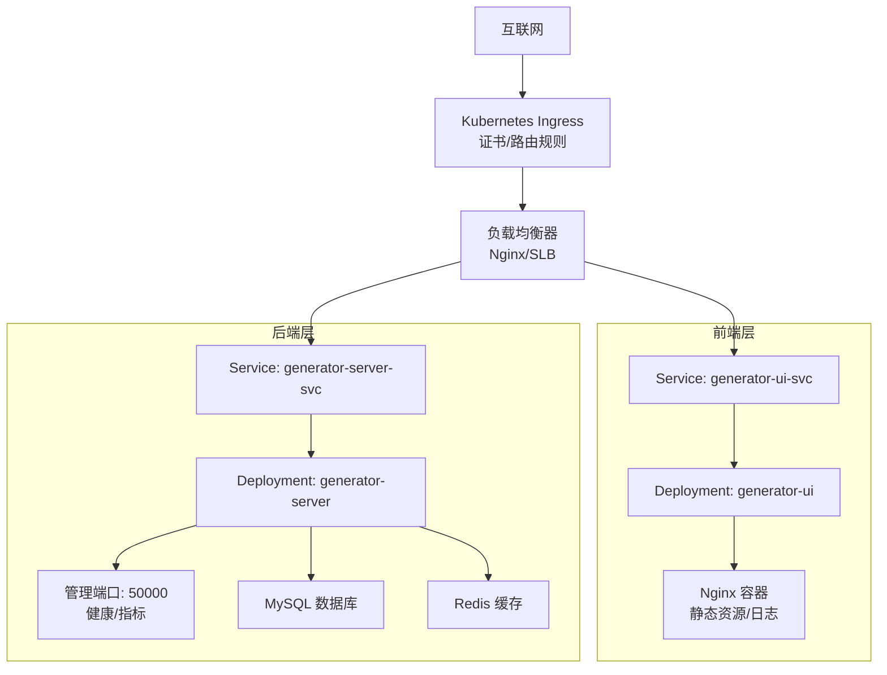
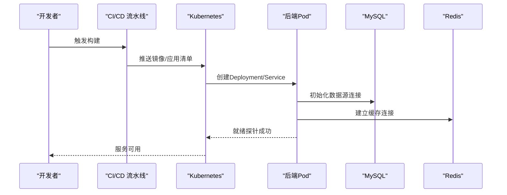
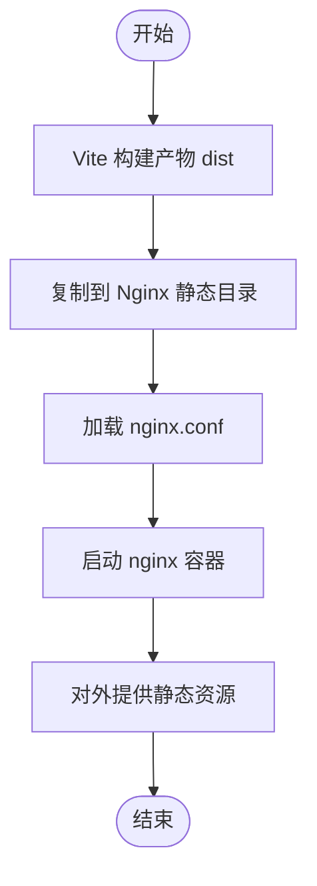
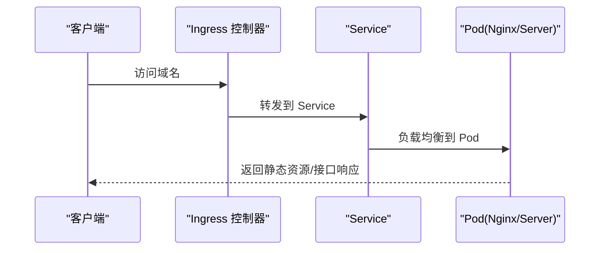
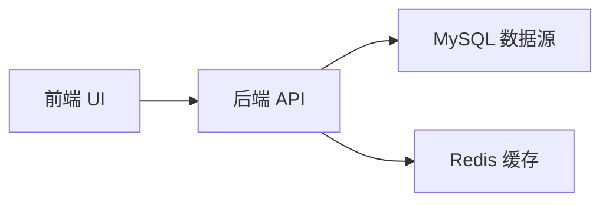

# 部署架构

<cite>
**本文引用的文件**
- [application.yml](file://generator-server-starter/src/main/resources/config/application.yml)
- [GeneratorServerApplication.java](file://generator-server-starter/src/main/java/com/wkclz/generator/server/starter/GeneratorServerApplication.java)
- [Dockerfile](file://generator-ui/Dockerfile)
- [nginx.conf](file://generator-ui/nginx.conf)
- [deploy-uat.yaml](file://generator-ui/deploy-uat.yaml)
- [package.json](file://generator-ui/package.json)
- [pom.xml](file://generator-server-starter/pom.xml)
</cite>

## 目录
1. [简介](#简介)
2. [项目结构](#项目结构)
3. [核心组件](#核心组件)
4. [架构总览](#架构总览)
5. [详细组件分析](#详细组件分析)
6. [依赖关系分析](#依赖关系分析)
7. [性能考虑](#性能考虑)
8. [故障排查指南](#故障排查指南)
9. [结论](#结论)
10. [附录](#附录)

## 简介
本文件面向 SH-Generator 的部署与运维团队，提供从开发到生产的完整部署架构说明。内容涵盖系统拓扑、运行环境要求、容器化策略、负载均衡与入口网关、数据库连接池与缓存配置建议、前端静态资源部署方式、后端服务部署流程、不同环境配置差异、性能优化与监控告警等。

## 项目结构
项目采用多模块结构，分为后端服务模块与前端 UI 模块：
- generator-server：业务服务模块，包含 REST 接口、数据访问层、领域模型与服务层。
- generator-server-starter：Spring Boot 启动模块，聚合业务模块并提供可执行入口。
- generator-ui：Vue3 前端工程，使用 Vite 构建，Nginx 提供静态资源服务与反向代理。
- 共享依赖通过 Maven 管理，后端使用 MySQL 数据源，前端构建产物由 Nginx 提供。

图表来源
- [Dockerfile:1-15](file://generator-ui/Dockerfile#L1-L15)
- [nginx.conf:1-77](file://generator-ui/nginx.conf#L1-L77)
- [package.json:1-53](file://generator-ui/package.json#L1-L53)
- [GeneratorServerApplication.java:1-16](file://generator-server-starter/src/main/java/com/wkclz/generator/server/starter/GeneratorServerApplication.java#L1-L16)
- [application.yml:1-52](file://generator-server-starter/src/main/resources/config/application.yml#L1-L52)
- [pom.xml:1-52](file://generator-server-starter/pom.xml#L1-L52)

章节来源
- [GeneratorServerApplication.java:1-16](file://generator-server-starter/src/main/java/com/wkclz/generator/server/starter/GeneratorServerApplication.java#L1-L16)
- [application.yml:1-52](file://generator-server-starter/src/main/resources/config/application.yml#L1-L52)
- [Dockerfile:1-15](file://generator-ui/Dockerfile#L1-L15)
- [nginx.conf:1-77](file://generator-ui/nginx.conf#L1-L77)
- [package.json:1-53](file://generator-ui/package.json#L1-L53)
- [pom.xml:1-52](file://generator-server-starter/pom.xml#L1-L52)

## 核心组件
- 后端服务
  - Spring Boot 应用，监听端口由配置文件定义；启用独立管理端口以暴露健康检查与指标。
  - MyBatis Mapper 扫描路径与分页插件配置在配置文件中声明。
  - 数据源驱动类型为 MySQL。
- 前端服务
  - 使用 Nginx 提供静态资源服务，并通过配置文件定义日志格式、压缩、连接参数等。
  - Dockerfile 基于 nginx:alpine，复制构建产物与 Nginx 配置，设置时区与启动命令。
- 部署编排
  - 提供 UAT 环境的 Kubernetes 编排示例，包含 Deployment、Service 与 Ingress。

章节来源
- [application.yml:1-52](file://generator-server-starter/src/main/resources/config/application.yml#L1-L52)
- [GeneratorServerApplication.java:1-16](file://generator-server-starter/src/main/java/com/wkclz/generator/server/starter/GeneratorServerApplication.java#L1-L16)
- [Dockerfile:1-15](file://generator-ui/Dockerfile#L1-L15)
- [nginx.conf:1-77](file://generator-ui/nginx.conf#L1-L77)
- [deploy-uat.yaml:1-77](file://generator-ui/deploy-uat.yaml#L1-L77)

## 架构总览
下图展示了生产环境的典型部署拓扑：前端通过 Ingress/Nginx 对外提供静态资源与 API 反向代理；后端服务通过 Spring Boot 运行在容器内，使用独立管理端口暴露健康与指标；数据库与缓存作为外部依赖由平台或集群提供。

图表来源
- [deploy-uat.yaml:1-77](file://generator-ui/deploy-uat.yaml#L1-L77)
- [nginx.conf:1-77](file://generator-ui/nginx.conf#L1-L77)
- [application.yml:1-52](file://generator-server-starter/src/main/resources/config/application.yml#L1-L52)

## 详细组件分析

### 后端服务部署与运行环境
- 启动类与打包
  - 启动类位于启动模块，使用 Spring Boot 插件进行打包与运行。
  - 启动模块的安装/部署插件被显式跳过，仅用于打包与启动。
- 运行端口与管理端口
  - Web 端口在配置文件中定义；管理端口独立配置，便于安全隔离与监控采集。
- 数据源与 MyBatis
  - 数据源驱动类型为 MySQL；MyBatis Mapper XML 扫描路径与驼峰映射已开启；分页插件方言为 MySQL。
- 配置文件要点
  - 包含 Jackson 默认属性过滤、PageHelper 分页参数、Actuator 管理端点开放等。

图表来源
- [pom.xml:1-52](file://generator-server-starter/pom.xml#L1-L52)
- [application.yml:1-52](file://generator-server-starter/src/main/resources/config/application.yml#L1-L52)

章节来源
- [GeneratorServerApplication.java:1-16](file://generator-server-starter/src/main/java/com/wkclz/generator/server/starter/GeneratorServerApplication.java#L1-L16)
- [pom.xml:1-52](file://generator-server-starter/pom.xml#L1-L52)
- [application.yml:1-52](file://generator-server-starter/src/main/resources/config/application.yml#L1-L52)

### 前端静态资源部署
- 镜像与容器
  - 基于 nginx:alpine，设置时区，复制构建产物与 Nginx 配置，启动命令为前台模式。
- Nginx 配置
  - 日志格式包含请求链路与响应时间等字段；gzip 压缩开启；长连接超时与 keepalive 请求次数合理配置；静态资源按需缓存策略由前端构建产物与浏览器控制。
- 构建与脚本
  - package.json 提供开发、构建与预览脚本，适配本地与 CI 环境。

图表来源
- [Dockerfile:1-15](file://generator-ui/Dockerfile#L1-L15)
- [nginx.conf:1-77](file://generator-ui/nginx.conf#L1-L77)
- [package.json:1-53](file://generator-ui/package.json#L1-L53)

章节来源
- [Dockerfile:1-15](file://generator-ui/Dockerfile#L1-L15)
- [nginx.conf:1-77](file://generator-ui/nginx.conf#L1-L77)
- [package.json:1-53](file://generator-ui/package.json#L1-L53)

### Kubernetes 编排与入口网关
- 编排示例
  - 提供 UAT 环境的 Deployment、Service 与 Ingress 示例，包含镜像拉取密钥、证书颁发与域名绑定。
- 入口网关
  - Ingress 使用注解配置证书颁发与 SSL 重定向策略；Service 类型为 ClusterIP，暴露 80 端口。
- 发布策略
  - 示例中采用 Recreate 策略，资源受限场景可切换为滚动更新（注释说明）。

图表来源
- [deploy-uat.yaml:1-77](file://generator-ui/deploy-uat.yaml#L1-L77)

章节来源
- [deploy-uat.yaml:1-77](file://generator-ui/deploy-uat.yaml#L1-L77)

## 依赖关系分析
- 组件耦合
  - 启动模块聚合业务模块，避免重复打包；前端通过 Nginx 与后端服务解耦。
- 外部依赖
  - 后端依赖 MySQL 与 Redis（外部提供），前端依赖 CDN 与浏览器缓存策略。
- 配置契约
  - 前端通过环境变量或构建参数注入后端 API 地址；后端通过配置文件声明数据源与管理端口。

图表来源
- [application.yml:1-52](file://generator-server-starter/src/main/resources/config/application.yml#L1-L52)

章节来源
- [application.yml:1-52](file://generator-server-starter/src/main/resources/config/application.yml#L1-L52)

## 性能考虑
- 前端性能
  - Nginx 开启 gzip 压缩与静态资源缓存；合理设置 keepalive 超时与并发连接数；日志格式包含请求耗时便于定位性能瓶颈。
- 后端性能
  - 独立管理端口便于接入 Prometheus 等监控系统；MyBatis 已开启驼峰映射与分页插件；建议在生产环境增加连接池大小与超时阈值。
- 容器与网络
  - 前端容器基于 Alpine 镜像减小体积；后端容器根据 CPU/内存需求设置资源限制与请求；Ingress 层面配置限流与健康检查。

章节来源
- [nginx.conf:1-77](file://generator-ui/nginx.conf#L1-L77)
- [application.yml:1-52](file://generator-server-starter/src/main/resources/config/application.yml#L1-L52)

## 故障排查指南
- 健康检查
  - 管理端点已开放，可通过独立端口访问健康与指标，便于自动化探针与告警。
- 日志定位
  - 前端 Nginx 错误与访问日志路径已在配置中定义，建议统一挂载到持久化存储并集中采集。
- 常见问题
  - 数据源连接失败：检查驱动类型与连接串；连接池参数是否合理。
  - 前端 404 或刷新路由异常：确认 Nginx try_files 与 SPA 路由回退配置。
  - Ingress 证书或域名解析：核对证书颁发器与域名绑定。

章节来源
- [application.yml:28-52](file://generator-server-starter/src/main/resources/config/application.yml#L28-L52)
- [nginx.conf:1-77](file://generator-ui/nginx.conf#L1-L77)

## 结论
本文给出了 SH-Generator 的部署架构与实施建议，覆盖前后端分离部署、容器化策略、入口网关、数据库与缓存配置要点、性能优化与监控告警思路。建议在生产环境中进一步完善连接池参数、缓存策略、证书与 TLS、以及可观测性体系（Prometheus/Grafana/Alertmanager）。

## 附录

### 不同环境配置差异与部署注意事项
- 开发环境
  - 使用本地或内网数据库与缓存；关闭或简化管理端点暴露；前端通过 Vite 开发服务器直连后端。
- 测试/UAT 环境
  - 使用与生产相近的资源规模与网络策略；Ingress 注解与证书配置需与生产一致但使用测试域名。
- 生产环境
  - 强制启用 HTTPS 与证书校验；严格控制管理端口访问范围；配置 SLB/LB 限流与健康检查；建立完善的日志与指标采集。

章节来源
- [deploy-uat.yaml:1-77](file://generator-ui/deploy-uat.yaml#L1-L77)

### 数据库连接池与缓存配置建议
- 连接池
  - 建议在配置文件中新增连接池参数（如最大连接数、空闲连接、超时等），并结合压测结果调优。
- 缓存
  - 建议引入 Redis 并配置连接参数、序列化策略与过期策略；对热点数据进行缓存预热与失效控制。

章节来源
- [application.yml:1-52](file://generator-server-starter/src/main/resources/config/application.yml#L1-L52)