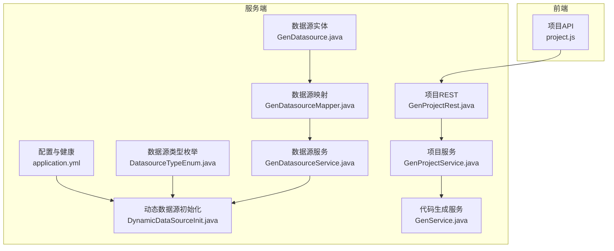
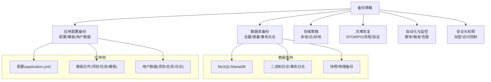
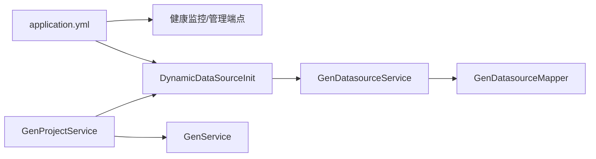

# 备份与恢复

<cite>
**本文引用的文件**
- [application.yml](file://generator-server-starter/src/main/resources/config/application.yml)
- [DynamicDataSourceInit.java](file://generator-server/src/main/java/com/wkclz/generator/server/helper/DynamicDataSourceInit.java)
- [DatasourceTypeEnum.java](file://generator-server/src/main/java/com/wkclz/generator/server/bean/enums/DatasourceTypeEnum.java)
- [GenDatasource.java](file://generator-server/src/main/java/com/wkclz/generator/server/bean/entity/GenDatasource.java)
- [GenDatasourceMapper.java](file://generator-server/src/main/java/com/wkclz/generator/server/mapper/GenDatasourceMapper.java)
- [GenDatasourceService.java](file://generator-server/src/main/java/com/wkclz/generator/server/service/GenDatasourceService.java)
- [GenService.java](file://generator-server/src/main/java/com/wkclz/generator/server/service/GenService.java)
- [GenProjectService.java](file://generator-server/src/main/java/com/wkclz/generator/server/service/GenProjectService.java)
- [GenProjectRest.java](file://generator-server/src/main/java/com/wkclz/generator/server/rest/GenProjectRest.java)
- [project.js](file://generator-ui/src/api/project.js)
- [tasks.md](file://.trae/specs/init-harness-engineering/tasks.md)
- [checklist.md](file://.trae/specs/init-harness-engineering/checklist.md)
- [spec.md](file://.trae/specs/init-harness-engineering/spec.md)
</cite>

## 目录
1. [简介](#简介)
2. [项目结构](#项目结构)
3. [核心组件](#核心组件)
4. [架构总览](#架构总览)
5. [详细组件分析](#详细组件分析)
6. [依赖关系分析](#依赖关系分析)
7. [性能考量](#性能考量)
8. [故障排查指南](#故障排查指南)
9. [结论](#结论)
10. [附录](#附录)

## 简介
本文件面向 SH-Generator 项目的备份与恢复，围绕数据库备份策略（全量、增量、事务日志）、应用配置与数据备份、存储策略（本地/云/异地）、灾难恢复计划（RTO/RPO、流程与验证）、自动化脚本与监控告警、数据迁移与升级过程中的备份恢复以及备份数据安全与权限控制进行系统化说明。文档以项目现有代码与配置为依据，结合实际可落地的操作建议，帮助保障业务连续性。

## 项目结构
SH-Generator 采用多模块结构，核心与备份恢复相关的模块与文件如下：
- 服务端配置与健康监控：generator-server-starter/resources/config/application.yml
- 动态数据源初始化：generator-server/helper/DynamicDataSourceInit.java
- 数据源类型枚举：generator-server/bean/enums/DatasourceTypeEnum.java
- 数据源实体与持久层：generator-server/bean/entity/GenDatasource.java、mapper/GenDatasourceMapper.java
- 数据源服务：generator-server/service/GenDatasourceService.java
- 代码生成服务：generator-server/service/GenService.java
- 项目管理服务与接口：generator-server/service/GenProjectService.java、rest/GenProjectRest.java
- 前端项目 API：generator-ui/src/api/project.js
- 工程化与活文档：.trae/specs/init-harness-engineering/*.md

图表来源
- [application.yml:1-51](file://generator-server-starter/src/main/resources/config/application.yml#L1-L51)
- [DynamicDataSourceInit.java:1-60](file://generator-server/src/main/java/com/wkclz/generator/server/helper/DynamicDataSourceInit.java#L1-L60)
- [DatasourceTypeEnum.java:1-56](file://generator-server/src/main/java/com/wkclz/generator/server/bean/enums/DatasourceTypeEnum.java#L1-L56)
- [GenDatasource.java:1-115](file://generator-server/src/main/java/com/wkclz/generator/server/bean/entity/GenDatasource.java#L1-L115)
- [GenDatasourceMapper.java:1-16](file://generator-server/src/main/java/com/wkclz/generator/server/mapper/GenDatasourceMapper.java#L1-L16)
- [GenDatasourceService.java:36-58](file://generator-server/src/main/java/com/wkclz/generator/server/service/GenDatasourceService.java#L36-L58)
- [GenService.java:100-152](file://generator-server/src/main/java/com/wkclz/generator/server/service/GenService.java#L100-L152)
- [GenProjectService.java:36-133](file://generator-server/src/main/java/com/wkclz/generator/server/service/GenProjectService.java#L36-L133)
- [GenProjectRest.java:37-78](file://generator-server/src/main/java/com/wkclz/generator/server/rest/GenProjectRest.java#L37-L78)
- [project.js:1-33](file://generator-ui/src/api/project.js#L1-L33)

章节来源
- [application.yml:1-51](file://generator-server-starter/src/main/resources/config/application.yml#L1-L51)
- [DynamicDataSourceInit.java:1-60](file://generator-server/src/main/java/com/wkclz/generator/server/helper/DynamicDataSourceInit.java#L1-L60)
- [DatasourceTypeEnum.java:1-56](file://generator-server/src/main/java/com/wkclz/generator/server/bean/enums/DatasourceTypeEnum.java#L1-L56)
- [GenDatasource.java:1-115](file://generator-server/src/main/java/com/wkclz/generator/server/bean/entity/GenDatasource.java#L1-L115)
- [GenDatasourceMapper.java:1-16](file://generator-server/src/main/java/com/wkclz/generator/server/mapper/GenDatasourceMapper.java#L1-L16)
- [GenDatasourceService.java:36-58](file://generator-server/src/main/java/com/wkclz/generator/server/service/GenDatasourceService.java#L36-L58)
- [GenService.java:100-152](file://generator-server/src/main/java/com/wkclz/generator/server/service/GenService.java#L100-L152)
- [GenProjectService.java:36-133](file://generator-server/src/main/java/com/wkclz/generator/server/service/GenProjectService.java#L36-L133)
- [GenProjectRest.java:37-78](file://generator-server/src/main/java/com/wkclz/generator/server/rest/GenProjectRest.java#L37-L78)
- [project.js:1-33](file://generator-ui/src/api/project.js#L1-L33)

## 核心组件
- 应用配置与健康监控：通过 application.yml 配置端口、数据源驱动、分页插件、管理端点等，便于统一监控与运维。
- 动态数据源初始化：根据数据源编码从数据库加载连接信息，支持 MySQL/MariaDB 类型校验与连接参数组装。
- 数据源实体与服务：提供数据源的增删改查、选项查询与按编码检索，支撑代码生成时的表结构与列元数据读取。
- 项目管理与代码生成：项目服务负责项目复制、更新与一致性维护；代码生成服务基于模板与参数生成文件，涉及本地文件写入。

章节来源
- [application.yml:1-51](file://generator-server-starter/src/main/resources/config/application.yml#L1-L51)
- [DynamicDataSourceInit.java:17-58](file://generator-server/src/main/java/com/wkclz/generator/server/helper/DynamicDataSourceInit.java#L17-L58)
- [GenDatasource.java:58-115](file://generator-server/src/main/java/com/wkclz/generator/server/bean/entity/GenDatasource.java#L58-L115)
- [GenDatasourceService.java:45-54](file://generator-server/src/main/java/com/wkclz/generator/server/service/GenDatasourceService.java#L45-L54)
- [GenProjectService.java:36-68](file://generator-server/src/main/java/com/wkclz/generator/server/service/GenProjectService.java#L36-L68)
- [GenService.java:100-152](file://generator-server/src/main/java/com/wkclz/generator/server/service/GenService.java#L100-L152)

## 架构总览
备份与恢复需覆盖以下关键面：
- 数据库备份：针对 MySQL/MariaDB 的全量、增量与事务日志备份策略
- 应用配置备份：配置文件、模板文件与用户数据备份
- 存储策略：本地、云存储备份与异地备份
- 灾难恢复：RTO/RPO 目标、恢复流程与验证
- 自动化与监控：备份脚本、触发与告警
- 安全与权限：备份数据加密与访问控制

## 详细组件分析

### 数据库备份策略
- 支持类型：根据数据源类型枚举，当前支持 MYSQL、MARIADB；动态数据源初始化仅允许 MYSQL/MARIADB。
- 全量备份：推荐使用逻辑导出（如 mysqldump）或物理快照（如 Percona XtraBackup）进行全量备份，周期按 RPO 设定（如每日/每周）。
- 增量备份：启用二进制日志（binlog），结合时间点恢复（PITR），实现更细粒度的恢复窗口。
- 事务日志备份：确保 binlog 开启并定期轮转，配合全量+增量实现高可靠恢复。
- 备份保留与轮转：按法规与业务需求设定保留期，定期清理过期备份。
- 验证与演练：定期进行备份恢复演练，验证备份完整性与恢复时间。

章节来源
- [DatasourceTypeEnum.java:13-24](file://generator-server/src/main/java/com/wkclz/generator/server/bean/enums/DatasourceTypeEnum.java#L13-L24)
- [DynamicDataSourceInit.java:34-40](file://generator-server/src/main/java/com/wkclz/generator/server/helper/DynamicDataSourceInit.java#L34-L40)

### 应用配置备份方案
- 配置文件备份：application.yml 属于应用配置，应纳入版本控制或单独备份，确保环境切换与灾备恢复可用。
- 模板文件备份：项目/任务/模板实体中包含模板内容字段，应定期导出模板集合，作为模板资产备份。
- 用户数据备份：项目、任务、日志等用户数据通过服务层接口进行备份，建议按天/周全量导出，结合 binlog 实现近实时增量。

章节来源
- [application.yml:1-51](file://generator-server-starter/src/main/resources/config/application.yml#L1-L51)
- [GenDatasource.java:58-115](file://generator-server/src/main/java/com/wkclz/generator/server/bean/entity/GenDatasource.java#L58-L115)
- [GenService.java:100-152](file://generator-server/src/main/java/com/wkclz/generator/server/service/GenService.java#L100-L152)

### 存储策略
- 本地备份：适用于快速恢复与低延迟场景，需考虑磁盘容量与可靠性。
- 云存储备份：利用对象存储（如 OSS/COS/S3）进行归档，具备高可用与弹性扩展优势。
- 异地备份：跨地域冗余，满足灾难级恢复需求，需评估网络延迟与合规要求。

（本节为概念性说明，不直接分析具体文件）

### 灾难恢复计划
- RTO/RPO 目标：根据业务 SLA 设定恢复时间与恢复点目标，优先保证核心数据与关键流程。
- 恢复流程：定义清晰的恢复步骤（环境准备、配置恢复、数据恢复、服务验证），并形成标准化手册。
- 测试验证：定期组织恢复演练，验证备份可用性、恢复时间与数据一致性。

（本节为概念性说明，不直接分析具体文件）

### 自动化备份脚本与监控告警
- 自动化脚本：封装数据库全量/增量备份、配置与模板导出、归档与轮转脚本，支持定时调度。
- 触发机制：结合应用健康检查与数据库状态，自动触发备份或失败告警。
- 监控告警：通过管理端点与日志采集，监控备份执行状态、存储空间与恢复演练结果。

章节来源
- [application.yml:28-51](file://generator-server-starter/src/main/resources/config/application.yml#L28-L51)

### 数据迁移与升级过程中的备份恢复
- 迁移前：对源数据库与应用配置进行全量备份，导出模板与用户数据。
- 升级前：对目标环境进行预热与验证，确保备份可恢复。
- 回滚策略：若升级失败，按恢复流程回退至最近一次成功备份。

（本节为概念性说明，不直接分析具体文件）

### 备份数据的安全保护与访问权限控制
- 加密传输与存储：备份通道采用加密协议，备份文件本地与云端均应加密。
- 访问控制：最小权限原则，限制备份文件访问范围，结合 IAM 与角色管理。
- 审计与日志：记录备份与恢复操作日志，便于审计与追踪。

（本节为概念性说明，不直接分析具体文件）

## 依赖关系分析
备份与恢复涉及的关键依赖链路如下：
- 配置依赖：application.yml 提供端口、管理端点与数据源驱动配置，是监控与备份脚本的输入之一。
- 数据源依赖：DynamicDataSourceInit 依赖 GenDatasourceService 获取数据源信息，进而建立数据库连接。
- 业务数据依赖：GenProjectService/GenService 等服务承载项目与代码生成数据，是备份的对象。

图表来源
- [application.yml:1-51](file://generator-server-starter/src/main/resources/config/application.yml#L1-L51)
- [DynamicDataSourceInit.java:17-58](file://generator-server/src/main/java/com/wkclz/generator/server/helper/DynamicDataSourceInit.java#L17-L58)
- [GenDatasourceService.java:45-54](file://generator-server/src/main/java/com/wkclz/generator/server/service/GenDatasourceService.java#L45-L54)
- [GenDatasourceMapper.java:1-16](file://generator-server/src/main/java/com/wkclz/generator/server/mapper/GenDatasourceMapper.java#L1-L16)
- [GenProjectService.java:36-68](file://generator-server/src/main/java/com/wkclz/generator/server/service/GenProjectService.java#L36-L68)
- [GenService.java:100-152](file://generator-server/src/main/java/com/wkclz/generator/server/service/GenService.java#L100-L152)

章节来源
- [application.yml:1-51](file://generator-server-starter/src/main/resources/config/application.yml#L1-L51)
- [DynamicDataSourceInit.java:17-58](file://generator-server/src/main/java/com/wkclz/generator/server/helper/DynamicDataSourceInit.java#L17-L58)
- [GenDatasourceService.java:45-54](file://generator-server/src/main/java/com/wkclz/generator/server/service/GenDatasourceService.java#L45-L54)
- [GenDatasourceMapper.java:1-16](file://generator-server/src/main/java/com/wkclz/generator/server/mapper/GenDatasourceMapper.java#L1-L16)
- [GenProjectService.java:36-68](file://generator-server/src/main/java/com/wkclz/generator/server/service/GenProjectService.java#L36-L68)
- [GenService.java:100-152](file://generator-server/src/main/java/com/wkclz/generator/server/service/GenService.java#L100-L152)

## 性能考量
- 备份窗口：合理安排全量与增量备份时间，避免业务高峰期。
- 并行与压缩：在保证一致性的前提下，使用并行与压缩提升备份效率。
- 存储带宽：云存储备份需考虑上传带宽与成本平衡。
- 恢复速度：优化恢复流程与资源准备，缩短 RTO。

（本节为通用指导，不直接分析具体文件）

## 故障排查指南
- 数据库连接问题：检查数据源编码是否存在、类型是否为 MYSQL/MARIADB、连接参数是否正确。
- 备份执行失败：核对备份脚本权限、存储空间、网络连通性与日志输出。
- 恢复验证：恢复后进行功能验证与数据一致性检查，确保业务可用。

章节来源
- [DynamicDataSourceInit.java:24-58](file://generator-server/src/main/java/com/wkclz/generator/server/helper/DynamicDataSourceInit.java#L24-L58)
- [GenDatasourceService.java:45-54](file://generator-server/src/main/java/com/wkclz/generator/server/service/GenDatasourceService.java#L45-L54)

## 结论
通过明确的备份策略、完善的存储与灾难恢复计划、自动化脚本与监控告警，以及严格的安全与权限控制，SH-Generator 可有效保障业务连续性。建议结合实际业务 SLA 设定 RTO/RPO 目标，并定期演练验证，持续优化备份与恢复流程。

## 附录
- 工程化与活文档参考：用于规范工程实践与文档体系，辅助备份与恢复流程的标准化与可追溯性。

章节来源
- [tasks.md:1-42](file://.trae/specs/init-harness-engineering/tasks.md#L1-L42)
- [checklist.md:23-45](file://.trae/specs/init-harness-engineering/checklist.md#L23-L45)
- [spec.md:68-89](file://.trae/specs/init-harness-engineering/spec.md#L68-L89)