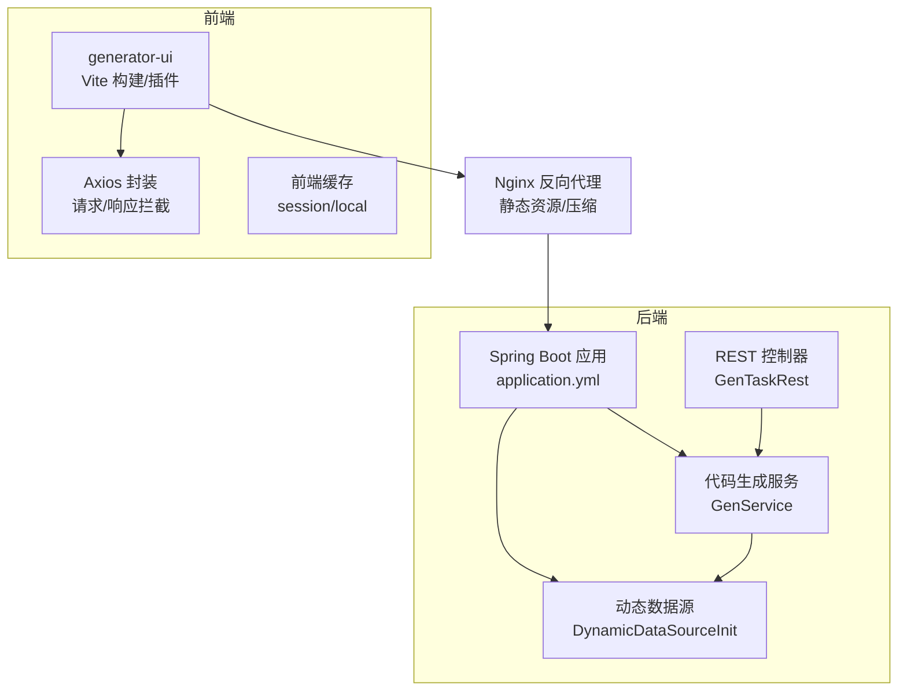
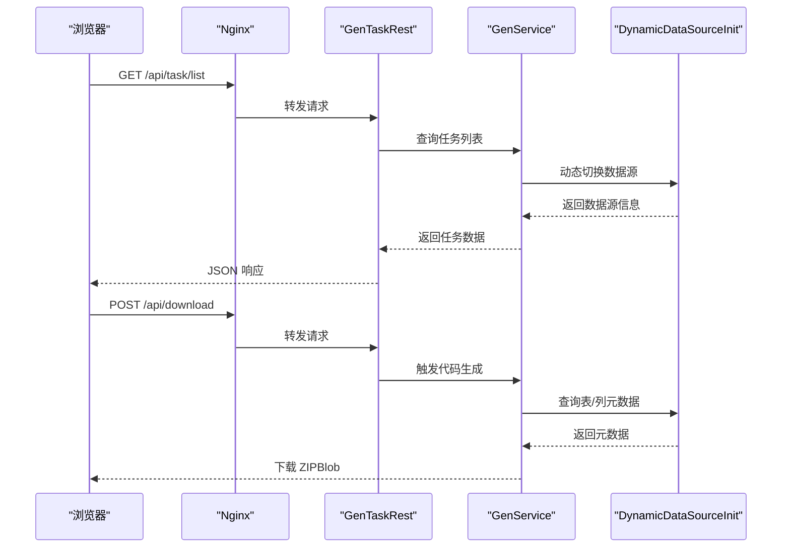
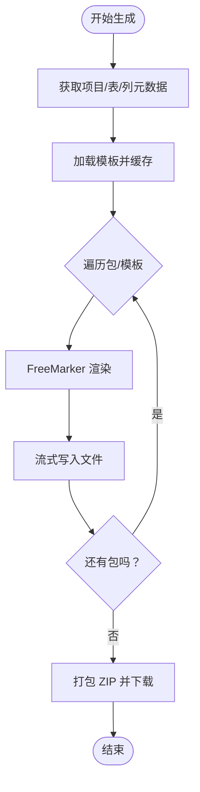
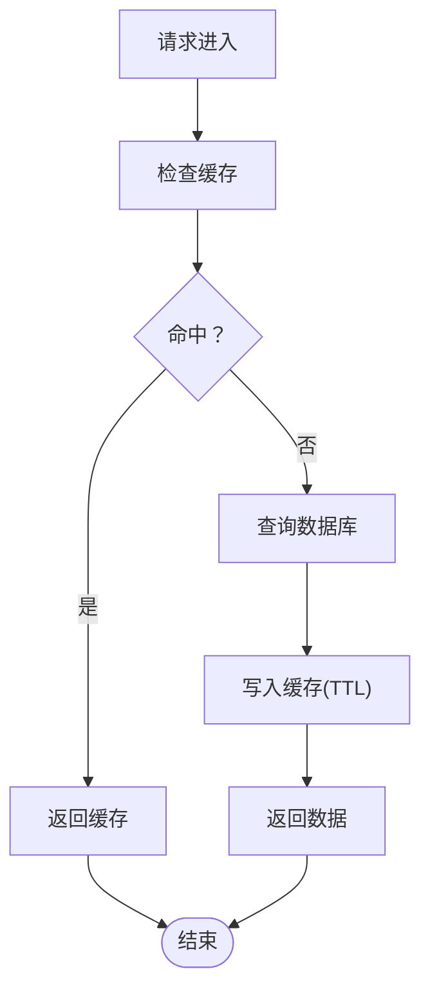
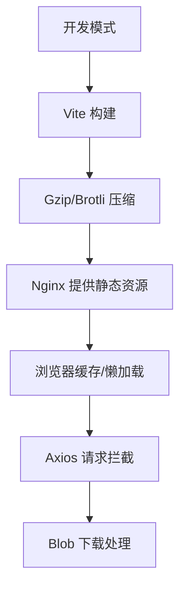
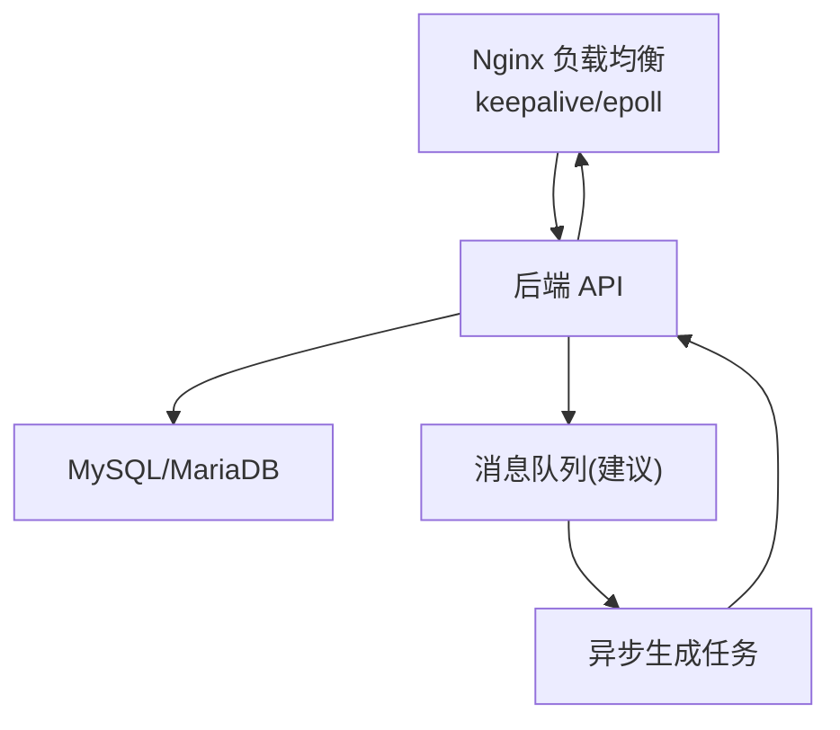
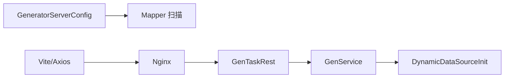

# 性能优化

<cite>
**本文引用的文件**
- [application.yml](file://generator-server-starter/src/main/resources/config/application.yml)
- [GeneratorServerConfig.java](file://generator-server/src/main/java/com/wkclz/generator/server/GeneratorServerConfig.java)
- [DynamicDataSourceInit.java](file://generator-server/src/main/java/com/wkclz/generator/server/helper/DynamicDataSourceInit.java)
- [GenService.java](file://generator-server/src/main/java/com/wkclz/generator/server/service/GenService.java)
- [GenTaskRest.java](file://generator-server/src/main/java/com/wkclz/generator/server/rest/GenTaskRest.java)
- [vite.config.js](file://generator-ui/vite.config.js)
- [compression.js](file://generator-ui/vite/plugins/compression.js)
- [index.js](file://generator-ui/vite/plugins/index.js)
- [request.js](file://generator-ui/src/utils/request.js)
- [cache.js](file://generator-ui/src/plugins/cache.js)
- [render.js](file://generator-ui/src/utils/generator/render.js)
- [nginx.conf](file://generator-ui/nginx.conf)
</cite>

## 目录
1. [简介](#简介)
2. [项目结构](#项目结构)
3. [核心组件](#核心组件)
4. [架构总览](#架构总览)
5. [详细组件分析](#详细组件分析)
6. [依赖关系分析](#依赖关系分析)
7. [性能考量](#性能考量)
8. [故障排查指南](#故障排查指南)
9. [结论](#结论)
10. [附录](#附录)

## 简介
本文件面向 SH-Generator 项目的性能优化，围绕数据库连接池优化、代码生成性能、缓存策略、前端性能、系统架构与异步处理、性能测试与监控等维度，给出可落地的配置建议、优化策略与排障方法。内容基于仓库现有配置与实现进行分析，并提供可视化图表帮助理解。

## 项目结构
项目采用多模块结构：
- generator-server：后端服务，包含 MyBatis、动态数据源、代码生成服务与 REST 接口
- generator-server-starter：Spring Boot 启动模块与配置
- generator-ui：Vue3 前端工程，包含 Vite 构建、插件化压缩、Axios 封装与缓存策略
- generator-client：Maven 插件（与性能优化关联较小）

**图表来源**
- [application.yml:1-52](file://generator-server-starter/src/main/resources/config/application.yml#L1-L52)
- [DynamicDataSourceInit.java:17-58](file://generator-server/src/main/java/com/wkclz/generator/server/helper/DynamicDataSourceInit.java#L17-L58)
- [GenService.java:38-229](file://generator-server/src/main/java/com/wkclz/generator/server/service/GenService.java#L38-L229)
- [GenTaskRest.java:17-74](file://generator-server/src/main/java/com/wkclz/generator/server/rest/GenTaskRest.java#L17-L74)
- [vite.config.js:1-72](file://generator-ui/vite.config.js#L1-L72)
- [request.js:17-125](file://generator-ui/src/utils/request.js#L17-L125)
- [cache.js:1-79](file://generator-ui/src/plugins/cache.js#L1-L79)
- [nginx.conf:1-76](file://generator-ui/nginx.conf#L1-L76)

**章节来源**
- [application.yml:1-52](file://generator-server-starter/src/main/resources/config/application.yml#L1-L52)
- [vite.config.js:1-72](file://generator-ui/vite.config.js#L1-L72)
- [request.js:17-125](file://generator-ui/src/utils/request.js#L17-L125)
- [cache.js:1-79](file://generator-ui/src/plugins/cache.js#L1-L79)
- [DynamicDataSourceInit.java:17-58](file://generator-server/src/main/java/com/wkclz/generator/server/helper/DynamicDataSourceInit.java#L17-L58)
- [GenService.java:38-229](file://generator-server/src/main/java/com/wkclz/generator/server/service/GenService.java#L38-L229)
- [GenTaskRest.java:17-74](file://generator-server/src/main/java/com/wkclz/generator/server/rest/GenTaskRest.java#L17-L74)
- [nginx.conf:1-76](file://generator-ui/nginx.conf#L1-L76)

## 核心组件
- 动态数据源初始化：根据项目选择的数据源编码动态构建 JDBC 连接信息，支持 MySQL/MariaDB 类型校验与 URL 组装
- 代码生成服务：负责拉取表/列元数据、组装生成参数、模板渲染与打包下载
- 前端请求封装：统一拦截器、超时控制、重复提交防抖、下载 Blob 处理
- 前端缓存：基于 sessionStorage/localStorage 的轻量缓存工具
- Vite 构建与压缩：Gzip/Brotli 压缩、产物分块、代理与开发服务器配置
- Nginx：静态资源、Gzip、keepalive、缓冲区与日志格式

**章节来源**
- [DynamicDataSourceInit.java:24-57](file://generator-server/src/main/java/com/wkclz/generator/server/helper/DynamicDataSourceInit.java#L24-L57)
- [GenService.java:92-159](file://generator-server/src/main/java/com/wkclz/generator/server/service/GenService.java#L92-L159)
- [request.js:17-125](file://generator-ui/src/utils/request.js#L17-L125)
- [cache.js:1-79](file://generator-ui/src/plugins/cache.js#L1-L79)
- [vite.config.js:26-53](file://generator-ui/vite.config.js#L26-L53)
- [compression.js:1-25](file://generator-ui/vite/plugins/compression.js#L1-L25)
- [nginx.conf:45-76](file://generator-ui/nginx.conf#L45-L76)

## 架构总览
后端通过动态数据源访问目标数据库，前端经由 Nginx 反向代理访问后端 API；代码生成过程涉及数据库查询、模板渲染与大文件打包下载。

**图表来源**
- [GenTaskRest.java:25-30](file://generator-server/src/main/java/com/wkclz/generator/server/rest/GenTaskRest.java#L25-L30)
- [GenService.java:72-90](file://generator-server/src/main/java/com/wkclz/generator/server/service/GenService.java#L72-L90)
- [DynamicDataSourceInit.java:24-57](file://generator-server/src/main/java/com/wkclz/generator/server/helper/DynamicDataSourceInit.java#L24-L57)
- [nginx.conf:67-75](file://generator-ui/nginx.conf#L67-L75)

## 详细组件分析

### 数据库连接池优化（后端）
现状与建议：
- 当前未显式声明连接池参数，MyBatis 与动态数据源依赖底层驱动行为
- 建议在 application.yml 中补充连接池参数，如连接数、超时、空闲回收等
- 对于高并发场景，建议启用连接池监控与慢查询日志
- 保持连接复用，避免频繁创建/销毁连接

优化要点：
- 连接数：依据并发请求数与数据库承载能力设定最大连接数
- 超时：设置连接获取超时、查询超时、事务超时
- 泄漏防护：开启连接泄漏检测、定期扫描空闲连接
- 连接有效性：启用连接有效性检测与自动重连

**章节来源**
- [application.yml:9-18](file://generator-server-starter/src/main/resources/config/application.yml#L9-L18)
- [DynamicDataSourceInit.java:42-57](file://generator-server/src/main/java/com/wkclz/generator/server/helper/DynamicDataSourceInit.java#L42-L57)

### 代码生成性能优化（后端）
现状与瓶颈：
- 生成流程包含多次 IO 与模板渲染，文件写入与 ZIP 打包可能成为瓶颈
- 模板渲染使用字符串解析，未见并发或缓存优化

优化策略：
- 并发处理：对不同包/模板的生成任务进行并行化，注意线程池大小与数据库连接池协调
- 内存管理：避免一次性读取大文件至内存，采用流式写入与分块处理
- 模板缓存：对模板内容进行缓存，减少重复解析
- I/O 优化：批量写入、预分配缓冲区、关闭资源时序优化

**图表来源**
- [GenService.java:92-159](file://generator-server/src/main/java/com/wkclz/generator/server/service/GenService.java#L92-L159)

**章节来源**
- [GenService.java:92-159](file://generator-server/src/main/java/com/wkclz/generator/server/service/GenService.java#L92-L159)

### 缓存策略设计（前端/后端）
前端缓存：
- 使用 sessionStorage/localStorage 存储轻量数据，避免重复请求
- 建议对下拉选项、字典、模板列表等进行短期缓存，结合版本号或时间戳控制失效

后端缓存（建议）：
- 对热点查询结果（如模板内容、项目配置）进行缓存
- 结合 Redis 实现分布式缓存，设置合理 TTL 与失效策略
- 缓存穿透防护：对空值也做短时缓存；对非法参数进行校验

**图表来源**
- [cache.js:1-79](file://generator-ui/src/plugins/cache.js#L1-L79)

**章节来源**
- [cache.js:1-79](file://generator-ui/src/plugins/cache.js#L1-L79)

### 前端性能优化
现状与优化点：
- 构建：启用 Gzip/Brotli 压缩，产物分块，减少首屏体积
- 请求：统一超时控制、重复提交防抖、下载 Blob 处理
- 渲染：自定义渲染组件，避免不必要的虚拟 DOM 开销

优化建议：
- 静态资源：开启长期缓存与 ETag；按需加载路由与组件
- 懒加载：图片、大组件、路由视图懒加载
- 浏览器缓存：合理设置 Cache-Control 与 Expires；区分静态资源与接口
- Axios：统一超时与错误处理，避免阻塞主线程

**图表来源**
- [vite.config.js:26-53](file://generator-ui/vite.config.js#L26-L53)
- [compression.js:1-25](file://generator-ui/vite/plugins/compression.js#L1-L25)
- [request.js:17-125](file://generator-ui/src/utils/request.js#L17-L125)

**章节来源**
- [vite.config.js:26-53](file://generator-ui/vite.config.js#L26-L53)
- [compression.js:1-25](file://generator-ui/vite/plugins/compression.js#L1-L25)
- [request.js:17-125](file://generator-ui/src/utils/request.js#L17-L125)
- [render.js:94-156](file://generator-ui/src/utils/generator/render.js#L94-L156)

### 系统架构层面的性能优化
- 负载均衡：Nginx 层面启用 keepalive、epoll、多 worker 进程与合理的 worker_connections
- 微服务拆分：当前为单体应用，若未来扩展可考虑将“模板管理”“任务调度”“日志审计”拆分为独立服务
- 异步处理：对耗时任务（如代码生成）采用队列或异步触发，返回任务 ID，前端轮询或 WebSocket 推送结果

**图表来源**
- [nginx.conf:10-15](file://generator-ui/nginx.conf#L10-L15)
- [nginx.conf:45-76](file://generator-ui/nginx.conf#L45-L76)

**章节来源**
- [nginx.conf:10-15](file://generator-ui/nginx.conf#L10-L15)
- [nginx.conf:45-76](file://generator-ui/nginx.conf#L45-L76)

## 依赖关系分析
- 后端启动类通过自动配置扫描组件与 Mapper
- GenService 依赖多个 Service 与动态数据源工厂
- 前端通过 Axios 访问后端 REST 接口，使用 Nginx 作为反向代理

**图表来源**
- [GeneratorServerConfig.java:7-11](file://generator-server/src/main/java/com/wkclz/generator/server/GeneratorServerConfig.java#L7-L11)
- [GenTaskRest.java:17-74](file://generator-server/src/main/java/com/wkclz/generator/server/rest/GenTaskRest.java#L17-L74)
- [GenService.java:38-52](file://generator-server/src/main/java/com/wkclz/generator/server/service/GenService.java#L38-L52)
- [DynamicDataSourceInit.java:17-20](file://generator-server/src/main/java/com/wkclz/generator/server/helper/DynamicDataSourceInit.java#L17-L20)
- [vite.config.js:41-53](file://generator-ui/vite.config.js#L41-L53)

**章节来源**
- [GeneratorServerConfig.java:7-11](file://generator-server/src/main/java/com/wkclz/generator/server/GeneratorServerConfig.java#L7-L11)
- [GenTaskRest.java:17-74](file://generator-server/src/main/java/com/wkclz/generator/server/rest/GenTaskRest.java#L17-L74)
- [GenService.java:38-52](file://generator-server/src/main/java/com/wkclz/generator/server/service/GenService.java#L38-L52)
- [DynamicDataSourceInit.java:17-20](file://generator-server/src/main/java/com/wkclz/generator/server/helper/DynamicDataSourceInit.java#L17-L20)
- [vite.config.js:41-53](file://generator-ui/vite.config.js#L41-L53)

## 性能考量
- 数据库层
  - 连接池参数：最大连接数、空闲超时、连接生命周期
  - 查询优化：分页、索引、避免 N+1 查询
  - 事务边界：缩短事务时间，减少锁竞争
- 代码生成层
  - 并行化：按包/模板并行生成，注意资源竞争
  - 流式 I/O：避免大文件全量读入内存
  - 模板缓存：减少 FreeMarker 解析开销
- 前端层
  - 构建优化：Tree-shaking、按需引入、长缓存
  - 请求优化：超时、重试、去抖、并发控制
  - 渲染优化：组件懒加载、减少不必要的响应式开销
- 架构层
  - 负载均衡：epoll、keepalive、worker 数量
  - 缓存：多级缓存（CDN/浏览器/应用/分布式）
  - 异步：队列/事件驱动，削峰填谷

[本节为通用指导，无需列出具体文件来源]

## 故障排查指南
- 数据库连接问题
  - 现象：连接超时、拒绝连接、连接泄露
  - 排查：检查连接池参数、慢查询日志、连接数上限
- 代码生成失败
  - 现象：模板解析异常、磁盘空间不足、ZIP 打包失败
  - 排查：查看日志、确认模板内容、磁盘配额、流式写入是否正确关闭
- 前端请求异常
  - 现象：超时、重复提交、下载失败
  - 排查：Axios 超时配置、重复提交拦截、Blob 校验与错误提示
- Nginx 性能问题
  - 现象：连接数过高、响应慢、静态资源未缓存
  - 排查：worker 进程/连接数、keepalive、gzip、静态资源缓存头

**章节来源**
- [GenService.java:134-140](file://generator-server/src/main/java/com/wkclz/generator/server/service/GenService.java#L134-L140)
- [request.js:115-124](file://generator-ui/src/utils/request.js#L115-L124)
- [nginx.conf:45-76](file://generator-ui/nginx.conf#L45-L76)

## 结论
通过对数据库连接池、代码生成流程、前端构建与请求、以及系统架构的优化，可显著提升 SH-Generator 的整体性能与稳定性。建议优先完善连接池与缓存配置，随后推进模板渲染与 I/O 的并行化与流式处理，并在架构层面引入异步与分布式缓存以支撑更高并发场景。

[本节为总结性内容，无需列出具体文件来源]

## 附录

### 性能测试与基准测试
- 压力测试工具：JMeter、Locust（后端）、WebPageTest/Lighthouse（前端）
- 基准指标：吞吐量、P95/P99 延迟、CPU/内存/GC、连接池利用率、磁盘 IOPS
- 场景建议：多并发用户、大模板/大数据集、弱网与高延迟网络

[本节为通用指导，无需列出具体文件来源]

### 监控指标与告警
- 后端指标：请求 QPS/错误率、数据库连接池使用率、模板渲染耗时、ZIP 打包耗时
- 前端指标：首屏时间、交互延迟、资源体积、缓存命中率
- 基础设施：Nginx 连接状态、后端 CPU/内存、磁盘 IO

[本节为通用指导，无需列出具体文件来源]