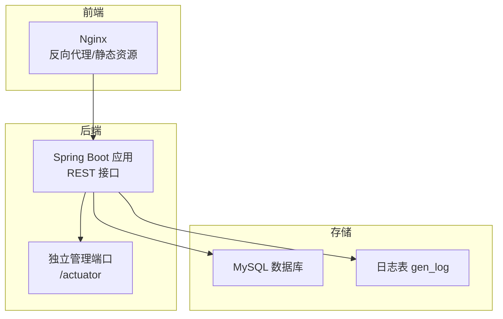
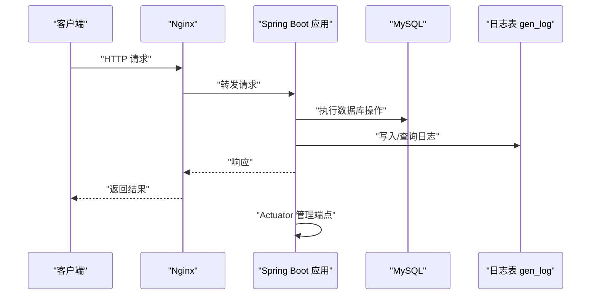
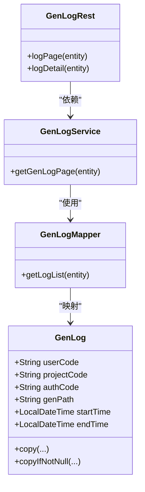
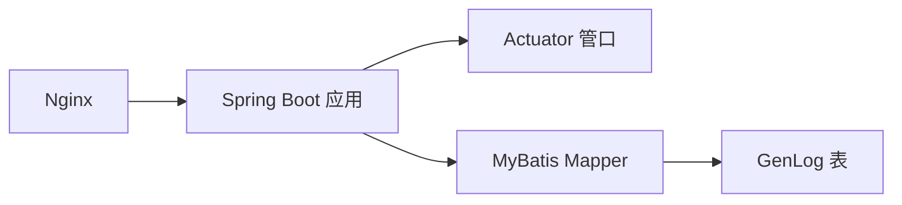

# 监控与日志

<cite>
**本文引用的文件**   
- [application.yml](file://generator-server-starter/src/main/resources/config/application.yml)
- [nginx.conf](file://generator-ui/nginx.conf)
- [GenLogRest.java](file://generator-server/src/main/java/com/wkclz/generator/server/rest/GenLogRest.java)
- [GenLog.java](file://generator-server/src/main/java/com/wkclz/generator/server/bean/entity/GenLog.java)
- [GenLogMapper.java](file://generator-server/src/main/java/com/wkclz/generator/server/mapper/GenLogMapper.java)
- [GenLogService.java](file://generator-server/src/main/java/com/wkclz/generator/server/service/GenLogService.java)
- [GenService.java](file://generator-server/src/main/java/com/wkclz/generator/server/service/GenService.java)
- [DynamicDataSourceInit.java](file://generator-server/src/main/java/com/wkclz/generator/server/helper/DynamicDataSourceInit.java)
</cite>

## 目录
1. [简介](#简介)
2. [项目结构](#项目结构)
3. [核心组件](#核心组件)
4. [架构总览](#架构总览)
5. [组件详解](#组件详解)
6. [依赖关系分析](#依赖关系分析)
7. [性能考量](#性能考量)
8. [故障排查指南](#故障排查指南)
9. [结论](#结论)
10. [附录](#附录)

## 简介
本文件面向 SH-Generator 项目的监控与日志管理，围绕以下目标展开：
- 系统监控指标：应用性能指标（APM）、数据库性能指标、系统资源监控、业务指标监控
- 日志配置：Spring Boot 应用日志、日志级别与格式规范
- 分布式链路追踪：请求追踪、调用链分析与性能瓶颈定位
- 告警机制：阈值设置、规则与通知渠道
- 日志收集与分析：ELK Stack 集成、日志聚合与检索
- 健康检查与故障诊断：健康端点、常见问题定位

当前仓库已具备基础的健康检查与独立管理端口配置，并在 Nginx 层面提供了访问日志格式与字段，便于后续扩展 APM、链路追踪与日志聚合。

## 项目结构
- 后端服务位于 generator-server 模块，通过 Spring Boot 提供 REST 接口；管理端点暴露在独立端口，便于监控与运维
- Nginx 作为反向代理与静态资源服务，提供统一访问入口与访问日志格式
- 日志实体与接口位于后端模块，支持日志分页查询与详情查看

图表来源
- [application.yml:28-51](file://generator-server-starter/src/main/resources/config/application.yml#L28-L51)
- [nginx.conf:17-76](file://generator-ui/nginx.conf#L17-L76)
- [GenLogRest.java:21-32](file://generator-server/src/main/java/com/wkclz/generator/server/rest/GenLogRest.java#L21-L32)

章节来源
- [application.yml:1-52](file://generator-server-starter/src/main/resources/config/application.yml#L1-L52)
- [nginx.conf:1-77](file://generator-ui/nginx.conf#L1-L77)

## 核心组件
- 管理端点与健康检查：通过独立端口暴露 Actuator 端点，开启健康探针与指标标签
- Nginx 访问日志：定义 JSON 格式的访问日志字段，便于接入 ELK 进行聚合与检索
- 日志实体与接口：提供日志分页查询与详情接口，支撑业务指标统计与审计

章节来源
- [application.yml:28-51](file://generator-server-starter/src/main/resources/config/application.yml#L28-L51)
- [nginx.conf:22-43](file://generator-ui/nginx.conf#L22-L43)
- [GenLogRest.java:21-32](file://generator-server/src/main/java/com/wkclz/generator/server/rest/GenLogRest.java#L21-L32)
- [GenLog.java:1-100](file://generator-server/src/main/java/com/wkclz/generator/server/bean/entity/GenLog.java#L1-L100)

## 架构总览
下图展示从客户端到后端服务、数据库与日志存储的整体交互，以及管理端点与 Nginx 的位置。

图表来源
- [application.yml:28-51](file://generator-server-starter/src/main/resources/config/application.yml#L28-L51)
- [nginx.conf:67-76](file://generator-ui/nginx.conf#L67-L76)
- [GenLogRest.java:21-32](file://generator-server/src/main/java/com/wkclz/generator/server/rest/GenLogRest.java#L21-L32)

## 组件详解

### 管理端点与健康检查
- 独立管理端口：启用独立端口用于暴露 Actuator 端点，便于与业务端口隔离
- 健康探针：开启 readiness 和 liveness 探针，支持健康状态与依赖检查
- 指标标签：为 Micrometer 指标添加应用标签，便于多实例聚合与筛选

章节来源
- [application.yml:28-51](file://generator-server-starter/src/main/resources/config/application.yml#L28-L51)

### Nginx 日志与访问控制
- 访问日志格式：采用 JSON 格式，包含时间戳、请求耗时、状态码、上游响应等关键字段
- 错误日志：集中错误日志输出，便于统一收集与分析
- 性能参数：连接数、压缩、keepalive 等参数优化，提升吞吐与稳定性

章节来源
- [nginx.conf:7-8](file://generator-ui/nginx.conf#L7-L8)
- [nginx.conf:22-43](file://generator-ui/nginx.conf#L22-L43)
- [nginx.conf:58-65](file://generator-ui/nginx.conf#L58-L65)

### 日志实体与接口
- 日志实体：包含用户、项目、授权、生成路径、起止时间等字段，支持复制与条件拷贝
- 日志接口：提供分页查询与详情查看，支撑业务审计与统计
- 日志映射：MyBatis Mapper 支持按实体条件查询列表

图表来源
- [GenLog.java:19-96](file://generator-server/src/main/java/com/wkclz/generator/server/bean/entity/GenLog.java#L19-L96)
- [GenLogRest.java:13-34](file://generator-server/src/main/java/com/wkclz/generator/server/rest/GenLogRest.java#L13-L34)
- [GenLogService.java:10-17](file://generator-server/src/main/java/com/wkclz/generator/server/service/GenLogService.java#L10-L17)
- [GenLogMapper.java:9-14](file://generator-server/src/main/java/com/wkclz/generator/server/mapper/GenLogMapper.java#L9-L14)

章节来源
- [GenLog.java:1-100](file://generator-server/src/main/java/com/wkclz/generator/server/bean/entity/GenLog.java#L1-L100)
- [GenLogRest.java:21-32](file://generator-server/src/main/java/com/wkclz/generator/server/rest/GenLogRest.java#L21-L32)
- [GenLogService.java:13-15](file://generator-server/src/main/java/com/wkclz/generator/server/service/GenLogService.java#L13-L15)
- [GenLogMapper.java:12-12](file://generator-server/src/main/java/com/wkclz/generator/server/mapper/GenLogMapper.java#L12-L12)

### 数据源与数据库性能
- 动态数据源：根据数据源编码动态解析并创建数据源，支持 MySQL/MariaDB 类型校验
- JDBC 连接：使用 MySQL Connector 驱动，URL 参数包含字符集与 SSL 配置
- 性能建议：结合 Nginx 与应用层连接池配置，合理设置超时与重试策略

章节来源
- [DynamicDataSourceInit.java:24-58](file://generator-server/src/main/java/com/wkclz/generator/server/helper/DynamicDataSourceInit.java#L24-L58)

### 生成路径与临时产物
- 生成路径：在容器环境下根据 catalina.base 生成唯一时间戳目录，避免并发冲突
- 目录创建：若目录不存在则自动创建，确保生成流程稳定

章节来源
- [GenService.java:217-227](file://generator-server/src/main/java/com/wkclz/generator/server/service/GenService.java#L217-L227)

## 依赖关系分析
- 后端模块依赖 MyBatis 与分页插件，日志模块通过 Mapper 与 Service 完成数据访问
- Nginx 作为前置网关，负责日志格式化与静态资源服务
- 管理端点与业务端口分离，降低监控开销对业务的影响

图表来源
- [application.yml:28-51](file://generator-server-starter/src/main/resources/config/application.yml#L28-L51)
- [nginx.conf:67-76](file://generator-ui/nginx.conf#L67-L76)
- [GenLogMapper.java:9-14](file://generator-server/src/main/java/com/wkclz/generator/server/mapper/GenLogMapper.java#L9-L14)

章节来源
- [GenLogMapper.java:9-14](file://generator-server/src/main/java/com/wkclz/generator/server/mapper/GenLogMapper.java#L9-L14)
- [GenLogService.java:10-17](file://generator-server/src/main/java/com/wkclz/generator/server/service/GenLogService.java#L10-L17)
- [GenLogRest.java:13-34](file://generator-server/src/main/java/com/wkclz/generator/server/rest/GenLogRest.java#L13-L34)

## 性能考量
- Nginx 参数优化：epoll、gzip、keepalive 等参数有助于提升高并发场景下的吞吐与延迟表现
- 独立管理端口：避免监控流量影响业务请求处理
- 日志格式化：JSON 访问日志便于结构化采集与分析，减少解析成本

章节来源
- [nginx.conf:10-15](file://generator-ui/nginx.conf#L10-L15)
- [nginx.conf:58-65](file://generator-ui/nginx.conf#L58-L65)
- [application.yml:35-36](file://generator-server-starter/src/main/resources/config/application.yml#L35-L36)

## 故障排查指南
- 健康检查
  - 访问独立管理端口的健康端点，确认应用与依赖可用性
  - 若健康检查失败，优先检查数据库连接与数据源配置
- 日志查询
  - 通过日志接口进行分页查询与详情查看，定位异常时间段与用户行为
  - 结合 Nginx 访问日志中的请求 ID 字段，串联前后端链路
- 数据库问题
  - 校验数据源类型与驱动配置，确保 MySQL/MariaDB 类型正确
  - 检查连接 URL、用户名与密码是否匹配
- 生成异常
  - 检查生成路径是否存在权限与磁盘空间
  - 查看生成过程中的起止时间，定位耗时环节

章节来源
- [application.yml:44-47](file://generator-server-starter/src/main/resources/config/application.yml#L44-L47)
- [GenLogRest.java:21-32](file://generator-server/src/main/java/com/wkclz/generator/server/rest/GenLogRest.java#L21-L32)
- [DynamicDataSourceInit.java:34-40](file://generator-server/src/main/java/com/wkclz/generator/server/helper/DynamicDataSourceInit.java#L34-L40)
- [GenService.java:217-227](file://generator-server/src/main/java/com/wkclz/generator/server/service/GenService.java#L217-L227)

## 结论
本项目已具备基础的健康检查与访问日志能力，建议在此基础上进一步引入：
- APM：如 Micrometer + Prometheus/Grafana 或 SkyWalking，采集应用性能指标
- 链路追踪：在 Nginx 与后端增加 trace-id 传播，实现端到端链路追踪
- 告警：基于阈值与规则在 Prometheus Alertmanager 或平台侧配置告警
- 日志分析：接入 ELK/EFK，统一采集与检索访问日志与应用日志

## 附录

### 日志配置与格式规范
- Spring Boot 应用日志
  - 建议使用结构化日志（如 JSON），便于与 Nginx 日志统一采集
  - 控制台输出可选，生产环境建议落盘或通过 stdout 输出至容器日志系统
- Nginx 访问日志
  - 已定义 JSON 格式字段，包含时间戳、请求耗时、状态码、上游响应等
  - 可直接对接日志收集系统进行聚合与检索

章节来源
- [nginx.conf:22-43](file://generator-ui/nginx.conf#L22-L43)

### 健康检查接口使用
- 管理端口：独立端口暴露 Actuator 端点，便于健康检查与指标采集
- 健康探针：开启 readiness/liveness 探针，支持依赖检查与就绪判断

章节来源
- [application.yml:35-47](file://generator-server-starter/src/main/resources/config/application.yml#L35-L47)