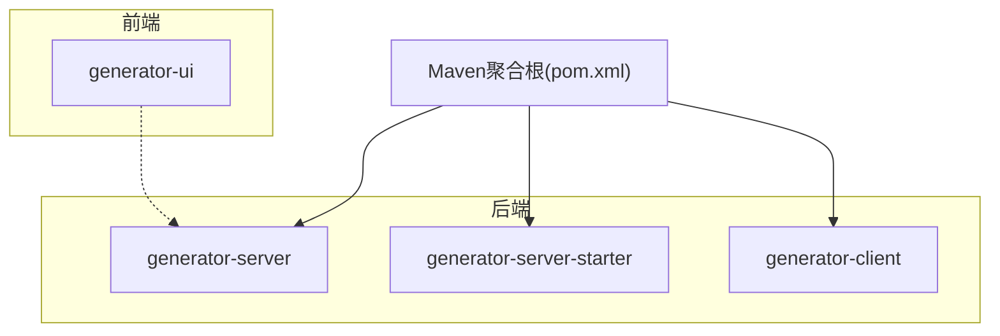
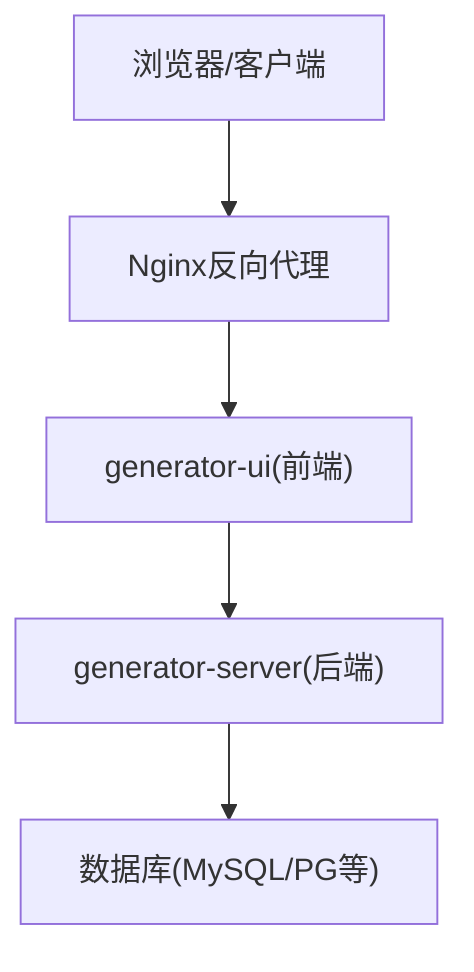
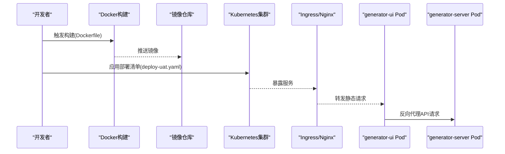
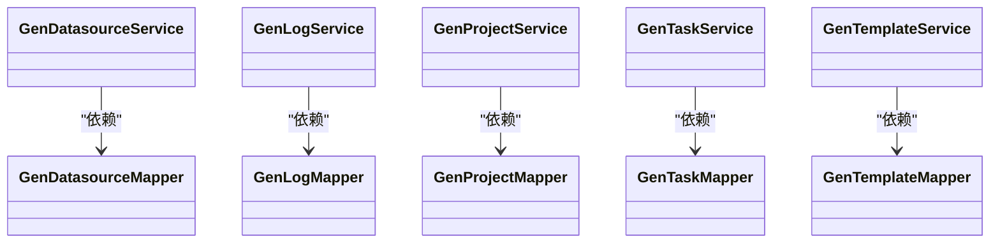
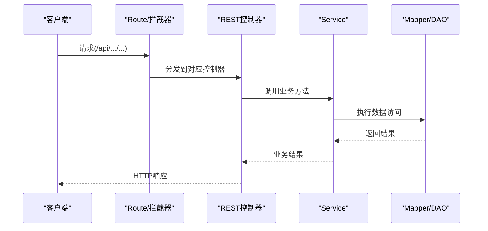
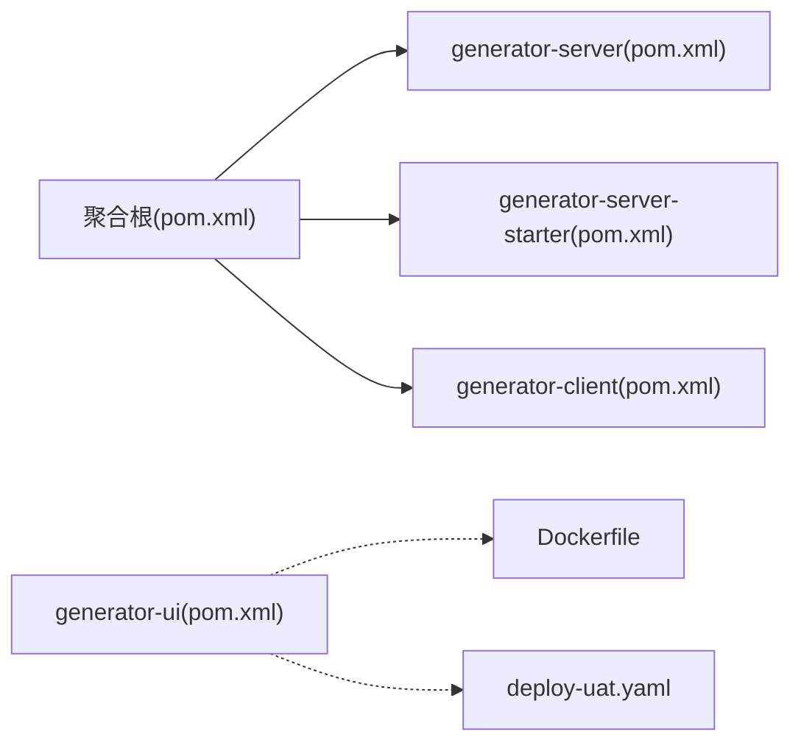

# 部署与运维

<cite>
**本文引用的文件**
- [application.yml](file://generator-server-starter/src/main/resources/config/application.yml)
- [Dockerfile](file://generator-ui/Dockerfile)
- [deploy-uat.yaml](file://generator-ui/deploy-uat.yaml)
- [nginx.conf](file://generator-ui/nginx.conf)
- [pom.xml](file://generator-server/pom.xml)
- [pom.xml](file://generator-server-starter/pom.xml)
- [pom.xml](file://generator-client/pom.xml)
- [pom.xml](file://pom.xml)
</cite>

## 目录
1. [简介](#简介)
2. [项目结构](#项目结构)
3. [核心组件](#核心组件)
4. [架构总览](#架构总览)
5. [详细组件分析](#详细组件分析)
6. [依赖关系分析](#依赖关系分析)
7. [性能考虑](#性能考虑)
8. [故障排查指南](#故障排查指南)
9. [结论](#结论)
10. [附录](#附录)

## 简介
本文件面向SH-Generator项目的生产部署与运维，覆盖服务器环境要求、数据库配置、网络设置、容器化（Docker/Kubernetes）部署方案、性能优化策略（连接池、缓存、负载均衡）、监控与日志配置、备份与灾难恢复等主题。文档以仓库中现有配置与代码为依据，结合通用最佳实践给出可操作的建议。

## 项目结构
项目采用多模块Maven工程组织，主要模块包括：
- generator-client：Maven插件模块，用于在本地或CI中生成代码。
- generator-server：后端服务模块，包含REST接口、业务逻辑、MyBatis Mapper与实体。
- generator-server-starter：Spring Boot启动器模块，提供应用入口与默认配置。
- generator-ui：前端模块，包含Vite构建配置、Dockerfile、Nginx配置及K8s部署清单。

**章节来源**
- [pom.xml](file://pom.xml)
- [pom.xml](file://generator-server/pom.xml)
- [pom.xml](file://generator-server-starter/pom.xml)
- [pom.xml](file://generator-client/pom.xml)

## 核心组件
- 后端服务：基于Spring Boot，提供数据源、模板、任务、日志等REST接口，使用MyBatis进行数据访问。
- 前端UI：基于Vite构建，提供Dockerfile与Nginx配置，并包含UAT环境的K8s部署清单。
- 构建与打包：通过Maven多模块统一管理；前端支持Docker镜像构建与K8s部署。

**章节来源**
- [application.yml](file://generator-server-starter/src/main/resources/config/application.yml)
- [Dockerfile](file://generator-ui/Dockerfile)
- [deploy-uat.yaml](file://generator-ui/deploy-uat.yaml)
- [nginx.conf](file://generator-ui/nginx.conf)

## 架构总览
整体架构由前端UI、后端服务与数据库组成。前端通过HTTP与后端交互，后端通过MyBatis访问数据库。

[此图为概念性架构示意，不直接映射具体源码文件，故无“图示来源”]

## 详细组件分析

### 后端配置与数据库连接
- 应用配置位于启动器模块的资源目录，包含数据库连接参数、端口、日志级别等关键项。
- 建议在生产环境通过环境变量或外部配置中心注入敏感信息（如数据库密码），避免硬编码。

**章节来源**
- [application.yml](file://generator-server-starter/src/main/resources/config/application.yml)

### 前端容器化与反向代理
- Dockerfile定义了前端镜像构建流程，通常包含安装依赖、构建产物与Nginx运行时。
- nginx.conf用于静态资源服务与反向代理到后端API。
- UAT环境的K8s部署清单展示了Deployment、Service与Ingress的基本编排思路。

**图示来源**
- [Dockerfile](file://generator-ui/Dockerfile)
- [deploy-uat.yaml](file://generator-ui/deploy-uat.yaml)

**章节来源**
- [Dockerfile](file://generator-ui/Dockerfile)
- [nginx.conf](file://generator-ui/nginx.conf)
- [deploy-uat.yaml](file://generator-ui/deploy-uat.yaml)

### 数据库访问层与事务
- MyBatis Mapper与XML映射文件位于后端模块，负责数据持久化。
- 动态数据源初始化类用于多数据源场景下的配置与切换。

**图示来源**
- [GenDatasourceMapper.java](file://generator-server/src/main/java/com/wkclz/generator/server/mapper/GenDatasourceMapper.java)
- [GenLogMapper.java](file://generator-server/src/main/java/com/wkclz/generator/server/mapper/GenLogMapper.java)
- [GenProjectMapper.java](file://generator-server/src/main/java/com/wkclz/generator/server/mapper/GenProjectMapper.java)
- [GenTaskMapper.java](file://generator-server/src/main/java/com/wkclz/generator/server/mapper/GenTaskMapper.java)
- [GenTemplateMapper.java](file://generator-server/src/main/java/com/wkclz/generator/server/mapper/GenTemplateMapper.java)

**章节来源**
- [GenDatasourceMapper.java](file://generator-server/src/main/java/com/wkclz/generator/server/mapper/GenDatasourceMapper.java)
- [GenLogMapper.java](file://generator-server/src/main/java/com/wkclz/generator/server/mapper/GenLogMapper.java)
- [GenProjectMapper.java](file://generator-server/src/main/java/com/wkclz/generator/server/mapper/GenProjectMapper.java)
- [GenTaskMapper.java](file://generator-server/src/main/java/com/wkclz/generator/server/mapper/GenTaskMapper.java)
- [GenTemplateMapper.java](file://generator-server/src/main/java/com/wkclz/generator/server/mapper/GenTemplateMapper.java)

### 服务接口与路由
- REST控制器提供数据源、模板、项目、任务、日志等接口。
- 路由配置集中于路由类，便于统一管理。

**图示来源**
- [Route.java](file://generator-server/src/main/java/com/wkclz/generator/server/Route.java)
- [GenDatasourceRest.java](file://generator-server/src/main/java/com/wkclz/generator/server/rest/GenDatasourceRest.java)
- [GenTemplateRest.java](file://generator-server/src/main/java/com/wkclz/generator/server/rest/GenTemplateRest.java)
- [GenProjectRest.java](file://generator-server/src/main/java/com/wkclz/generator/server/rest/GenProjectRest.java)
- [GenTaskRest.java](file://generator-server/src/main/java/com/wkclz/generator/server/rest/GenTaskRest.java)
- [GenLogRest.java](file://generator-server/src/main/java/com/wkclz/generator/server/rest/GenLogRest.java)

**章节来源**
- [Route.java](file://generator-server/src/main/java/com/wkclz/generator/server/Route.java)
- [GenDatasourceRest.java](file://generator-server/src/main/java/com/wkclz/generator/server/rest/GenDatasourceRest.java)
- [GenTemplateRest.java](file://generator-server/src/main/java/com/wkclz/generator/server/rest/GenTemplateRest.java)
- [GenProjectRest.java](file://generator-server/src/main/java/com/wkclz/generator/server/rest/GenProjectRest.java)
- [GenTaskRest.java](file://generator-server/src/main/java/com/wkclz/generator/server/rest/GenTaskRest.java)
- [GenLogRest.java](file://generator-server/src/main/java/com/wkclz/generator/server/rest/GenLogRest.java)

## 依赖关系分析
- Maven聚合根统一管理版本与插件；各子模块按职责拆分，保证内聚与解耦。
- 前端模块依赖Dockerfile与K8s部署清单，形成从构建到交付的一体化流程。

**图示来源**
- [pom.xml](file://pom.xml)
- [pom.xml](file://generator-server/pom.xml)
- [pom.xml](file://generator-server-starter/pom.xml)
- [pom.xml](file://generator-client/pom.xml)
- [Dockerfile](file://generator-ui/Dockerfile)
- [deploy-uat.yaml](file://generator-ui/deploy-uat.yaml)

**章节来源**
- [pom.xml](file://pom.xml)
- [pom.xml](file://generator-server/pom.xml)
- [pom.xml](file://generator-server-starter/pom.xml)
- [pom.xml](file://generator-client/pom.xml)

## 性能考虑
- 数据库连接池
  - 建议在生产环境启用连接池（如HikariCP），并根据QPS与并发线程数调优最大连接数、空闲超时、连接生命周期等参数。
  - 将连接串、用户名、密码通过环境变量注入，避免明文配置。
- 缓存策略
  - 对热点查询（如模板列表、数据源配置）引入Redis缓存，设置合理TTL与失效策略。
  - 使用分布式锁或幂等设计避免缓存击穿与雪崩。
- 负载均衡
  - 前端通过Nginx做静态资源与反向代理；后端通过K8s Service暴露服务，配合Ingress实现流量分发。
  - 后端实例水平扩展，结合健康检查与就绪探针保障流量接入质量。
- 其他
  - 启用数据库慢查询日志与SQL审计，定期分析热点SQL并优化索引。
  - 前端构建开启压缩与Tree-shaking，减少包体积与首屏时间。

[本节为通用性能建议，不直接分析具体源码文件，故无“章节来源”]

## 故障排查指南
- 日志与监控
  - 后端建议输出结构化日志（JSON），包含traceId、模块、接口、耗时、状态码等字段，便于链路追踪与聚合分析。
  - 前端异常上报至统一平台，记录用户行为、页面路径、错误堆栈与设备信息。
- 健康检查
  - 后端提供健康检查端点，返回数据库连通性、磁盘空间、JVM状态等关键指标。
- 错误处理
  - 统一异常处理器捕获业务异常与系统异常，返回标准化错误码与提示信息，避免泄露内部细节。
- 回滚与灰度
  - K8s滚动更新时启用副本数与就绪探针，失败自动回滚；灰度发布逐步扩大流量比例。

[本节为通用运维建议，不直接分析具体源码文件，故无“章节来源”]

## 结论
本部署与运维文档基于仓库现有配置与模块划分，给出了生产环境的落地建议。建议在实际部署前完成环境隔离、密钥管理、监控告警与备份演练，确保系统稳定与数据安全。

## 附录
- 生产环境部署清单（建议）
  - 服务器：Linux（CentOS/Ubuntu），JDK 8+，MySQL/PostgreSQL，Redis（可选），Nginx，Kubernetes集群。
  - 网络：开放80/443（前端）、后端服务端口；限制数据库端口仅对内网开放。
  - 安全：TLS证书、WAF、最小权限RBAC、Secret管理。
- 备份与灾备
  - 数据库定时快照与增量备份，保留至少7天在线与28天离线备份。
  - 关键配置与镜像纳入版本控制与制品库，支持一键回滚。
- 运维自动化
  - CI/CD流水线：代码提交触发构建、测试、扫描、打包与部署。
  - 告警：CPU/内存/磁盘/连接池饱和/慢查询/错误率阈值告警。

[本节为通用运维建议，不直接分析具体源码文件，故无“章节来源”]