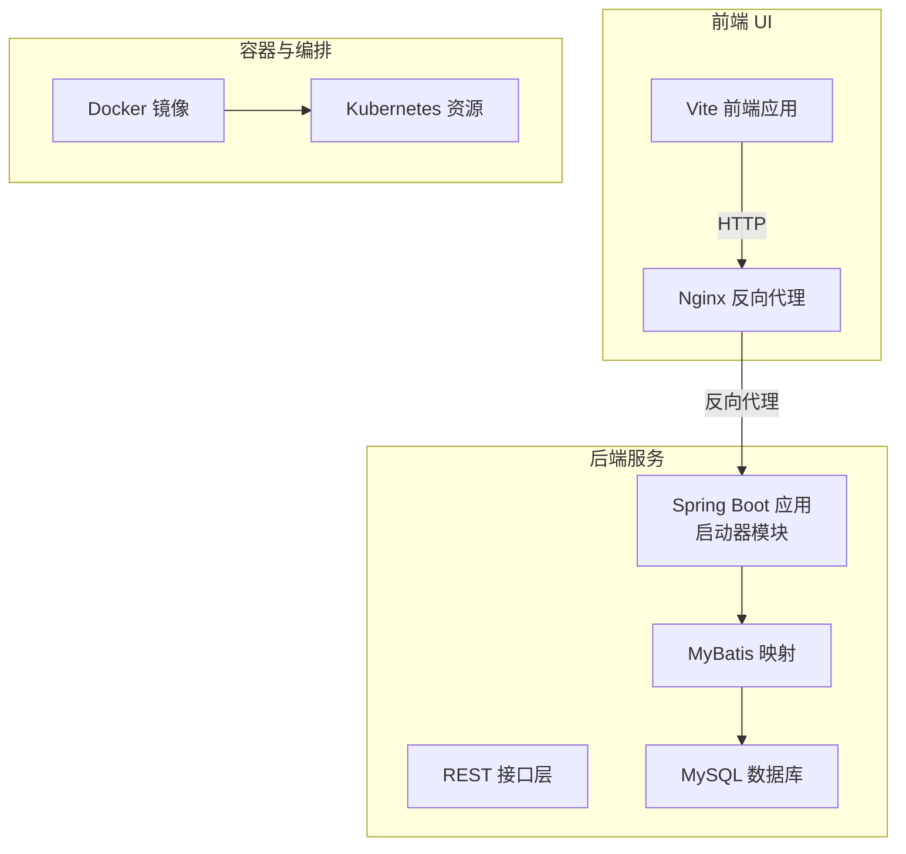
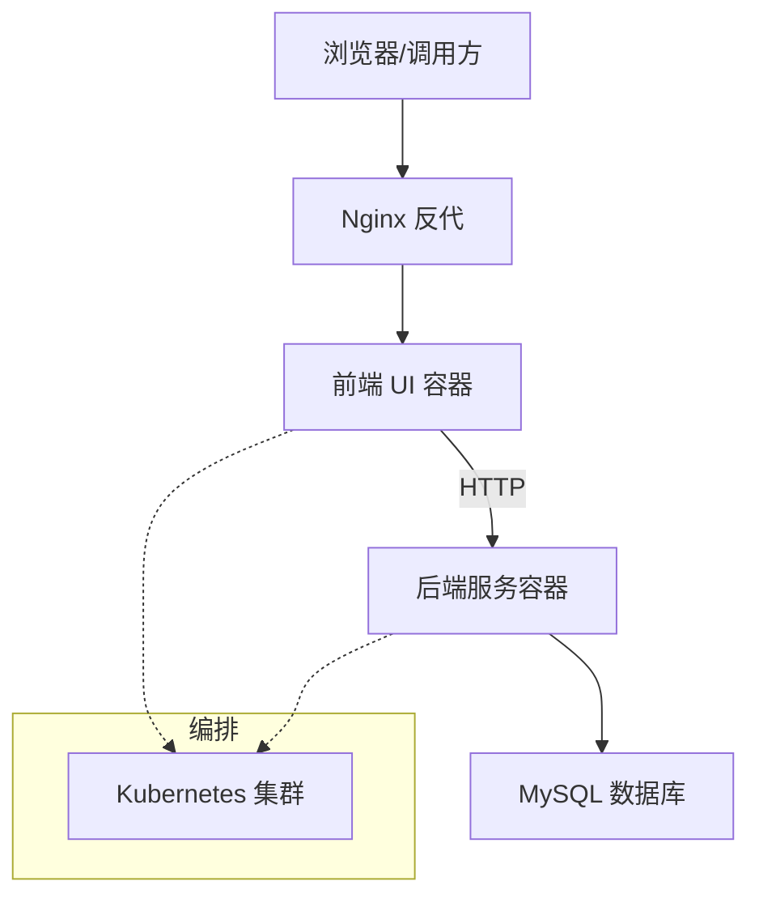
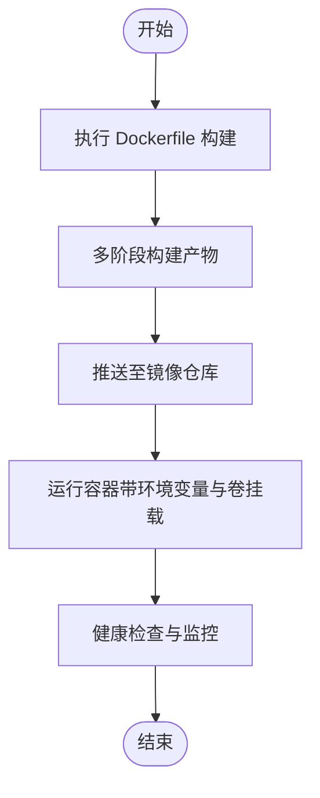
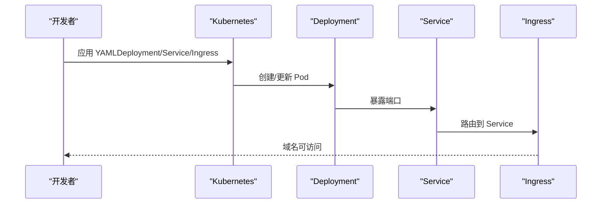
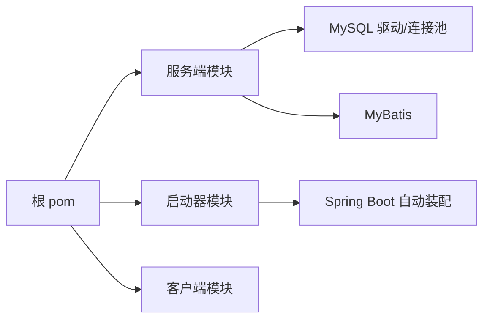

# 部署配置

<cite>
**本文引用的文件**
- [application.yml](file://generator-server-starter/src/main/resources/config/application.yml)
- [Dockerfile](file://generator-ui/Dockerfile)
- [deploy-uat.yaml](file://generator-ui/deploy-uat.yaml)
- [pom.xml（根）](file://pom.xml)
- [pom.xml（服务端）](file://generator-server/pom.xml)
- [pom.xml（客户端）](file://generator-client/pom.xml)
- [pom.xml（启动器）](file://generator-server-starter/pom.xml)
- [README.md（UI）](file://generator-ui/README.md)
- [README.md（项目根）](file://README.md)
</cite>

## 目录
1. [简介](#简介)
2. [项目结构](#项目结构)
3. [核心组件](#核心组件)
4. [架构总览](#架构总览)
5. [详细组件分析](#详细组件分析)
6. [依赖分析](#依赖分析)
7. [性能考虑](#性能考虑)
8. [故障排查指南](#故障排查指南)
9. [结论](#结论)
10. [附录](#附录)

## 简介
本部署配置文档面向 SH-Generator 项目，覆盖生产环境服务器要求、数据库与网络配置、Docker 容器化部署以及 Kubernetes 部署要点，并给出环境变量、密钥与配置文件管理的最佳实践。本文所有技术细节均基于仓库中现有配置文件与构建脚本进行归纳总结。

## 项目结构
项目采用多模块 Maven 结构，包含服务端、客户端与前端 UI 模块；服务端通过 Spring Boot 启动器提供 REST 接口；前端 UI 使用 Vite 构建并通过 Dockerfile 进行容器化打包；同时提供 UAT 环境的 Kubernetes 部署示例。

**章节来源**
- [pom.xml（根）](file://pom.xml)
- [pom.xml（服务端）](file://generator-server/pom.xml)
- [pom.xml（启动器）](file://generator-server-starter/pom.xml)
- [pom.xml（客户端）](file://generator-client/pom.xml)

## 核心组件
- 后端服务：基于 Spring Boot 的生成器服务，提供数据源、模板、任务、日志等 REST 接口。
- 前端 UI：基于 Vite 的可视化界面，负责模板编辑、项目配置与任务调度。
- 数据库：MySQL，使用 MyBatis 进行持久化访问。
- 容器化：前端 UI 提供 Dockerfile，支持镜像构建与运行。
- 编排：提供 UAT 环境的 Kubernetes YAML 示例。

**章节来源**
- [application.yml](file://generator-server-starter/src/main/resources/config/application.yml)
- [Dockerfile](file://generator-ui/Dockerfile)
- [deploy-uat.yaml](file://generator-ui/deploy-uat.yaml)

## 架构总览
下图展示生产环境典型部署拓扑：前端 UI 通过 Nginx 对外提供静态资源与反向代理；后端服务通过独立端口对外提供 REST API；数据库位于内网或专用实例；容器与编排用于弹性伸缩与滚动更新。

## 详细组件分析

### 生产环境服务器环境要求
- 操作系统：Linux（推荐 CentOS/Ubuntu），需满足容器与编排平台要求。
- JDK 版本：建议使用与项目构建一致的 JDK 版本（以根 pom 中的 Java 版本为准）。
- 数据库：MySQL（版本以实际生产环境为准，建议 5.7+ 或 8.0+）。
- 硬件资源：CPU/内存根据并发量与生成任务复杂度评估，建议至少 2C4G 起步。
- 容器与编排：Docker 与 Kubernetes 环境准备就绪。

**章节来源**
- [pom.xml（根）](file://pom.xml)
- [pom.xml（服务端）](file://generator-server/pom.xml)
- [pom.xml（启动器）](file://generator-server-starter/pom.xml)

### 数据库配置指南
- 连接配置：在后端配置文件中设置数据库连接地址、用户名、密码与驱动信息。
- 连接池参数：合理设置最大连接数、空闲超时、连接生命周期等参数，避免资源泄露。
- 初始化脚本：提供 SQL 初始化脚本，完成表结构与基础数据的创建与填充。
- 安全策略：生产环境使用只读账号执行查询，写入账号最小权限原则；开启 SSL 连接与审计日志。

**章节来源**
- [application.yml](file://generator-server-starter/src/main/resources/config/application.yml)

### 网络配置要求
- 端口开放：后端服务监听端口（如 8080）、前端静态资源端口（如 80）、数据库端口（如 3306）按需开放。
- 防火墙：仅放行必要端口，限制来源 IP；对管理端口进行白名单控制。
- 域名配置：为前端与后端分别配置域名解析；启用 HTTPS 并配置证书；反向代理透传请求头。

**章节来源**
- [Dockerfile](file://generator-ui/Dockerfile)
- [deploy-uat.yaml](file://generator-ui/deploy-uat.yaml)

### Docker 容器化部署方案
- 构建镜像：使用前端模块的 Dockerfile 进行多阶段构建，输出轻量级镜像。
- 运行参数：挂载配置目录、暴露端口、设置环境变量、健康检查与重启策略。
- 镜像标签：按版本号打标签，便于回滚与追踪。

**章节来源**
- [Dockerfile](file://generator-ui/Dockerfile)

### Kubernetes 部署配置
- Deployment：定义副本数、滚动更新策略、资源配额、健康探针与环境变量。
- Service：暴露后端服务端口，选择器匹配 Pod 标签。
- Ingress：配置域名路由规则、TLS 终止与路径转发。
- UAT 示例：参考仓库中的 deploy-uat.yaml，按生产环境调整镜像、资源与安全策略。

**章节来源**
- [deploy-uat.yaml](file://generator-ui/deploy-uat.yaml)

### 环境变量、密钥与配置文件管理最佳实践
- 环境变量：敏感信息（数据库密码、第三方密钥）通过环境变量注入，避免硬编码。
- 密钥管理：使用 Kubernetes Secret 或外部密钥服务（如 Vault），最小权限原则。
- 配置文件：非敏感配置放入 ConfigMap；版本化管理，变更走发布流程。
- 分环境：dev/uat/prod 分离配置，避免交叉污染。

**章节来源**
- [application.yml](file://generator-server-starter/src/main/resources/config/application.yml)
- [deploy-uat.yaml](file://generator-ui/deploy-uat.yaml)

## 依赖分析
- 模块依赖：根 pom 管理子模块聚合；服务端模块引入 Spring Boot 与 MyBatis 依赖；启动器模块负责应用入口与配置加载。
- 外部依赖：MySQL 驱动、连接池、日志框架等由各模块的 pom 统一声明与版本管理。

**章节来源**
- [pom.xml（根）](file://pom.xml)
- [pom.xml（服务端）](file://generator-server/pom.xml)
- [pom.xml（启动器）](file://generator-server-starter/pom.xml)
- [pom.xml（客户端）](file://generator-client/pom.xml)

## 性能考虑
- 连接池优化：根据 QPS 与并发线程数调整连接池大小，设置合理的空闲与超时阈值。
- 数据库索引：为常用查询字段建立索引，避免慢查询。
- 前端缓存：静态资源长缓存与版本化，减少带宽占用。
- 容器资源：为 Pod 设置 CPU/内存请求与限制，结合 HPA 实现弹性扩缩容。

## 故障排查指南
- 启动失败：检查后端配置文件中的数据库连接参数与网络连通性。
- 健康检查：确认容器健康探针返回码与日志输出。
- 日志定位：查看后端服务日志与数据库慢查询日志，定位异常请求与 SQL 性能问题。
- 网络问题：验证 Ingress 规则、Service 端口映射与防火墙放行情况。

**章节来源**
- [application.yml](file://generator-server-starter/src/main/resources/config/application.yml)
- [deploy-uat.yaml](file://generator-ui/deploy-uat.yaml)

## 结论
本部署配置文档基于仓库现有配置与构建脚本，给出了从服务器环境、数据库、网络到容器与编排的完整落地建议。建议在生产环境中进一步完善安全基线、监控告警与备份恢复策略，并持续优化资源配额与连接池参数以提升稳定性与性能。

## 附录
- 快速参考
  - 后端配置文件位置：[application.yml](file://generator-server-starter/src/main/resources/config/application.yml)
  - 前端 Dockerfile：[Dockerfile](file://generator-ui/Dockerfile)
  - UAT 部署示例：[deploy-uat.yaml](file://generator-ui/deploy-uat.yaml)
  - 项目根 README：[README.md（项目根）](file://README.md)
  - UI README：[README.md（UI）](file://generator-ui/README.md)