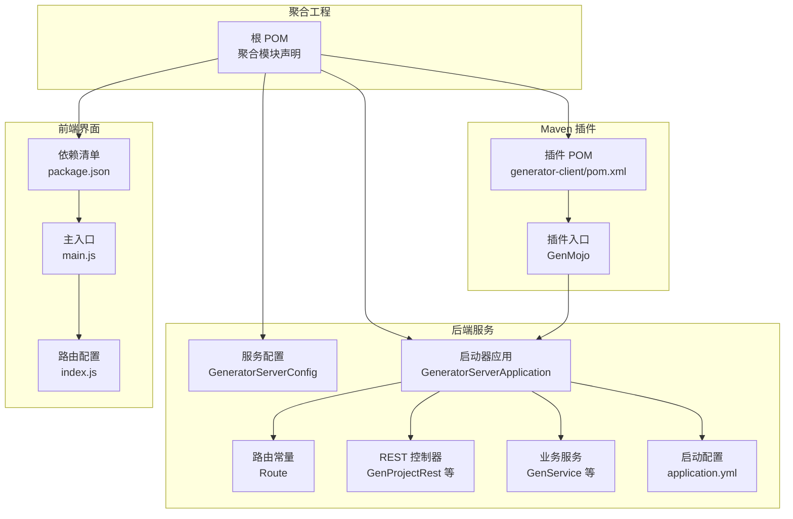
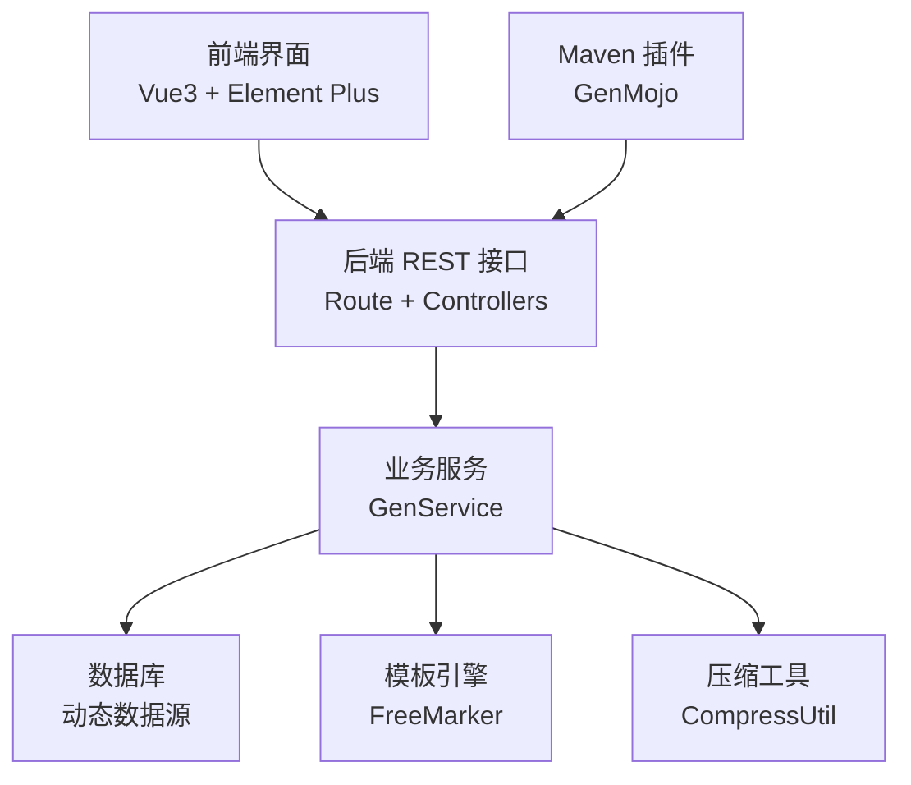
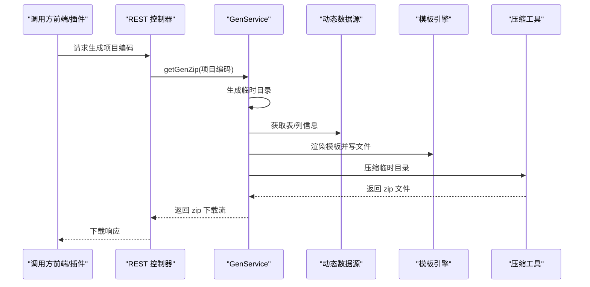
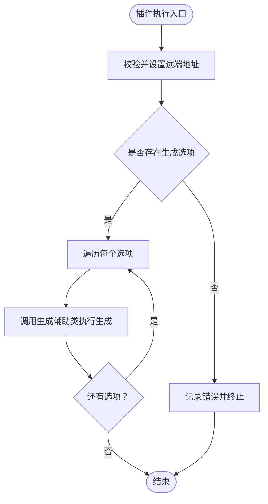
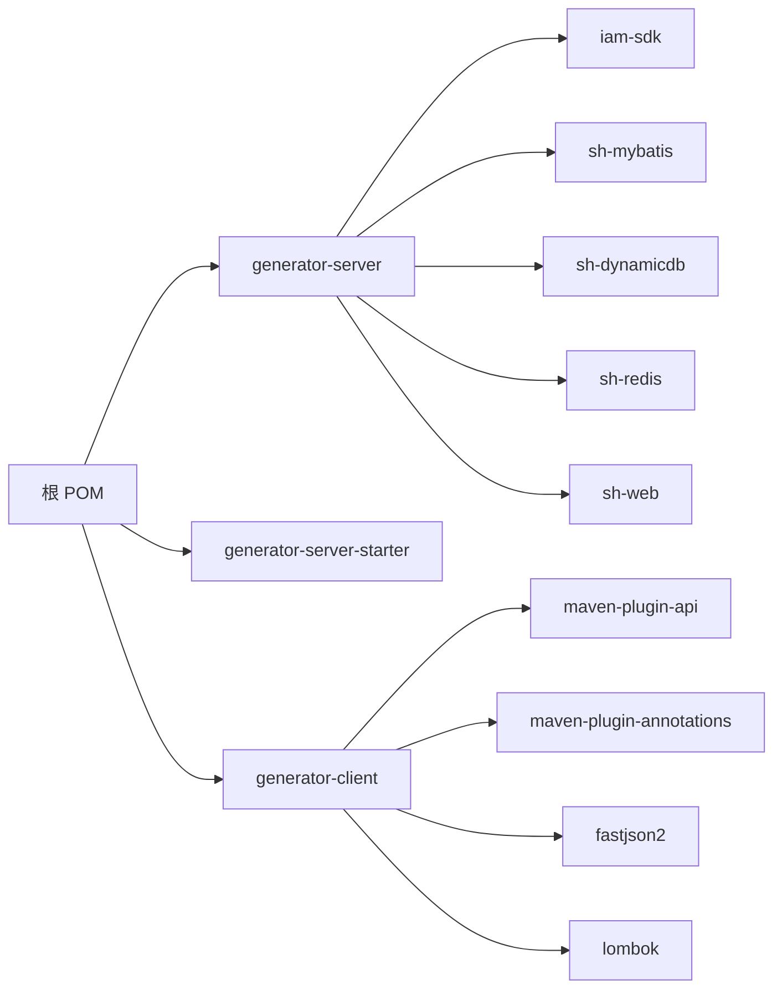

# 项目概述

<cite>
**本文引用的文件**
- [根 POM（pom.xml）](file://pom.xml)
- [服务启动器应用（GeneratorServerApplication.java）](file://generator-server-starter/src/main/java/com/wkclz/generator/server/starter/GeneratorServerApplication.java)
- [服务端配置（GeneratorServerConfig.java）](file://generator-server/src/main/java/com/wkclz/generator/server/GeneratorServerConfig.java)
- [路由常量（Route.java）](file://generator-server/src/main/java/com/wkclz/generator/server/Route.java)
- [客户端 Maven 插件入口（GenMojo.java）](file://generator-client/src/main/java/com/wkclz/generator/client/GenMojo.java)
- [客户端 POM（generator-client/pom.xml）](file://generator-client/pom.xml)
- [服务端 POM（generator-server/pom.xml）](file://generator-server/pom.xml)
- [服务端启动器配置（application.yml）](file://generator-server-starter/src/main/resources/config/application.yml)
- [UI 主入口（main.js）](file://generator-ui/src/main.js)
- [UI 路由（index.js）](file://generator-ui/src/router/index.js)
- [UI 包管理（package.json）](file://generator-ui/package.json)
- [服务端项目 REST 控制器（GenProjectRest.java）](file://generator-server/src/main/java/com/wkclz/generator/server/rest/GenProjectRest.java)
- [服务端通用生成服务（GenService.java）](file://generator-server/src/main/java/com/wkclz/generator/server/service/GenService.java)
- [服务端项目 DTO（GenProjectDto.java）](file://generator-server/src/main/java/com/wkclz/generator/server/bean/dto/GenProjectDto.java)
- [README（README.md）](file://README.md)
</cite>

## 目录
1. [引言](#引言)
2. [项目结构](#项目结构)
3. [核心组件](#核心组件)
4. [架构总览](#架构总览)
5. [详细组件分析](#详细组件分析)
6. [依赖关系分析](#依赖关系分析)
7. [性能与可维护性考量](#性能与可维护性考量)
8. [故障排查指南](#故障排查指南)
9. [结论](#结论)
10. [附录](#附录)

## 引言
SH-Generator 是一个面向现代化开发的“代码生成器”项目，旨在通过“前后端分离 + 模块化 + Maven 插件”的一体化方案，帮助团队快速从数据库表结构生成高质量的后端代码、模板文件与打包产物，显著降低重复劳动、提升工程一致性与交付效率。项目以 Spring Boot 为基础后端，Vue3 + Vite 构建的前端界面，结合自研 Maven 插件实现本地或 CI 流水线一键触发代码生成。

本项目的核心价值在于：
- 提升研发效率：从“表 → 模板 → 代码”的自动化流水线，减少手工编码错误。
- 统一工程规范：通过统一的模板与生成规则，确保多项目风格一致。
- 降低协作成本：可视化配置 + 远程调用 + 打包下载，便于跨团队协作。
- 易于扩展：模块化设计与插件化集成，便于接入新的模板、数据源与生成策略。

## 项目结构
项目采用多模块聚合结构，核心模块包括：
- generator-server：后端服务模块，提供 REST 接口、业务服务、数据访问与模板渲染能力。
- generator-server-starter：服务启动器与配置模块，负责应用启动与基础环境配置。
- generator-client：Maven 插件模块，封装命令行/CI 触发逻辑，远程调用后端生成并下载产物。
- generator-ui：前端界面模块，提供数据源、模板、项目、任务与日志的可视化管理与操作界面。

图表来源
- [根 POM（pom.xml）:20-24](file://pom.xml#L20-L24)
- [服务启动器应用（GeneratorServerApplication.java）:1-16](file://generator-server-starter/src/main/java/com/wkclz/generator/server/starter/GeneratorServerApplication.java#L1-L16)
- [服务端配置（GeneratorServerConfig.java）:7-11](file://generator-server/src/main/java/com/wkclz/generator/server/GeneratorServerConfig.java#L7-L11)
- [路由常量（Route.java）:6-88](file://generator-server/src/main/java/com/wkclz/generator/server/Route.java#L6-L88)
- [客户端 POM（generator-client/pom.xml）:1-75](file://generator-client/pom.xml#L1-L75)
- [客户端 Maven 插件入口（GenMojo.java）:15-40](file://generator-client/src/main/java/com/wkclz/generator/client/GenMojo.java#L15-L40)
- [服务端启动器配置（application.yml）:1-52](file://generator-server-starter/src/main/resources/config/application.yml#L1-L52)
- [UI 主入口（main.js）:1-105](file://generator-ui/src/main.js#L1-L105)
- [UI 路由（index.js）:1-86](file://generator-ui/src/router/index.js#L1-L86)
- [UI 包管理（package.json）:1-53](file://generator-ui/package.json#L1-L53)

章节来源
- [根 POM（pom.xml）:20-24](file://pom.xml#L20-L24)
- [服务端配置（GeneratorServerConfig.java）:7-11](file://generator-server/src/main/java/com/wkclz/generator/server/GeneratorServerConfig.java#L7-L11)
- [服务端启动器配置（application.yml）:1-52](file://generator-server-starter/src/main/resources/config/application.yml#L1-L52)
- [客户端 POM（generator-client/pom.xml）:1-75](file://generator-client/pom.xml#L1-L75)
- [UI 包管理（package.json）:1-53](file://generator-ui/package.json#L1-L53)

## 核心组件
- 后端服务层（generator-server）
  - 路由常量与 REST 控制器：集中定义模块前缀与各资源接口，如数据源、模板、项目、任务、日志与代码生成相关接口。
  - 业务服务：核心生成服务负责收集表结构、列信息、任务规则，按模板渲染输出文件，并最终打包下载。
  - 配置扫描：通过自动配置类启用组件扫描与 Mapper 扫描，保证服务与持久层装配正确。
- 前端界面（generator-ui）
  - 基于 Vue3 + Element Plus 的管理界面，提供列表、表单、富文本、上传、编辑器等组件化能力。
  - 路由与权限：采用 hash 模式与公共/动态路由结构，支持权限控制与页面级功能。
- Maven 插件（generator-client）
  - 将生成流程封装为 Maven 插件目标，支持在构建生命周期阶段触发远程生成，便于本地与 CI 场景集成。
  - 插件目标接收生成选项与远端地址，内部委托辅助类完成请求与下载。

章节来源
- [路由常量（Route.java）:6-88](file://generator-server/src/main/java/com/wkclz/generator/server/Route.java#L6-L88)
- [服务端项目 REST 控制器（GenProjectRest.java）:14-78](file://generator-server/src/main/java/com/wkclz/generator/server/rest/GenProjectRest.java#L14-L78)
- [服务端通用生成服务（GenService.java）:36-229](file://generator-server/src/main/java/com/wkclz/generator/server/service/GenService.java#L36-L229)
- [服务端配置（GeneratorServerConfig.java）:7-11](file://generator-server/src/main/java/com/wkclz/generator/server/GeneratorServerConfig.java#L7-L11)
- [UI 主入口（main.js）:1-105](file://generator-ui/src/main.js#L1-L105)
- [UI 路由（index.js）:1-86](file://generator-ui/src/router/index.js#L1-L86)
- [客户端 Maven 插件入口（GenMojo.java）:15-40](file://generator-client/src/main/java/com/wkclz/generator/client/GenMojo.java#L15-L40)
- [客户端 POM（generator-client/pom.xml）:1-75](file://generator-client/pom.xml#L1-L75)

## 架构总览
系统采用“前端界面 + 后端服务 + Maven 插件”的三层协同架构：
- 前端通过 REST 接口与后端交互，进行数据源、模板、项目、任务与日志的管理与查询。
- 后端根据项目配置与任务规则，读取数据库表结构与列信息，结合模板引擎渲染生成文件，并提供打包下载。
- Maven 插件在本地或 CI 中触发远程生成，简化集成与自动化流程。

图表来源
- [路由常量（Route.java）:6-88](file://generator-server/src/main/java/com/wkclz/generator/server/Route.java#L6-L88)
- [服务端通用生成服务（GenService.java）:92-190](file://generator-server/src/main/java/com/wkclz/generator/server/service/GenService.java#L92-L190)
- [客户端 Maven 插件入口（GenMojo.java）:15-40](file://generator-client/src/main/java/com/wkclz/generator/client/GenMojo.java#L15-L40)

## 详细组件分析

### 后端服务与生成流程
- 数据采集：根据项目配置选择数据源，动态切换数据源上下文，批量获取表与列信息，过滤逻辑删除字段。
- 参数组装：将表、列、任务规则转换为生成参数，供模板渲染使用。
- 模板渲染：按模板内容与参数生成文件，写入临时目录；支持异常兜底，避免中断。
- 打包下载：将临时目录压缩为 zip，设置响应头并流式返回给前端或插件。

图表来源
- [服务端通用生成服务（GenService.java）:72-190](file://generator-server/src/main/java/com/wkclz/generator/server/service/GenService.java#L72-L190)
- [路由常量（Route.java）:76-85](file://generator-server/src/main/java/com/wkclz/generator/server/Route.java#L76-L85)

章节来源
- [服务端通用生成服务（GenService.java）:55-229](file://generator-server/src/main/java/com/wkclz/generator/server/service/GenService.java#L55-L229)

### Maven 插件集成
- 插件目标：在 Maven 生命周期的特定阶段触发，支持传入远端地址与生成选项。
- 执行流程：设置基础地址、校验选项、逐项调用生成辅助类执行远程生成与下载。

图表来源
- [客户端 Maven 插件入口（GenMojo.java）:27-40](file://generator-client/src/main/java/com/wkclz/generator/client/GenMojo.java#L27-L40)

章节来源
- [客户端 Maven 插件入口（GenMojo.java）:15-40](file://generator-client/src/main/java/com/wkclz/generator/client/GenMojo.java#L15-L40)
- [客户端 POM（generator-client/pom.xml）:41-73](file://generator-client/pom.xml#L41-L73)

### 前端界面与路由
- 主入口：注册全局组件、指令与插件，挂载 Element Plus 与国际化。
- 路由：定义公共路由与可扩展的动态路由，支持面包屑、侧边栏与 keep-alive 缓存策略。

章节来源
- [UI 主入口（main.js）:1-105](file://generator-ui/src/main.js#L1-L105)
- [UI 路由（index.js）:28-86](file://generator-ui/src/router/index.js#L28-L86)
- [UI 包管理（package.json）:1-53](file://generator-ui/package.json#L1-L53)

## 依赖关系分析
- 聚合与模块划分：根 POM 聚合三个子模块，分别承担服务、前端与插件职责。
- 服务端依赖：引入 IAM SDK、MyBatis 增强、动态数据源、Redis、Web 基础设施等，支撑鉴权、持久化与缓存。
- 插件依赖：依赖 Maven 插件 API 与注解、FastJSON2、Lombok，以及自定义编译与插件插件配置。
- 启动器配置：定义端口、数据源驱动、Jackson 默认策略、分页插件与监控端点等。

图表来源
- [根 POM（pom.xml）:20-24](file://pom.xml#L20-L24)
- [服务端 POM（generator-server/pom.xml）:14-40](file://generator-server/pom.xml#L14-L40)
- [客户端 POM（generator-client/pom.xml）:16-38](file://generator-client/pom.xml#L16-L38)

章节来源
- [根 POM（pom.xml）:1-35](file://pom.xml#L1-L35)
- [服务端 POM（generator-server/pom.xml）:1-58](file://generator-server/pom.xml#L1-L58)
- [客户端 POM（generator-client/pom.xml）:1-75](file://generator-client/pom.xml#L1-L75)

## 性能与可维护性考量
- 生成性能
  - 采用一次性批量获取表与列信息，减少多次往返。
  - 临时目录生成后统一压缩，避免频繁 IO。
  - 模板渲染失败时进行异常兜底，保障流程稳定性。
- 可维护性
  - 模块化拆分清晰，前后端与插件职责明确。
  - 路由常量集中管理，REST 接口命名规范，便于扩展。
  - 插件目标与生命周期绑定，便于 CI 集成与自动化。
- 安全与健壮性
  - 启动器配置开启健康检查与指标端点，便于运维观测。
  - 生成日志记录开始与结束时间，便于审计与排障。

## 故障排查指南
- 插件执行无选项
  - 现象：插件日志报错“未发现可用的配置”。
  - 处理：确认传入的生成选项列表非空，或在配置中正确指定。
  - 参考：[客户端 Maven 插件入口（GenMojo.java）:34-36](file://generator-client/src/main/java/com/wkclz/generator/client/GenMojo.java#L34-L36)
- 生成数据为空
  - 现象：提示“没有可生成代码的数据”。
  - 处理：检查项目配置的数据源编码、表前缀与任务规则是否匹配。
  - 参考：[服务端通用生成服务（GenService.java）:95-97](file://generator-server/src/main/java/com/wkclz/generator/server/service/GenService.java#L95-L97)
- 压缩异常
  - 现象：提示“压缩代码异常”。
  - 处理：确认临时目录存在且具备写权限，检查磁盘空间。
  - 参考：[服务端通用生成服务（GenService.java）:162-170](file://generator-server/src/main/java/com/wkclz/generator/server/service/GenService.java#L162-L170)
- 远程地址未设置
  - 现象：插件无法连接后端。
  - 处理：在插件执行时传入正确的远端地址，或在运行环境中配置。
  - 参考：[客户端 Maven 插件入口（GenMojo.java）:29-33](file://generator-client/src/main/java/com/wkclz/generator/client/GenMojo.java#L29-L33)

章节来源
- [客户端 Maven 插件入口（GenMojo.java）:27-40](file://generator-client/src/main/java/com/wkclz/generator/client/GenMojo.java#L27-L40)
- [服务端通用生成服务（GenService.java）:92-190](file://generator-server/src/main/java/com/wkclz/generator/server/service/GenService.java#L92-L190)

## 结论
SH-Generator 通过“前后端分离 + 模块化 + Maven 插件”的设计，实现了从数据库到代码的高效自动化生成。其清晰的模块边界、完善的生成流程与易于集成的插件机制，使其既能满足初学者快速上手，也能为有经验的开发者提供灵活扩展的技术基座。建议在实际落地中结合团队规范完善模板体系与任务规则，并持续优化生成性能与可观测性。

## 附录
- 快速定位
  - 后端启动类：[服务启动器应用（GeneratorServerApplication.java）:1-16](file://generator-server-starter/src/main/java/com/wkclz/generator/server/starter/GeneratorServerApplication.java#L1-L16)
  - 路由常量：[路由常量（Route.java）:6-88](file://generator-server/src/main/java/com/wkclz/generator/server/Route.java#L6-L88)
  - 生成服务：[服务端通用生成服务（GenService.java）:36-229](file://generator-server/src/main/java/com/wkclz/generator/server/service/GenService.java#L36-L229)
  - 插件入口：[客户端 Maven 插件入口（GenMojo.java）:15-40](file://generator-client/src/main/java/com/wkclz/generator/client/GenMojo.java#L15-L40)
  - 前端入口：[UI 主入口（main.js）:1-105](file://generator-ui/src/main.js#L1-L105)
  - 启动配置：[服务端启动器配置（application.yml）:1-52](file://generator-server-starter/src/main/resources/config/application.yml#L1-L52)
  - 项目简介：[README（README.md）:1-3](file://README.md#L1-L3)