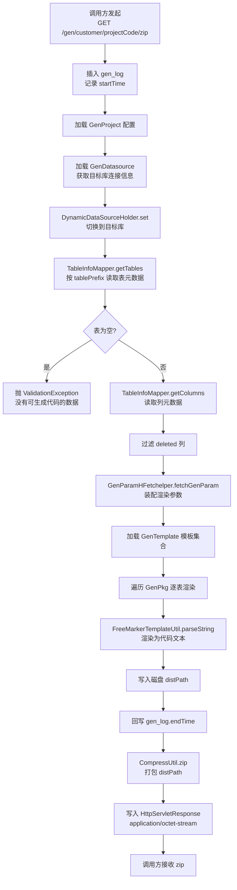

# 业务流程索引

最后更新：`2026-06-26`

## 流程列表

| 流程名 | 触发条件 | 业务价值 |
|--------|----------|----------|
| 配置生成项目 | 用户首次创建代码生成任务 | 建立生成任务的最顶层配置，绑定目标数据源与表范围 |
| 维护生成任务 | 项目创建后或模板变更后 | 定义项目下要生成哪些文件、用哪个模板、生成到哪 |
| 触发代码生成并下载 | 用户完成配置后点击生成 | 产出符合规范的工程代码，降低手写脚手架成本 |
| 生成日志追溯 | 生成完成后或排障时 | 追踪每次生成的耗时与产物路径 |

## 核心流程详细描述

### 流程图规范

流程图使用 Mermaid 语法绘制，直接内嵌于流程文档与 Story 文档中。

### 主流程：触发代码生成并下载

这是 sh-generator 最核心的业务流程，由 `GenService.getGenZip` 串联：

### 流程命名规范

- 流程名采用 "动词 + 名词" 形式
- 流程ID采用小写下划线命名，如 `gen_zip_flow`

### 流程文档结构

每个业务流程文档应包含：

1. **流程概述** - 流程目的和范围
2. **触发条件** - 何时触发该流程
3. **参与者** - 涉及的角色或系统
4. **流程步骤** - 详细步骤说明
5. **异常处理** - 异常情况处理
6. **度量指标** - 流程性能指标

### 异常处理要点

- **目标库无匹配表**：`getTables` 返回空 → `genCodeData` 抛 `ValidationException`（"没有可生成代码的数据"）。
- **模板渲染异常**：单文件渲染失败不中断整体流程，异常信息以 `StringFormat` 写入产物文件内容，便于用户定位模板问题。
- **文件未找到**：`FileOutputStream` 抛 `FileNotFoundException` → 转 `SystemException`。
- **压缩/下载异常**：`zipDataAndPush` 中的异常被 `log.error` 记录但不再向上抛出，调用方可能拿到不完整的响应。

---

*本文件基于 sh-generator 源码分析生成，后续随业务演进持续更新*
