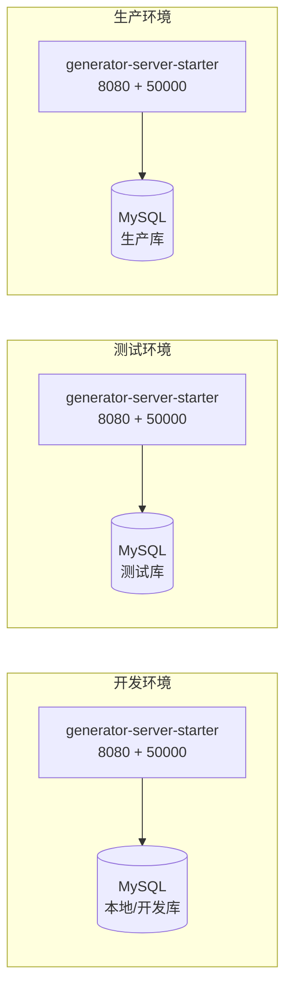

# 部署架构

## 部署架构图

## 部署环境说明

sh-generator 为单体 Spring Boot 应用，部署形态简单：每个环境一个 `generator-server-starter` 实例，连接一个 MySQL 实例。`generator-ui` 作为静态前端资源可独立部署或由后端托管；`generator-client` 作为 Maven 插件由使用方工程依赖调用，不单独部署。

应用通过 `spring.profiles.active` 区分环境（默认 `local`），各环境数据库连接、iam 鉴权服务地址等通过对应 profile 的配置文件覆盖。

## 环境配置

| 环境 | 说明 | 配置要点 |
|------|------|----------|
| local | 本地开发 | `spring.profiles.active=local`；MySQL 本地实例；管理端口 50000 暴露全部 actuator endpoints（`include: "*"`） |
| test | 测试环境 | `spring.profiles.active=test`；独立测试库；health 端点 `showDetails: always` 便于排障 |
| prod | 生产环境 | `spring.profiles.active=prod`；生产 MySQL；建议收窄 `management.endpoints.web.exposure.include`，关闭 `shutdown`/`restart` 端点 |

> 注：当前 `application.yml` 默认开启 `shutdown`、`restart` 端点并暴露全部 actuator，生产环境需通过 profile 覆盖收窄，详见技术债务记录。

## 部署流程

1. 在项目根目录执行 `mvn clean package -DskipTests`，产出 `generator-server-starter/target/*.jar`。
2. 将 jar 上传至目标主机，通过 `java -jar generator-server-starter.jar --spring.profiles.active=<env>` 启动。
3. 应用启动后业务端口 8080 提供生成服务，管理端口 50000 提供 actuator 探针与运维端点。
4. （可选）部署 `generator-ui` 静态资源至前端服务器或 CDN，配置后端 API 地址指向 8080。
5. （可选）使用方工程在自身 `pom.xml` 引入 `generator-client`，通过 `mvn <goal>` 调用生成能力。

## 运维注意事项

- **生成产物目录**：代码生成产物落盘于 `{catalina.base}/gen/{yyyyMMddHHmmssSSS}/`，每次生成新建一个时间戳目录，无自动清理机制，长期运行需人工或定时清理，否则磁盘会持续增长（见技术债务记录）。
- **动态数据源**：`DynamicDataSourceHolder.set` 为线程级切换，生成完成后未显式 clear，依赖框架后续拦截或下次 set 覆盖；在高并发或线程池复用场景需关注上下文残留。
- **管理端口**：50000 端口暴露 actuator 全部端点，且开启了 `shutdown`/`restart`，部署到生产前必须收窄。
- **日志**：使用 `lombok.extern.slf4j.Slf4j`，生成过程会在日志中输出每个生成文件的绝对路径（`======> 生成文件 {path}`），便于追踪但需注意路径泄露。
