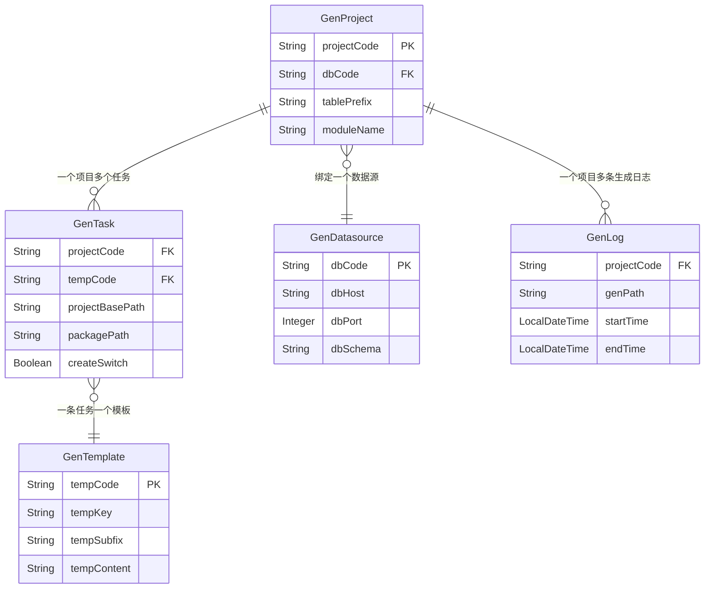

# 数据模型索引

> 所有实体位于 `generator-server/src/main/java/com/wkclz/generator/server/bean/entity/`，继承 `com.wkclz.core.base.BaseEntity`（提供 `id`、`sort`、`createTime`、`createBy`、`updateTime`、`updateBy`、`remark`、`version` 等公共字段）。实体类提供 `copy` / `copyIfNotNull` 静态拷贝方法。

## 数据模型列表

| 实体名 | 说明 | 关联模块 |
|--------|------|----------|
| GenProject | 生成项目（代码生成的最顶层配置） | 项目管理 |
| GenTask | 生成任务（项目下的一条生成规则） | 任务管理 |
| GenTemplate | 生成模板（FreeMarker 模板内容） | 模板管理 |
| GenDatasource | 目标数据源（被读取元数据的业务库） | 数据源管理 |
| GenLog | 生成日志 | 日志管理 |

## 数据模型详细文档

### GenProject

对应表 `gen_project`。一个生成项目绑定一个目标数据源与一组表前缀，是代码生成的最顶层配置。

| 字段 | 类型 | 说明 |
|------|------|------|
| userCode | String | 用户编码 |
| projectCode | String | 项目编码（唯一） |
| dbCode | String | 目标数据源编码（关联 GenDatasource） |
| tablePrefix | String | 表前缀（用于过滤目标库的表） |
| moduleName | String | 模块名 |
| projectName | String | 项目名 |
| projectDesc | String | 项目描述 |

### GenTask

对应表 `gen_task`。一个项目下可有多条任务，每条任务绑定一个模板与目标包路径，控制具体生成行为。

| 字段 | 类型 | 说明 |
|------|------|------|
| userCode | String | 用户编码 |
| projectCode | String | 所属项目编码（关联 GenProject） |
| tempCode | String | 模板编码（关联 GenTemplate） |
| taskName | String | 任务名 |
| createSwitch | Boolean | 是否生成 |
| deleteSwitch | Boolean | 是否删除 |
| projectBasePath | String | 项目基础路径（生成产物相对路径） |
| packagePath | String | 包路径 |
| taskDesc | String | 任务描述 |

### GenTemplate

对应表 `gen_template`。存储 FreeMarker 模板内容，渲染时由 `FreeMarkerTemplateUtil.parseString` 解析。

| 字段 | 类型 | 说明 |
|------|------|------|
| userCode | String | 用户编码 |
| tempCode | String | 模板编码（唯一） |
| tempKey | String | 模板标识 |
| tempName | String | 模板名 |
| tempSubfix | String | 生成文件后缀（如 `.java`、`.xml`） |
| tempDesc | String | 模板描述 |
| tempContent | String | 模板内容（FreeMarker 语法） |

### GenDatasource

对应表 `gen_datasource`。描述被读取元数据的目标业务库连接信息。

| 字段 | 类型 | 说明 |
|------|------|------|
| userCode | String | 用户编码 |
| dbCode | String | 数据源编码（唯一） |
| dbType | String | 数据库类型 |
| dbHost | String | 主机名 |
| dbPort | Integer | 端口 |
| dbSchema | String | 数据库名称 |
| dbUsername | String | 数据库用户名 |
| dbPassword | String | 数据库密码（详情接口返回时置 null） |

### GenLog

对应表 `gen_log`。记录每次生成的开始/结束时间与产物路径。

| 字段 | 类型 | 说明 |
|------|------|------|
| userCode | String | 用户编码 |
| projectCode | String | 项目编码 |
| authCode | String | 授权码 |
| genPath | String | 生成产物落盘路径 |
| startTime | LocalDateTime | 开始时间 |
| endTime | LocalDateTime | 结束时间 |

## 数据模型关系图

## 数据模型变更记录

| 版本 | 变更类型 | 变更内容 | 日期 |
|------|----------|----------|------|
| 5.0.0-SNAPSHOT | 初始 | 建立 GenProject/GenTask/GenTemplate/GenDatasource/GenLog 五张主表 | 2026-06-26 |
