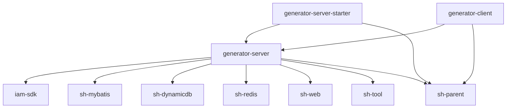

# 依赖索引

## 外部依赖列表

| 依赖名 | 版本 | 用途 |
|--------|------|------|
| sh-parent | 5.0.0-SNAPSHOT | 父 POM，统一管理 Spring Boot 版本、依赖版本、插件配置 |
| iam-sdk | 5.0.0-SNAPSHOT | 鉴权与用户上下文（`@CurrentMember`），与 iam 服务对接 |
| sh-mybatis | 5.0.0-SNAPSHOT | MyBatis 封装，提供 `BaseEntity`、`TableInfoMapper`、`ColumnInfo` 等基础能力 |
| sh-dynamicdb | 5.0.0-SNAPSHOT | 动态数据源（`DynamicDataSourceHolder`），按 `dbCode` 切换目标库读取元数据 |
| sh-redis | 5.0.0-SNAPSHOT | Redis 缓存封装 |
| sh-web | 5.0.0-SNAPSHOT | Web 层封装，提供统一 `Result` 返回、`Assert` 校验、异常体系（`SystemException`/`ValidationException`） |
| sh-tool | 5.0.0-SNAPSHOT | 工具集，提供 `CompressUtil`（zip）、`MapUtil`、`StringFormat` |
| MySQL Connector/J | 由 sh-parent 管理 | JDBC 驱动 `com.mysql.cj.jdbc.Driver` |
| FreeMarker | 由 sh-parent 管理 | 模板渲染（`FreeMarkerTemplateUtil`） |
| PageHelper | 由 sh-parent 管理 | MyBatis 分页插件，方言 `mysql` |
| Lombok | 由 sh-parent 管理 | `@Data`、`@Slf4j` 等注解处理 |

> 注：以上版本号为 `pom.xml` 中显式声明的值；Spring Boot、MyBatis、MySQL Connector/J 等三方库的具体版本由 `sh-parent` 统一管理，本仓库不重复声明。

## 内部模块依赖关系

## 依赖关系详细说明

### generator-server-starter → generator-server

启动模块依赖核心业务模块。starter 仅含主类与配置，全部业务能力来自 server。打包时 starter 产出可执行 jar。

### generator-client → generator-server

Maven 插件模块依赖核心业务模块以复用 `GenService` 等生成能力，对外暴露为 Mojo goal。

### generator-server → sh-dynamicdb

最关键的运行时依赖。`GenService.getTables` / `getColumns` 在读取目标库元数据前调用 `DynamicDataSourceHolder.set(project.getDbCode())` 切换数据源，使 `TableInfoMapper` 的查询落到用户配置的业务库而非 generator 自身的库。

### generator-server → sh-mybatis

提供 `BaseEntity`（所有实体的基类）、`TableInfoMapper`（读取 `information_schema`）、`ColumnInfo` / `TableInfo`（元数据载体）。

### generator-server → iam-sdk

提供 `@CurrentMember` 注入当前用户，`userCode` 字段贯穿五张主表实现数据隔离。

## 第三方库说明

| 库名 | 版本范围 | 许可证 | 备注 |
|------|----------|--------|------|
| Spring Boot | 由 sh-parent 管理 | Apache 2.0 | 应用框架 |
| MyBatis | 由 sh-parent 管理 | Apache 2.0 | 持久层 |
| FreeMarker | 由 sh-parent 管理 | Apache 2.0 | 模板引擎 |
| MySQL Connector/J | 由 sh-parent 管理 | GPL-2.0 | JDBC 驱动 |
| PageHelper | 由 sh-parent 管理 | MIT | 分页插件 |
| Lombok | 由 sh-parent 管理 | MIT | 编译期注解处理 |
| Apache Commons Collections | 由 sh-parent 管理 | Apache 2.0 | `CollectionUtils` 空集合判断 |

## 依赖更新策略

- **统一版本**：所有 `com.wkclz.framework` 内部依赖与父 POM `sh-parent` 保持同一 `${revision}`（当前 `5.0.0-SNAPSHOT`），通过 `pom.xml` 的 `<revision>5.0.0-SNAPSHOT</revision>` 统一管理，升级时只需修改一处。
- **iam-sdk 版本**：单独由 `iam.version` 属性管理，便于与 iam 服务版本对齐。
- **三方库**：交由 `sh-parent` 统一管理，本仓库不重复声明版本号，避免与父 POM 冲突。
- **JDK**：`maven.compiler.source/target=25`，升级 JDK 需同步评估 sh-parent 与全部 sh-* 依赖的兼容性。
