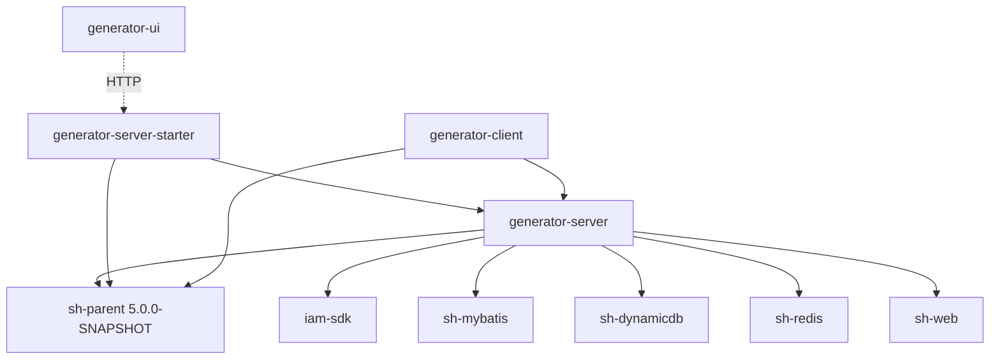

# 模块索引

## 模块列表

| 模块名 | 职责 | 技术栈 | 入口路径 |
|--------|------|--------|----------|
| generator-server | 代码生成器核心业务实现：实体、Service、Rest、Mapper、模板渲染引擎 | Java 25 / Spring Boot / MyBatis / FreeMarker | `generator-server/src/main/java/com/wkclz/generator/server/` |
| generator-server-starter | Spring Boot 启动模块，聚合 server 依赖并提供主入口与配置 | Spring Boot / iam-sdk | `generator-server-starter/src/main/java/com/wkclz/generator/server/starter/GeneratorServerApplication.java` |
| generator-client | Maven Mojo 插件，封装代码生成能力供外部工程以命令行方式调用 | Maven Plugin API | `generator-client/src/main/java/` |
| generator-ui | 代码生成器前端控制台 | Vue 3 / Vite / Element Plus | `generator-ui/` |

## 模块详细文档

### generator-server

核心业务模块，承载代码生成器的全部领域逻辑。包结构 `com.wkclz.generator.server`：

- `bean/entity/`：领域实体 `GenProject`、`GenTask`、`GenTemplate`、`GenDatasource`、`GenLog`，均继承 `BaseEntity`，提供 `copy` / `copyIfNotNull` 静态拷贝方法。
- `bean/dto/`、`bean/gen/`：传输对象与生成参数对象（`GenParam`、`GenPkg`）。
- `rest/`：REST 入口 `GenProjectRest`、`GenTaskRest`、`GenTemplateRest`、`GenDatasourceRest`、`GenLogRest`、`GenCustomerRest`，统一使用 `Assert.notNull` 做入参校验，返回值由框架封装。
- `service/`：业务服务 `GenProjectService`、`GenTaskService`、`GenTemplateService`、`GenDatasourceService`、`GenLogService`、`GenService`（生成引擎）。
- `helper/`：`GenParamHFetchelper` 负责将表/列元数据与生成任务装配为 `GenParam`。
- `mapper/`（xml）：MyBatis mapper，位于 `classpath*:mapper/**/*.xml`。

详细文档：[generator-server-detail.md](generator-server-detail.md)

### generator-server-starter

Spring Boot 启动模块，仅包含主类 `GeneratorServerApplication` 与配置 `application.yml`。聚合 `generator-server` 及其全部运行时依赖（iam-sdk、sh-mybatis、sh-dynamicdb、sh-redis、sh-web）。配置要点：

- 业务端口 `server.port=8080`
- 默认 profile `local`
- 数据源驱动 `com.mysql.cj.jdbc.Driver`
- MyBatis `map-underscore-to-camel-case: true`，mapper 扫描 `classpath*:mapper/**/*.xml`
- PageHelper 方言 `mysql`
- 独立管理端口 `50000`，暴露全部 actuator endpoints，开启 `shutdown` / `restart`

详细文档：[generator-server-starter-detail.md](generator-server-starter-detail.md)

### generator-client

Maven Mojo 插件模块，依赖 `generator-server`，对外暴露代码生成能力，使外部工程能够在构建期通过 `mvn <goal>` 触发代码生成，避免每次都通过 Web 控制台操作。

详细文档：[generator-client-detail.md](generator-client-detail.md)

### generator-ui

代码生成器前端控制台，基于 Vue 3 + Vite + Element Plus 构建。提供项目管理、任务管理、模板管理、数据源管理、日志查询、代码生成下载等可视化操作界面，通过 HTTP 调用 `generator-server-starter` 的 8080 端口。

详细文档：[generator-ui-detail.md](generator-ui-detail.md)

## 模块依赖关系

`generator-server` 是被依赖方，`generator-server-starter` 与 `generator-client` 均依赖它；三者共享父 POM `sh-parent 5.0.0-SNAPSHOT`，统一版本与依赖管理。`generator-ui` 与后端仅通过 HTTP 解耦。
