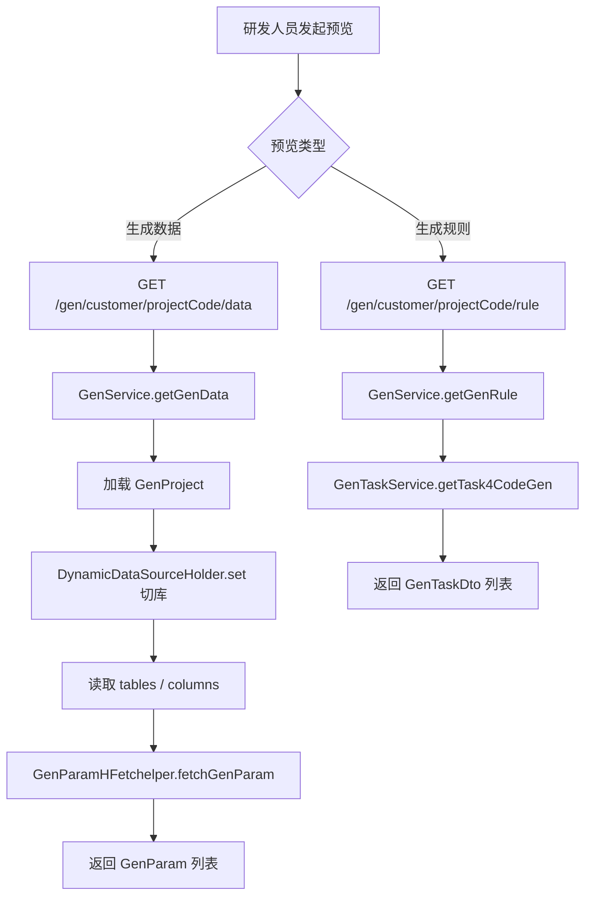

# Story: 预览生成数据

## 描述
作为研发团队的一员，我希望在真正生成代码前预览将要渲染的生成参数（GenParam 列表）与生成规则（GenTaskDto 列表），以便确认配置正确，避免生成错误代码。

## 参与者
| 角色 | 说明 |
|------|------|
| 研发人员 | 发起预览请求 |
| GenService | 采集元数据并装配 GenParam，但不落盘渲染 |
| GenTaskService | 返回生成规则 GenTaskDto 列表 |

## 流程图

## 验收标准
- [ ] data 接口返回 GenParam 列表，包含表/列元数据与任务装配结果
- [ ] rule 接口返回 GenTaskDto 列表，反映当前项目的生成任务配置
- [ ] 预览不产生磁盘文件，不写 gen_log
- [ ] 目标库无匹配表时返回空列表或明确提示

## 关联模块
- GenCustomerRest
- GenService
- GenParamHFetchelper
- GenTaskService

## 关联 API
- GET `/gen/customer/{projectCode}/data`
- GET `/gen/customer/{projectCode}/rule`

## 优先级
P1

## 状态
Done
