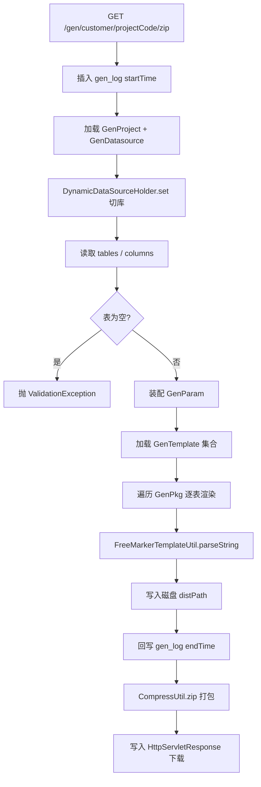

# Story: 生成代码并下载 zip

## 描述
作为研发团队的一员，我希望触发代码生成后，系统能读取目标库元数据、按模板渲染代码、打包为 zip 并通过 HTTP 下载，以便我拿到符合团队规范的工程源码。

## 参与者
| 角色 | 说明 |
|------|------|
| 研发人员 / Mojo | 发起生成请求 |
| GenService | 核心生成引擎：采集元数据 → 装配参数 → 渲染模板 → 打包下载 |
| DynamicDataSourceHolder | 切换到目标库 |
| TableInfoMapper | 读取表/列元数据 |
| FreeMarkerTemplateUtil | 渲染模板 |
| CompressUtil | 打包 zip |
| GenLogService | 记录生成日志 |

## 流程图

## 验收标准
- [ ] 生成前后各写一次 gen_log（startTime / endTime）
- [ ] 目标库无匹配表时抛 ValidationException，不生成空 zip
- [ ] 单文件渲染异常不中断整体流程，异常信息写入产物文件内容
- [ ] projectBasePath 中的 ../ 被替换为 parent/ 防止路径逃逸
- [ ] 响应头 Content-Disposition 为 attachment，Content-Type 为 application/octet-stream
- [ ] 产物目录位于 {catalina.base}/gen/{yyyyMMddHHmmssSSS}/

## 关联模块
- GenCustomerRest（`generator-server/src/main/java/com/wkclz/generator/server/rest/GenCustomerRest.java`）
- GenService（`generator-server/src/main/java/com/wkclz/generator/server/service/GenService.java`）
- GenParamHFetchelper
- FreeMarkerTemplateUtil
- CompressUtil

## 关联 API
- GET `/gen/customer/{projectCode}/zip`

## 优先级
P0

## 状态
Done
