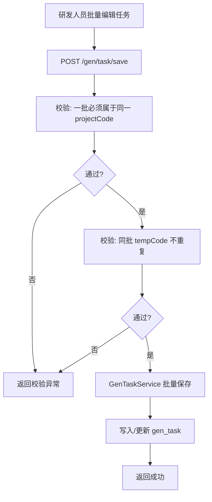

# Story: 批量保存生成任务

## 描述
作为研发团队的一员，我希望能够一次性保存一个项目下的多条生成任务（每条任务绑定一个模板与目标包路径），以便高效配置项目的全部生成规则。

## 参与者
| 角色 | 说明 |
|------|------|
| 研发人员 | 在任务管理界面批量编辑并提交 |
| GenTaskService | 校验并持久化任务集合 |
| GenProjectService | 校验 projectCode 存在性 |
| GenTemplateService | 校验 tempCode 存在性 |

## 流程图

## 验收标准
- [ ] 一批任务属于不同 projectCode 时返回校验异常
- [ ] 同一批任务中存在重复 tempCode 时返回校验异常
- [ ] 保存成功后 gen_task 表记录与提交内容一致
- [ ] createSwitch / deleteSwitch 开关状态正确持久化

## 关联模块
- GenTaskRest
- GenTaskService

## 关联 API
- POST `/gen/task/save`

## 优先级
P0

## 状态
Done
