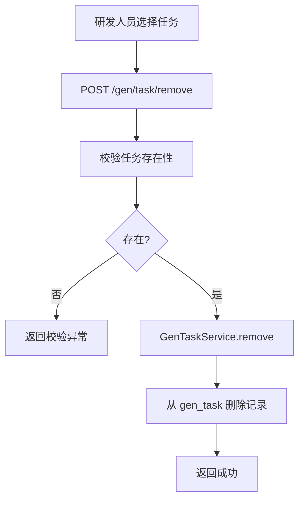

# Story: 删除生成任务

## 描述
作为研发团队的一员，我希望能够删除不再需要的生成任务，以便保持任务列表的整洁，避免误生成废弃代码。

## 参与者
| 角色 | 说明 |
|------|------|
| 研发人员 | 选择任务并触发删除 |
| GenTaskService | 执行删除 |

## 流程图

## 验收标准
- [ ] 删除后 gen_task 表对应记录消失
- [ ] 删除不存在的任务时返回明确异常
- [ ] 删除操作不影响同项目下其他任务

## 关联模块
- GenTaskRest
- GenTaskService

## 关联 API
- POST `/gen/task/remove`

## 优先级
P1

## 状态
Done
