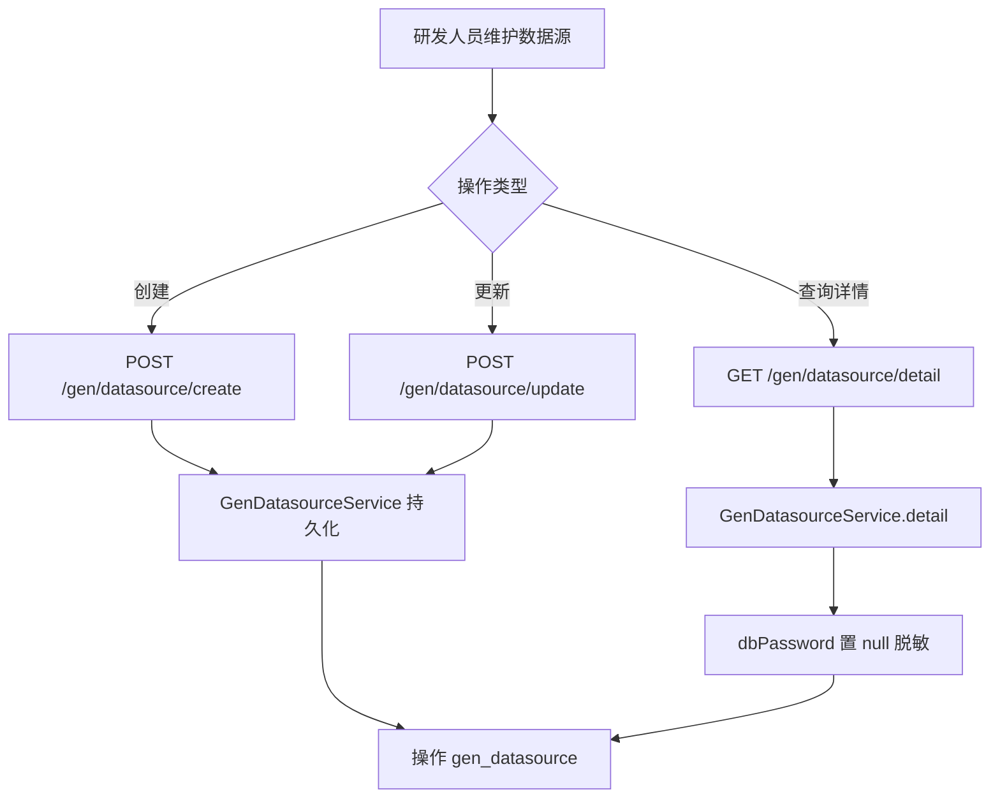

# Story: 维护目标数据源

## 描述
作为研发团队的一员，我希望能够维护目标业务库的连接信息（主机、端口、库名、账号密码），以便代码生成器切换到该库读取表/列元数据。详情查询时密码需脱敏。

## 参与者
| 角色 | 说明 |
|------|------|
| 研发人员 | 维护数据源连接信息 |
| GenDatasourceService | 持久化并在详情查询时脱敏 |
| DynamicDataSourceHolder | 生成代码时按 dbCode 切换数据源 |

## 流程图

## 验收标准
- [ ] 创建/更新后 gen_datasource 表记录正确
- [ ] 详情接口返回的 dbPassword 必须为 null（脱敏）
- [ ] dbCode 唯一
- [ ] 下拉选项接口返回精简的 dbCode + 标识列表
- [ ] 生成代码时 DynamicDataSourceHolder.set(dbCode) 能正确切换到该数据源

## 关联模块
- GenDatasourceRest
- GenDatasourceService

## 关联 API
- GET `/gen/datasource/page`
- GET `/gen/datasource/detail`
- POST `/gen/datasource/create`
- POST `/gen/datasource/update`
- POST `/gen/datasource/remove`
- GET `/gen/datasource/options`

## 优先级
P0

## 状态
Done
