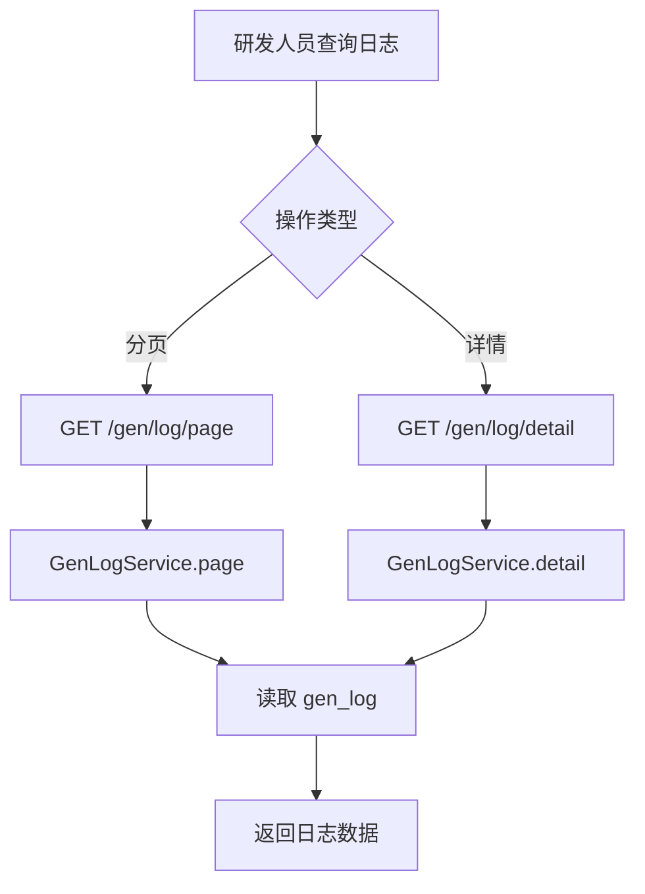

# Story: 查询生成日志

## 描述
作为研发团队的一员，我希望能够分页查询与查看每次代码生成的日志（开始时间、结束时间、产物路径），以便追溯生成历史与排查生成异常。

## 参与者
| 角色 | 说明 |
|------|------|
| 研发人员 | 查询日志列表与详情 |
| GenLogService | 只读查询 gen_log |
| GenService | 生成时写入日志（startTime / endTime） |

## 流程图

## 验收标准
- [ ] 日志接口为只读，不提供增删改
- [ ] 分页查询返回 startTime / endTime / genPath / projectCode
- [ ] 详情接口返回单条日志完整信息
- [ ] 日志数据按 userCode 隔离

## 关联模块
- GenLogRest
- GenLogService

## 关联 API
- GET `/gen/log/page`
- GET `/gen/log/detail`

## 优先级
P1

## 状态
Done
