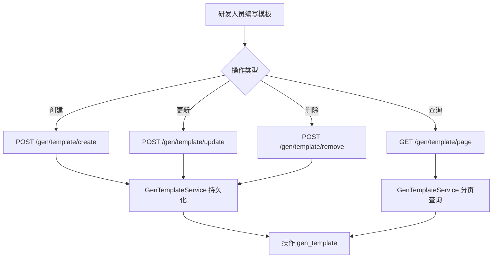

# Story: 维护生成模板

## 描述
作为研发团队的一员，我希望能够创建、更新、删除、查询 FreeMarker 代码生成模板，以便定义代码生成的渲染规则与文件后缀。

## 参与者
| 角色 | 说明 |
|------|------|
| 研发人员 | 编写并维护 FreeMarker 模板内容 |
| GenTemplateService | 持久化模板 |
| FreeMarkerTemplateUtil | 渲染时解析模板内容 |

## 流程图

## 验收标准
- [ ] 模板内容（tempContent）以 FreeMarker 语法正确存储
- [ ] tempSubfix 决定生成文件后缀（如 .java、.xml）
- [ ] tempCode 唯一
- [ ] 下拉选项接口（/gen/template/options）返回精简的 tempCode/tempName 列表

## 关联模块
- GenTemplateRest
- GenTemplateService

## 关联 API
- GET `/gen/template/page`
- GET `/gen/template/detail`
- POST `/gen/template/create`
- POST `/gen/template/update`
- POST `/gen/template/remove`
- GET `/gen/template/options`

## 优先级
P0

## 状态
Done
