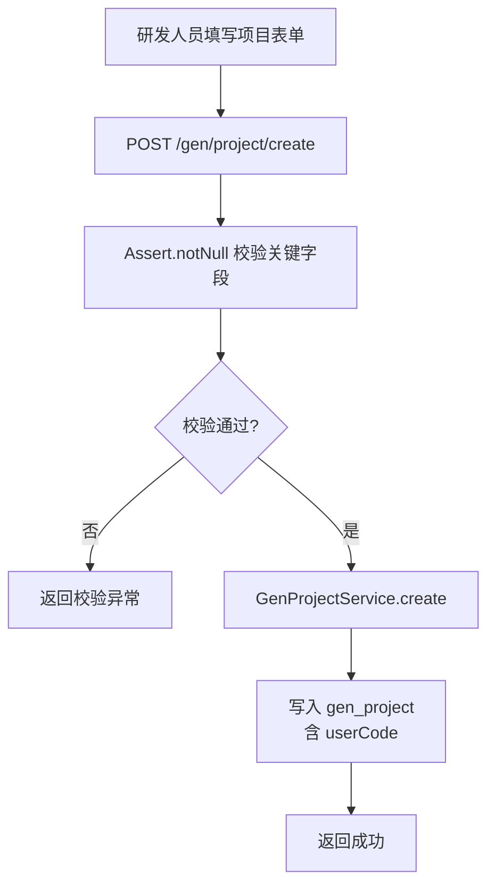

# Story: 创建生成项目

## 描述
作为研发团队的一员，我希望能够创建一个代码生成项目，配置项目编码、目标数据源（dbCode）、表前缀、模块名等信息，以便后续基于该项目配置生成任务并产出代码。

## 参与者
| 角色 | 说明 |
|------|------|
| 研发人员 | 通过 Web 控制台或 API 创建生成项目 |
| iam 服务 | 提供当前用户上下文（userCode），用于数据隔离 |
| GenProjectService | 持久化生成项目配置 |
| GenDatasourceService | 校验 dbCode 是否存在 |

## 流程图

## 验收标准
- [ ] 必填字段（projectCode、dbCode、tablePrefix 等）缺失时返回明确校验异常
- [ ] 创建成功后 gen_project 表新增一条记录，userCode 为当前登录用户
- [ ] 同一 userCode 下 projectCode 唯一
- [ ] 返回值由 sh-web 框架统一封装为标准 Result 结构

## 关联模块
- GenProjectRest（`generator-server/src/main/java/com/wkclz/generator/server/rest/GenProjectRest.java`）
- GenProjectService（`generator-server/src/main/java/com/wkclz/generator/server/service/GenProjectService.java`）

## 关联 API
- POST `/gen/project/create`

## 优先级
P0

## 状态
Done
