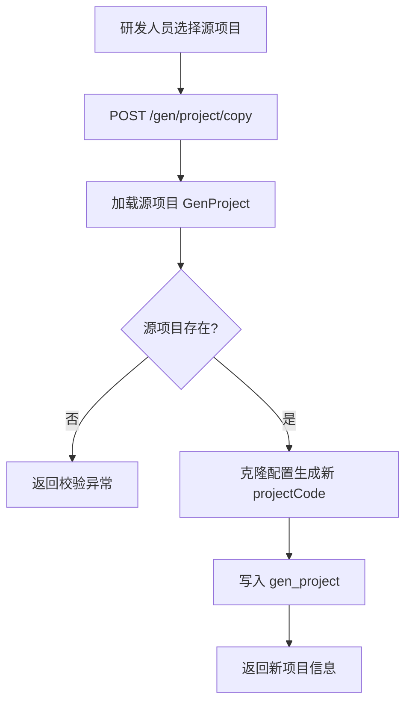

# Story: 复制生成项目

## 描述
作为研发团队的一员，我希望能够基于已有的生成项目复制一份配置，以便快速搭建相似的业务模块代码生成任务，避免重复填写相同配置。

## 参与者
| 角色 | 说明 |
|------|------|
| 研发人员 | 选择源项目并触发复制 |
| GenProjectService | 读取源项目配置并克隆为新项目 |
| GenTaskService | （可选）连带复制源项目下的生成任务 |

## 流程图

## 验收标准
- [ ] 复制后生成一条新的 gen_project 记录，projectCode 与源项目不同
- [ ] 新项目继承源项目的 dbCode、tablePrefix、moduleName 等配置
- [ ] 源项目本身不被修改

## 关联模块
- GenProjectRest
- GenProjectService

## 关联 API
- POST `/gen/project/copy`

## 优先级
P1

## 状态
Done
